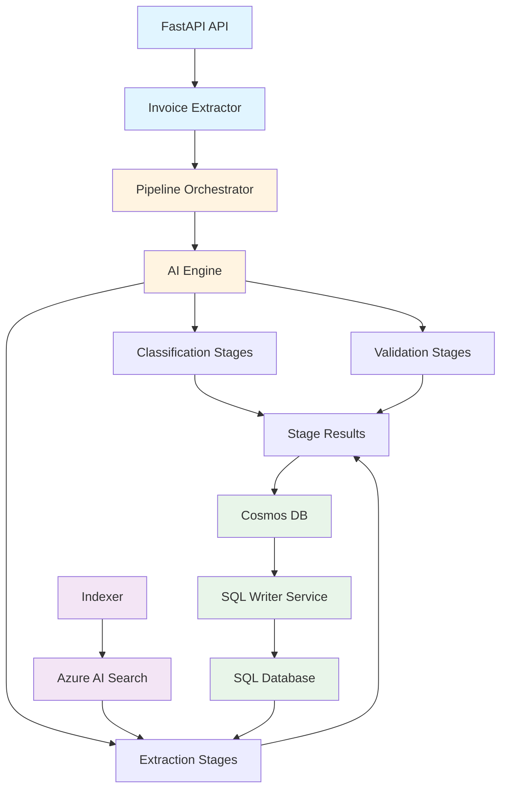
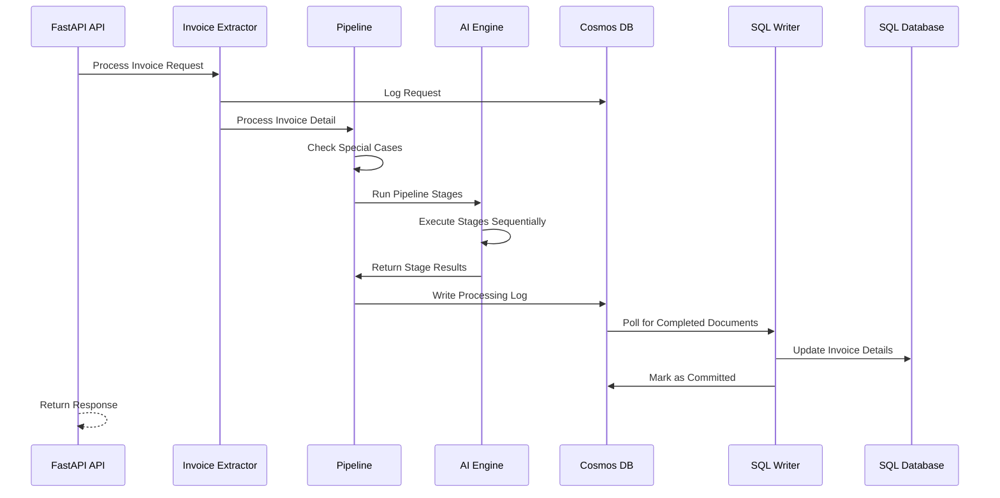
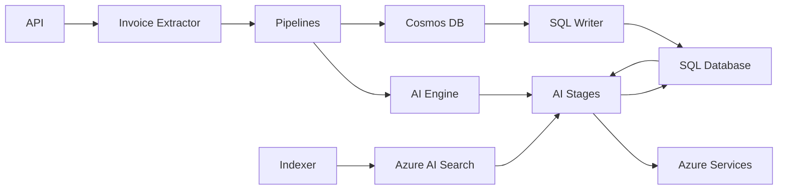

# Solution Overview

**Last Updated:** 2025-12-17
**Author:** Kirill Levtov
**Related:** [Indexer](02-indexer.md) | [SQL Writer](03-sql-writer.md) | [Processing Stages](04-complete-match-stage.md)

## Overview

The AI-based invoice item matching solution is a comprehensive system that processes invoice line items through multiple AI-powered stages to extract and match manufacturer names, part numbers, UNSPSC codes, and other product information. The system combines exact database matching, semantic search, fine-tuned AI models, and web search to achieve high-accuracy product identification.

The solution operates as a FastAPI-based web service that receives invoice processing requests, orchestrates multi-stage AI pipelines, and writes results to both SQL databases and Cosmos DB for tracking and analysis.

## Key Concepts

### Invoice Detail
A single line item from an invoice containing product description and metadata. Each invoice detail flows through the processing pipeline independently.

### Processing Pipeline
A configurable sequence of stages that process invoice details. The pipeline can be modified based on special cases (e.g., generic items, lot items, fee items).

### Processing Stage
A discrete step in the pipeline that performs specific extraction or validation tasks. Stages execute sequentially and pass data between them using a shared cache.

### Confidence Score
A numerical value (0-100) indicating the system's certainty in an extracted value. Higher scores indicate greater confidence in the accuracy of the extraction.

### Special Cases
Predefined scenarios that modify the standard pipeline by skipping or adding stages. Examples include generic items, lot items, and fee/labor items.

## System Architecture

The system consists of several major components that work together:



### Main Components

1. **API Layer (`app.py`)**
   - FastAPI application that exposes REST endpoints
   - Handles authentication via JWT middleware
   - Manages request/response logging
   - Coordinates worker threads for background processing

2. **Pipeline Orchestrator (`pipelines.py`)**
   - Manages the overall processing flow for invoice details
   - Applies special case logic to modify pipelines
   - Handles duplicate invoice detail identification
   - Prepares data for database writes

3. **AI Engine (`ai_engine.py`)**
   - Executes individual processing stages
   - Manages stage-to-stage data flow via cache
   - Consolidates confidence scores across stages
   - Determines final values based on highest confidence

4. **AI Stages (`ai_stages.py`)**
   - Implements individual stage logic (classification, matching, extraction)
   - Interfaces with Azure AI services (Language Studio, OpenAI, AI Search)
   - Calculates confidence scores for extracted values

5. **Indexer (`indexer/semantic_search_indexer.py`)**
   - Synchronizes product data from SQL to Azure AI Search
   - Generates vector embeddings for semantic search
   - Runs as a background service with multi-threaded architecture

6. **SQL Writer Service (`sql_writer.py`)**
   - Asynchronously writes processing results from Cosmos DB to SQL
   - Implements retry logic with exponential backoff
   - Uses circuit breaker pattern for fault tolerance
   - Handles duplicate invoice detail updates

7. **Databases**
   - **SQL Database (SDP)**: Master product data, invoice details, tracking tables
   - **Cosmos DB**: Processing logs, API requests, intermediate results
   - **Azure AI Search**: Vector embeddings and indexed product data for semantic search

## Processing Flow

### High-Level Flow



### Detailed Processing Steps

1. **Request Reception**
   - API receives invoice processing request (all invoices, single invoice, or specific details)
   - Request is logged to Cosmos DB with unique ID and timestamp
   - Invoice Extractor retrieves invoice detail records from SQL database

2. **Pre-Processing**
   - System checks if ASK part number or UPC already exists in database
   - If found, processing exits early with status "RC-RPA"
   - Otherwise, processing continues to pipeline

3. **Special Case Detection**
   - Pipeline examines invoice detail attributes (category ID, manufacturer name, etc.)
   - Matches against configured special cases in `special_cases.yaml`
   - Modifies stage mapping by skipping or adding stages as needed
   - Examples:
     - **Generic Items (CASE_1)**: Skip COMPLETE_MATCH stage
     - **Lot Items (CASE_2)**: Skip CONTEXT_VALIDATOR, FINETUNED_LLM, and web search stages
     - **Fee/Labor Items**: Skip all extraction stages after classification

4. **Pipeline Execution**
   - AI Engine executes stages sequentially based on stage mapping
   - Each stage receives data from previous stages via shared cache
   - Stages can be:
     - **Classification**: Categorize description (MATERIAL, FEE, TAX, etc.)
     - **Extraction**: Extract manufacturer, part number, UNSPSC
     - **Validation**: Verify contextual relevance of matches

5. **Stage Execution**
   - Each stage performs its specific task and returns:
     - Extracted values (manufacturer name, part number, UNSPSC, etc.)
     - Confidence scores for each extracted value
     - Status (success, error)
     - Additional metadata
   - Results are stored in stage results object

6. **Confidence Consolidation**
   - After each extraction stage, system consolidates confidence scores
   - Compares current stage results with previous stages
   - Selects highest confidence value for each field
   - Determines if next stage is required based on thresholds

7. **Final Result Determination**
   - System selects final values based on highest confidence across all stages
   - Calculates final invoice line status:
     - **RC-AI**: Ready for consumption by AI (high confidence)
     - **DS1**: Data steward review required (low confidence)
     - **AI_ERROR**: Error occurred during processing
   - Prepares data for database writes

8. **Result Persistence**
   - Processing results written to Cosmos DB document
   - Document includes:
     - Request details
     - Invoice detail from RPA
     - Pre-processing details
     - All stage results with confidence scores
     - Final consolidated output
     - Post-processing details (duplicate IDs)
   - SQL Writer Service polls Cosmos DB for completed documents
   - Updates SQL database tables asynchronously
   - Handles duplicate invoice details with same values

## Stage Execution Details

### Standard Pipeline Stages

The default pipeline (CASE_0) includes the following stages in order:

1. **CLASSIFICATION - DESCRIPTION_CLASSIFIER**
   - Categorizes invoice description into: MATERIAL, FEE, TAX, LABOR, FREIGHT, DISCOUNTS, BAD, AP_ADJUSTMENT
   - Determines if further extraction is needed
   - Confidence threshold: Varies by category

2. **CLASSIFICATION - LOT_CLASSIFIER** (conditional)
   - Runs only if description contains "LOT" characters
   - Determines if item is a lot/kit of multiple items
   - If LOT detected, modifies pipeline to skip certain stages

3. **CLASSIFICATION - RENTAL_CLASSIFIER** (conditional)
   - Determines if item is a rental
   - Runs for MATERIAL, FEE, FREIGHT, TAX, DISCOUNTS categories
   - Sets rental indicator flag

4. **SEMANTIC_SEARCH - SEMANTIC_SEARCH**
   - Uses vector embeddings to find similar products in Azure AI Search
   - Extracts manufacturer name and UNSPSC code
   - Vector search leveraging semantic similarity of product descriptions

5. **COMPLETE_MATCH - COMPLETE_MATCH**
   - Performs exact matching against Azure AI Search index and SQL product database
   - Extracts manufacturer name, part number, UNSPSC, UPC, AK part number
   - Includes fallback logic for manufacturer-only matching

6. **CONTEXT_VALIDATOR - CONTEXT_VALIDATOR**
   - Validates contextual relevance of COMPLETE_MATCH results
   - Uses LLM to compare invoice text to matched product descriptions
   - Classifies relationship: DIRECT_MATCH, LOT_OR_KIT, REPLACEMENT_PART, ACCESSORY_PART, UNRELATED
   - Invalidates matches that are not contextually appropriate

7. **FINETUNED_LLM - FINETUNED_LLM**
   - Uses custom-trained LLM to extract manufacturer, part number, UNSPSC
   - Includes manufacturer aliases and training examples as context
   - Uses RAG (Retrieval Augmented Generation) for relevant examples
   - Boosts confidence when RPA values match AI extractions

8. **EXTRACTION_WITH_LLM_AND_WEBSEARCH - AZURE_AI_AGENT_WITH_BING_SEARCH**
   - Uses AI agent with Bing search to find product information online
   - Ranks results based on manufacturer match, part number match, description similarity, data source priority
   - Returns top-ranked result with confidence scores
   - Provides source URL for verification

### Data Passing Between Stages

Stages communicate through a shared `AIEngineCache` object that contains:

- **description_embedding**: Vector embedding of invoice description
- **cleaned_description**: Normalized description text
- **latest_stage_details**: Results from most recent stage
- **previous_stage_details**: Results from previous stage
- **semantic_search_results**: Cached search results
- **manufacturer_aliases**: Dictionary of manufacturer name variations

This cache allows stages to:
- Reuse expensive computations (embeddings, search results)
- Access previous stage outputs for comparison
- Build upon earlier extractions

## Special Case Handling

### CASE_0: Default Pipeline
- **Trigger**: No special conditions met
- **Stages**: All stages execute in standard order
- **Output Fields**: manufacturer_name, part_number, unspsc

### CASE_1: Generic Items Pipeline
- **Trigger**: Category ID = '1.2' (Generic items)
- **Modifications**: Skip COMPLETE_MATCH stage (no exact match possible for generic items)
- **Output Fields**: manufacturer_name, unspsc (no part number)
- **Rationale**: Generic items don't have specific part numbers

### CASE_2: LOT Items Pipeline
- **Trigger**: Category ID = '1.1' (LOT items) or LOT_CLASSIFIER detects LOT
- **Modifications**: Skip CONTEXT_VALIDATOR, FINETUNED_LLM, EXTRACTION_WITH_LLM_AND_WEBSEARCH
- **Output Fields**: manufacturer_name only
- **Rationale**: LOT items represent multiple products, so part number and UNSPSC are not applicable
- **Special Handling**: If RPA already extracted manufacturer from PO mapping, use that value

### Fee/Labor/Tax Items
- **Trigger**: Classification stage identifies as FEE, LABOR, TAX, FREIGHT, DISCOUNTS, AP_ADJUSTMENT
- **Modifications**: Stop after classification, no extraction stages run
- **Output Fields**: category only
- **Status**: RC-AI (ready for consumption)
- **Rationale**: These items don't represent physical products

## Final Output Consolidation

### Result Selection Logic

The system determines the final output through a hierarchical selection process that prioritizes data consistency over mixing fields from different stages:

1. **Stage Selection**
   - The system evaluates processing stages sequentially.
   - If a stage's results meet the configured confidence thresholds (after boosting), that stage is selected as the final source.
   - If no stage meets the thresholds, the system compares the average confidence scores of required fields across all valid stages and selects the highest-scoring **stage**.
   - **Consistency**: The system prioritizes taking the core product identity (Manufacturer and Part Number) from a single stage to ensure the data represents a coherent product entity. It avoids mixing Manufacturer from one stage with a Part Number from another unless specific enrichment rules apply.

2. **Confidence Boosting**
   - If the value extracted by a stage matches a value from a trusted source (such as RPA input or a previous high-confidence stage), the confidence score for that field is boosted.
   - This boosting mechanism reflects the higher certainty derived from agreement between independent data sources.

3. **Data Enrichment**
   - Once a winning stage is selected, the system may enrich it with missing data points from other stages.
   - **Example**: If the selected stage identified the Manufacturer and Part Number but failed to find a UNSPSC code or UPC, the system can propagate these specific values from another stage if they are available.

4. **Threshold Evaluation**
   - The final consolidated confidence scores are compared against configured thresholds.
   - **RC-AI**: All required fields meet or exceed thresholds.
   - **DS1**: One or more required fields are below the threshold, requiring manual review.

### Verification Flag Logic

The `is_verified_flag` indicates a high-certainty match against a trusted master data source. This flag is set to 'Y' (True) only when **all** of the following conditions are met:

1.  **Trusted Data Source**: The product was matched against a verified dataset, specifically **IDEA** or **Trade Service (TRD_SVC)**. Matches against the general invoice history (pipeline data) do not qualify for verification.
2.  **Explicit Match**: Both the Manufacturer Name and Part Number were explicitly identified in the input description and matched to the database record. Matches based on Part Number alone (where the manufacturer is inferred implicitly) do not qualify.
3.  **Uniqueness**: The system found exactly one unique combination of Part Number and Manufacturer Name. If multiple potential candidates exist (ambiguity), the flag remains 'N'.

This rigorous logic ensures that `is_verified_flag = 'Y'` represents a definitive, unambiguous link to a master catalog item.

### Output Fields

The final output includes:

**Core Fields:**
- `manufacturer_name`: Extracted manufacturer name
- `part_number`: Extracted part number
- `unspsc`: UNSPSC classification code
- `upc`: UPC barcode (if found)
- `aks_part_number`: ASK internal part number (if found)
- `description`: Cleaned description text

**Confidence Fields:**
- `manufacturer_name_conf`: Confidence score (0-100)
- `part_number_conf`: Confidence score (0-100)
- `unspsc_conf`: Confidence score (0-100)

**Stage Tracking Fields:**
- `manufacturer_name_stage`: Which stage provided the value
- `part_number_stage`: Which stage provided the value
- `unspsc_stage`: Which stage provided the value
- `manufacturer_name_conf_stage`: Which stage provided the confidence
- `part_number_conf_stage`: Which stage provided the confidence
- `unspsc_conf_stage`: Which stage provided the confidence

**Status Fields:**
- `invoice_line_status`: RC-AI, DS1, or AI_ERROR
- `is_verified_flag`: Y or N
- `is_mfr_clean_flag`: Whether manufacturer name is standardized
- `is_rental`: Y or N
- `category`: Classification category
- `category_conf`: Classification confidence

**Additional Fields:**
- `web_search_url`: Source URL from web search (if applicable)
- `end_time`: Processing completion timestamp

## Python Modules

### Core Application
- `app.py` - FastAPI application entry point, API endpoints, middleware configuration
  - `lifespan()` - Manages application startup and shutdown
  - `process_all_invoices()` - Endpoint to process all invoices
  - `process_invoice()` - Endpoint to process single invoice
  - `process_invoice_details()` - Endpoint to process specific invoice details
  - `worker_alive()` - Health check endpoint for worker threads

### Pipeline Management
- `pipelines.py` - Pipeline orchestration and special case handling
  - `Pipelines.process()` - Main entry point for processing invoice details
  - `Pipelines.check_special_cases()` - Detects and applies special cases
  - `Pipelines.apply_skips()` - Removes stages from pipeline
  - `Pipelines.apply_additions()` - Adds stages to pipeline
  - `Pipelines.run_pipeline()` - Executes the configured pipeline
  - `Pipelines.prepare_data_to_write_into_sdp()` - Prepares final output

### AI Processing
- `ai_engine.py` - Stage execution engine and result consolidation
  - `AIEngine.process_description()` - Orchestrates stage execution
  - `AIEngine.run_extraction_engine()` - Runs extraction stages sequentially
  - `AIEngine.check_if_stage_allowed()` - Determines if stage should run
  - `AIEngine.check_if_lot()` - Handles LOT classification logic
  - `AIEngine.determine_rental_indicator()` - Handles rental classification

- `ai_stages.py` - Individual stage implementations
  - `AIStages.fetch_classification()` - Description classifier
  - `AIStages.fetch_lot_classification()` - LOT classifier
  - `AIStages.fetch_rental_classification()` - Rental classifier
  - `AIStages.check_semantic_match()` - Semantic search stage
  - `AIStages.check_complete_match()` - Complete match stage
  - `AIStages.validate_context()` - Context validator stage
  - `AIStages.extract_from_finetuned_llm()` - Fine-tuned LLM stage
  - `AIStages.extract_with_ai_agents_from_websearch()` - Web search stage

### Background Services
- `worker.py` - Background worker thread management
  - `Worker.start_worker_thread()` - Starts supervisor and worker threads
  - `Worker.queue_request_id()` - Queues request for processing

- `sql_writer.py` - Asynchronous SQL database writer
  - `SqlWriterService.start()` - Starts the SQL writer service
  - `SqlWriterService.stop()` - Stops the SQL writer service
  - `SqlWriterService._process_batch()` - Processes batch of documents

- `indexer/semantic_search_indexer.py` - Search index synchronization
  - Multi-threaded architecture for data reading, processing, and writing

### Supporting Modules
- `constants.py` - Stage names, statuses, enums, database objects
- `config.py` - Configuration management and Azure App Config integration
- `invoice_extraction.py` - Invoice data retrieval and request handling
- `matching_utils.py` - Product matching logic and manufacturer lookup
- `semantic_matching.py` - Vector similarity matching
- `azure_search_utils.py` - Azure AI Search operations
- `llm.py` - LLM client wrappers for Azure OpenAI
- `agents.py` - AI agent implementations for web search
- `prompts.py` - LLM prompt templates

## Configuration

Configuration is managed through YAML files and Azure App Configuration. The system uses four main configuration files that control pipeline behavior, confidence scoring, thresholds, and special case handling.

### config.yaml - Application Settings

| Parameter | Type | Description | Default/Example |
|-----------|------|-------------|-----------------|
| `APP_VERSION` | string | Application version number for tracking deployments | 1.2.69-dev.39595 |
| `ENVIRONMENT` | string | Deployment environment (local, dev, test, prod) | local |
| `ALLOWED_CLIENTS.dev` | string | OAuth client ID for development environment | UUID |
| `ALLOWED_CLIENTS.test` | string | OAuth client ID for test environment | UUID |
| `ALLOWED_CLIENTS.prod` | string | OAuth client ID for production environment | UUID |
| `EXACT_MATCH_SOURCE` | string | Data source for exact matching: "database" or "azure_search" | azure_search |
| `PREDEFINED_SITES` | string | Path to file containing predefined site mappings | data/predefined_sites.txt |
| `SQL_WRITER_SETTINGS.batch_size` | integer | Number of documents to process in each SQL Writer batch | 25 |
| `SQL_WRITER_SETTINGS.poll_interval_seconds` | integer | Seconds between Cosmos DB polling cycles | 5 |
| `SQL_WRITER_SETTINGS.max_workers` | integer | Number of concurrent SQL Writer worker threads | 1 |

**Key Configuration Notes:**
- `EXACT_MATCH_SOURCE` determines whether COMPLETE_MATCH stage queries SQL database directly or uses Azure AI Search index
- `SQL_WRITER_SETTINGS` controls the asynchronous database update service performance and resource usage
- `ALLOWED_CLIENTS` provides OAuth authentication security by restricting API access to authorized client applications

### special_cases.yaml - Pipeline Modifications

This file defines special cases that modify the standard processing pipeline based on invoice detail attributes. Each case specifies trigger conditions, stages to skip, and output fields to extract.

#### CASE_0: Default Pipeline

| Setting | Value | Description |
|---------|-------|-------------|
| `NAME` | DEFAULT PIPELINE | Standard pipeline for material items |
| `STAGES` | All stages | Runs all classification, extraction, and validation stages |
| `OUTPUT_FIELDS` | part_number, manufacturer_name, unspsc | All three fields extracted |

**Stages Executed:**
- CLASSIFICATION: DESCRIPTION_CLASSIFIER, LOT_CLASSIFIER
- SEMANTIC_SEARCH: SEMANTIC_SEARCH
- COMPLETE_MATCH: COMPLETE_MATCH
- CONTEXT_VALIDATOR: CONTEXT_VALIDATOR
- FINETUNED_LLM: FINETUNED_LLM
- EXTRACTION_WITH_LLM_AND_WEBSEARCH: AZURE_AI_AGENT_WITH_BING_SEARCH

#### CASE_1: Generic Items Pipeline

| Setting | Value | Description |
|---------|-------|-------------|
| `NAME` | GENERIC PIPELINE | Pipeline for generic/commodity items |
| `INPUT_COLUMN` | CTGY_ID | Field to check for trigger condition |
| `INPUT_VALUES` | ['1.2'] | Category ID that triggers this case |
| `SKIP_STAGES.COMPLETE_MATCH` | [COMPLETE_MATCH] | Skip exact database matching |
| `OUTPUT_FIELDS` | manufacturer_name, unspsc | Only manufacturer and UNSPSC extracted (no part number) |

**Rationale:** Generic items (e.g., "GENERIC WIRE", "GENERIC CONDUIT") don't have specific manufacturer part numbers, so exact matching is not applicable. The pipeline focuses on identifying the generic manufacturer category and UNSPSC classification.

**Example Trigger Values:**
- Category ID: 1.2 (Generic items)
- Manufacturer names like: GENERIC - OTHER, GENERIC CONDUIT, GENERIC LIGHTING, GENERIC WIRE

#### CASE_2: LOT Items Pipeline

| Setting | Value | Description |
|---------|-------|-------------|
| `NAME` | RPA LOT PIPELINE | Pipeline for lot/kit items containing multiple products |
| `INPUT_COLUMN` | CTGY_ID | Field to check for trigger condition |
| `INPUT_VALUES` | ['1.1'] | Category ID that triggers this case |
| `SKIP_STAGES.CONTEXT_VALIDATOR` | [CONTEXT_VALIDATOR] | Skip validation stage |
| `SKIP_STAGES.FINETUNED_LLM` | [FINETUNED_LLM] | Skip LLM extraction stage |
| `SKIP_STAGES.EXTRACTION_WITH_LLM_AND_WEBSEARCH` | [AZURE_AI_AGENT_WITH_BING_SEARCH] | Skip web search stage |
| `OUTPUT_FIELDS` | manufacturer_name | Only manufacturer extracted (no part number or UNSPSC) |

**Rationale:** LOT items represent multiple products bundled together (e.g., "LOT OF ELECTRICAL SUPPLIES"), so extracting a single part number or UNSPSC is not meaningful. The system focuses on identifying the manufacturer/supplier of the lot. If RPA already extracted manufacturer from PO mapping, that value is used with high confidence.

**Example Trigger Values:**
- Category ID: 1.1 (LOT items)
- Descriptions containing "LOT" detected by LOT_CLASSIFIER

### thresholds.yaml - Confidence Thresholds

This file defines minimum confidence scores required for each field at each stage. These thresholds determine:
1. Whether a stage's result is considered reliable
2. Whether to continue to the next stage or stop early
3. Final invoice line status (RC-AI vs DS1)

#### Classification Thresholds

| Stage | Field | Threshold | Description |
|-------|-------|-----------|-------------|
| DESCRIPTION_CLASSIFIER | category | 95 | Minimum confidence for category classification |

#### Extraction Stage Thresholds

| Stage | Manufacturer | Part Number | UNSPSC | Notes |
|-------|--------------|-------------|--------|-------|
| COMPLETE_MATCH | 70 | 71 | 70 | Exact database matching |
| SEMANTIC_SEARCH | 75 | 75 | 75 | Vector similarity search |
| FINETUNED_LLM | 95 | 100 | 95 | Custom-trained AI model |
| EXTRACTION_WITH_LLM_AND_WEBSEARCH | 73 | 74 | 70 | Web search with AI agent |

**Threshold Interpretation:**
- **Below Threshold**: Field value not reliable, continue to next stage
- **At or Above Threshold**: Field value reliable, can stop early if all required fields meet thresholds
- **Final Status Determination**: If all required fields meet thresholds from any stage, status = RC-AI; otherwise status = DS1

**Example Scenario: Confidence Consolidation through Agreement**

1. **COMPLETE_MATCH Stage**:
   - Identifies: Manufacturer "EATON", Part Number "BR120".
   - Confidence: Manufacturer **95** (High), Part Number **65** (Low).
   - **Result**: Thresholds not met (Part Number 65 < 71). Pipeline continues.

2. **FINETUNED_LLM Stage**:
   - Identifies: Manufacturer "EATON", Part Number "BR120".
   - Confidence: Manufacturer 80 (Lower), Part Number **98** (High).
   - **Evaluation**: System detects that this stage identified the **same product** as the previous stage.

3. **Consolidation**:
   - Because the stages agree on the product identity, the system selects the highest confidence score for each field:
     - Manufacturer: Takes **95** (from COMPLETE_MATCH).
     - Part Number: Takes **98** (from FINETUNED_LLM).
   - **Final Result**: The consolidated result (Mfr: 95, Part: 98) now meets all configured thresholds.
   - **Status**: RC-AI (Ready for Consumption), and the pipeline stops early.

*Note: If FINETUNED_LLM had identified a **different** product (e.g., "SIEMENS", "Q120"), the scores would NOT be combined. The new result would be evaluated independently against the thresholds.*

### confidences.yaml - Confidence Scoring Rules

This file defines the formulas and parameters for calculating confidence scores at each stage. Confidence scores reflect the system's certainty in extracted values based on match quality, data source reliability, and contextual factors.

#### RPA Process Confidence Boost

| Parameter | Value | Description |
|-----------|-------|-------------|
| `CONFIDENCE_BOOST` | 10 | Points added when RPA value matches AI-extracted value |

**Rationale:** When RPA (upstream system) and AI independently extract the same value, confidence increases due to agreement between multiple data sources.

#### SEMANTIC_SEARCH Confidence Parameters

**Search Configuration:**

| Parameter | Value | Description |
|-----------|-------|-------------|
| `similarity_threshold` | 0.75 | Minimum similarity score for returned results (0-1) |
| `top_results` | 5 | Number of results to retrieve from Azure AI Search |
| `max_results` | 25 | Maximum results to consider for processing |

**Confidence Calculation:**

| Parameter | Value | Description |
|-----------|-------|-------------|
| `mid_point` | 0.55 | Point where similarity becomes meaningful |
| `exp_factor` | 10 | Factor controlling exponential curve steepness |
| `single_match_factor` | 0.95 | Factor applied for single matches (0-1) |
| `min_confidence_threshold` | 50 | Minimum confidence to return result (0-100) |
| `single_match_similarity_threshold` | 80 | Minimum similarity for single matches (0-100) |

**UNSPSC Confidence:**

| Parameter | Value | Description |
|-----------|-------|-------------|
| `level_thresholds` | [90, 80, 70, 60] | Thresholds for UNSPSC levels (Family, Class, Commodity, Segment) |
| `generic_delta_percentage` | 10 | Percentage difference for preferring generic over specific |

**RAG Context:**

| Parameter | Value | Description |
|-----------|-------|-------------|
| `min_example_similarity` | 0.85 | Minimum similarity to include item as few-shot example (0-1) |

#### COMPLETE_MATCH Confidence Parameters

**General Settings:**

| Parameter | Value | Description |
|-----------|-------|-------------|
| `min_confidence_threshold` | 50 | Minimum confidence to return results |
| `top_score_relative_filter_factor` | 0.7 | Records must have >70% of top score to be considered |
| `VERIFIED_SOURCES` | ['IDEA', 'TRD_SVC'] | Data sources considered verified/reliable |

**Part Number Confidence:**

| Parameter | Value | Description |
|-----------|-------|-------------|
| `base_weight` | 0.0 | Base score for part number |
| `weight` | 0.8 | Core part number points weight (0-1) |
| `manufacturer_weight` | 0.5 | Manufacturer influence on part score (0-1) |
| `desc_sim_weight` | 0.4 | Description similarity impact (0-1) |
| `uipnc_match_bonus` | 15 | Bonus for unique independent part number candidate match |
| `uipnc_penalty_unit` | 5 | Penalty unit for ambiguous part numbers |

**Part Number Length Points:**

| Length | Points | Description |
|--------|--------|-------------|
| < 4 chars | 10 | Very short part numbers (low confidence) |
| 4 chars | 30 | Short part numbers |
| 5 chars | 45 | Below average length |
| 6 chars | 60 | Average length |
| 7 chars | 70 | Above average length |
| 8 chars | 80 | Good length |
| 9 chars | 90 | Very good length |
| 10 chars | 95 | Excellent length |
| > 10 chars | 100 | Maximum confidence for length |

**Rationale:** Longer part numbers are more specific and less likely to be false matches. Very short part numbers (1-3 characters) could match many products.

**Manufacturer Confidence:**

| Parameter | Value | Description |
|-----------|-------|-------------|
| `implicit_match_score_cap` | 90 | Maximum score if manufacturer not explicitly in description |
| `base_weight` | 0.0 | Base score for manufacturer |
| `part_weight` | 0.5 | Part number influence on manufacturer score (0-1) |
| `weight` | 0.8 | Base manufacturer matching importance (0-1) |
| `desc_sim_weight` | 0.4 | Description impact on manufacturer (0-1) |
| `beginning_of_description_bonus` | 30 | Bonus if manufacturer found at start of description |

**Manufacturer Match Points (Primary Match Found):**

| Scenario | Points | Description |
|----------|--------|-------------|
| `no_conflicts_base` | 90 | Base points when no other manufacturers found |
| `primary_short_penalty` | -10 | Penalty if manufacturer name < 4 chars |
| `primary_long_bonus` | 10 | Bonus if manufacturer name > 6 chars |

**Manufacturer Match Points (Conflicts Found):**

| Scenario | Points | Description |
|----------|--------|-------------|
| `one_short_conflict_score` | 70 | One conflict, manufacturer < 4 chars |
| `multiple_short_conflicts_score` | 60 | Multiple conflicts, all < 4 chars |
| `one_long_conflict_score` | 40 | One conflict, manufacturer >= 4 chars |
| `one_long_one_or_more_short_conflicts_score` | 30 | One long conflict + short conflicts |
| `multiple_long_conflicts_score` | 0 | Multiple conflicts >= 4 chars |

**Manufacturer Match Points (No Primary Match):**

| Scenario | Points | Description |
|----------|--------|-------------|
| `no_others_score` | 30 | No manufacturer found, no others detected |
| `only_short_others_score` | 10 | No manufacturer found, only short others detected |
| `one_long_other_score` | -10 | No manufacturer found, one long other detected |
| `multiple_long_others_score` | -30 | No manufacturer found, multiple long others detected |

**UNSPSC Confidence:**

| Parameter | Value | Description |
|-----------|-------|-------------|
| `base_weight` | 0.0 | Base score for UNSPSC |
| `part_weight` | 0.4 | Part number contribution (0-1) |
| `manufacturer_weight` | 0.4 | Manufacturer contribution (0-1) |
| `desc_sim_weight` | 0.9 | Description similarity contribution (0-1) |

**Description Similarity:**

| Parameter | Value | Description |
|-----------|-------|-------------|
| `mid_point` | 0.55 | Midpoint for similarity normalization (0-1) |
| `high_threshold` | 0.95 | High similarity threshold for filtering |
| `low_threshold` | 0.8 | Low similarity threshold for filtering |

**Single Manufacturer Confidence (Manufacturer-Only Matching):**

| Name Length | Score | Description |
|-------------|-------|-------------|
| < 4 chars | 60 | Short manufacturer names |
| 4 chars | 75 | Four character names |
| 5 chars | 85 | Five character names |
| 6 chars | 90 | Six character names |
| 7 chars | 95 | Seven character names |
| >= 8 chars | 100 | Long manufacturer names (highest confidence) |

**Conflict Penalties:**

| Scenario | Penalty | Description |
|----------|---------|-------------|
| `penalty_for_single_conflict` | 20 | One other conflicting manufacturer exists |
| `penalty_for_multiple_conflicts` | 30 | Multiple other conflicting manufacturers exist |

#### EXTRACTION_WITH_LLM_AND_WEBSEARCH Confidence Parameters

**Manufacturer Match Scoring:**

| Match Type | Points | Description |
|------------|--------|-------------|
| `exact` | 40 | Exact manufacturer name match |
| `likely` | 30 | Likely manufacturer match |
| `possible` | 20 | Possible manufacturer match |
| `not_detected` | 0 | Manufacturer not detected in result |
| `mismatch` | -10 | Manufacturer mismatch (penalty) |
| `existing_mfr` | 10 | Bonus if manufacturer already known |

**Part Number Match Scoring:**

| Match Type | Points | Description |
|------------|--------|-------------|
| `exact` | 25 | Exact part number match |
| `strong` | 20 | Strong part number match |
| `partial` | 15 | Partial part number match |
| `possible` | 5 | Possible part number match |
| `no_match` | 0 | No part number match |

**Part Number Length Scoring:**

| Length Category | Points | Description |
|-----------------|--------|-------------|
| `alphanumeric` | 10 | Contains both letters and numbers |
| `lt_4` | 0 | Less than 4 characters |
| `eq_4_5` | 5 | 4-5 characters |
| `eq_6_7` | 10 | 6-7 characters |
| `gt_7` | 15 | Greater than 7 characters |

**Description Similarity Scoring:**

| Similarity Level | Points | Description |
|------------------|--------|-------------|
| `exact` | 25 | Exact description match |
| `very_high` | 20 | Very high similarity |
| `high` | 15 | High similarity |
| `medium` | 5 | Medium similarity |
| `low` | 0 | Low similarity |

**Data Source Priority Scoring:**

| Source Type | Points | Description |
|-------------|--------|-------------|
| `single_p` | 10 | Single priority source (manufacturer website, distributor) |
| `multiple_p` | 25 | Multiple priority sources agree |
| `single_p_and_np` | 25 | Priority and non-priority sources agree |
| `np_each` | 5 | Each non-priority source (forums, generic sites) |

**Confidence Calculation Weightage:**

**Default Case (CASE):**

| Field | Weight | Description |
|-------|--------|-------------|
| `mfr` | 0.45 | Manufacturer contributes 45% to overall confidence |
| `prt_num` | 0.45 | Part number contributes 45% to overall confidence |
| `unspsc` | 0.1 | UNSPSC contributes 10% to overall confidence |

**Generic Items Case (CASE_1):**

| Field | Weight | Description |
|-------|--------|-------------|
| `mfr` | 0 | Manufacturer not weighted (generic) |
| `prt_num` | 0 | Part number not weighted (generic items don't have part numbers) |
| `unspsc` | 1 | UNSPSC contributes 100% to overall confidence |

### Configuration Impact on Processing

**How Special Cases Modify Pipeline:**
1. System checks `INPUT_COLUMN` value against `INPUT_VALUES` for each case
2. If match found, applies `SKIP_STAGES` to remove stages from pipeline
3. Adjusts `OUTPUT_FIELDS` to only extract relevant fields
4. Pipeline executes with modified stage list

**How Thresholds Determine Status:**
1. After each stage, system compares confidence scores to thresholds
2. If all required fields meet thresholds, pipeline can stop early (optimization)
3. After all stages complete, system evaluates final confidence scores:
   - **RC-AI**: All required fields >= thresholds (ready for consumption)
   - **DS1**: One or more fields < thresholds (requires data steward review)

**How Confidence Rules Calculate Scores:**
1. Each stage uses formulas from `confidences.yaml` to calculate scores
2. Scores combine multiple factors: match quality, length, similarity, data source
3. Higher scores indicate greater certainty in extracted values
4. Scores guide final value selection (highest confidence wins)

## Dependencies

### Module Dependencies



### External Dependencies

1. **Azure AI Search**
   - Required by: SEMANTIC_SEARCH stage
   - Dependency: Indexer must have populated the search index
   - Failure Impact: Semantic search stage will fail, pipeline continues to next stage

2. **SQL Database (SDP)**
   - Required by: COMPLETE_MATCH stage, all stages for manufacturer lookup
   - Dependency: Database must contain up-to-date product data
   - Failure Impact: Complete match stage will fail, pipeline continues to next stage

3. **Cosmos DB**
   - Required by: All processing (logging), SQL Writer Service
   - Dependency: Database must be accessible for writes
   - Failure Impact: Processing results not logged, SQL Writer cannot function

4. **Azure OpenAI**
   - Required by: FINETUNED_LLM stage, CONTEXT_VALIDATOR stage
   - Dependency: LLM deployments must be available
   - Failure Impact: Affected stages will fail, pipeline continues to next stage

5. **Azure AI Agent with Bing Search**
   - Required by: EXTRACTION_WITH_LLM_AND_WEBSEARCH stage
   - Dependency: Bing Search API must be accessible
   - Failure Impact: Web search stage will fail, uses previous stage results

### Stage Dependencies

- **SEMANTIC_SEARCH** depends on **Indexer** having populated Azure AI Search
- **COMPLETE_MATCH** depends on **Azure AI Search index** or **SQL Database** containing product data
- **CONTEXT_VALIDATOR** depends on **COMPLETE_MATCH** producing results to validate
- **SQL Writer** depends on **Cosmos DB** containing completed processing results
- All extraction stages depend on **CLASSIFICATION** to determine if extraction is needed

### Failure Handling

- If a stage fails, the pipeline continues to subsequent stages
- Final results use the best available data from successful stages
- Critical failures (e.g., Cosmos DB unavailable) stop processing and return error status
- SQL Writer uses circuit breaker pattern to prevent cascading failures during SQL outages

## Examples

### Example 1: Simple Material Item with Clear Manufacturer and Part Number

**Input:**
```
Invoice Description: "T&B 425 1-1/4 INSULATING SLEEVE"
Manufacturer from RPA: "THOMAS AND BETTS"
Part Number from RPA: "425"
```

**Processing Flow:**

1. **CLASSIFICATION - DESCRIPTION_CLASSIFIER**
   - Category: MATERIAL
   - Confidence: 100
   - Cleaned Description: "thomas and betts t b 425 1-1/4 insulating sleeve"

2. **CLASSIFICATION - RENTAL_CLASSIFIER**
   - Category: NON_RENTAL
   - Confidence: 100

3. **SEMANTIC_SEARCH - SEMANTIC_SEARCH**
   - Manufacturer: ABB (incorrect, low confidence)
   - UNSPSC: 39131711
   - Confidence: Manufacturer 62, UNSPSC 66

4. **COMPLETE_MATCH - COMPLETE_MATCH**
   - Manufacturer: THOMAS & BETTS (exact match)
   - Part Number: Not found
   - UNSPSC: 39131711 (from semantic search)
   - Confidence: Manufacturer 100, Part Number 0, UNSPSC 66

5. **FINETUNED_LLM - FINETUNED_LLM**
   - Manufacturer: THOMAS & BETTS
   - Part Number: T B 425
   - UNSPSC: 39121311
   - Confidence: Manufacturer 100, Part Number 100, UNSPSC 76

6. **EXTRACTION_WITH_LLM_AND_WEBSEARCH - AZURE_AI_AGENT_WITH_BING_SEARCH**
   - Manufacturer: THOMAS & BETTS
   - Part Number: 425 (exact match from web)
   - UNSPSC: 39131711
   - UPC: 78621000425
   - Source: https://www.standardelectricsupply.com/Thomas-And-Betts-425-Insuliner-Insulating-Sleeve
   - Confidence: Manufacturer 100, Part Number 80, UNSPSC 90

**Final Output:**
- Manufacturer: THOMAS & BETTS (confidence 100, from COMPLETE_MATCH)
- Part Number: 425 (confidence 80, from WEB_SEARCH)
- UNSPSC: 39131711 (confidence 90, from WEB_SEARCH)
- UPC: 78621000425 (from WEB_SEARCH)
- Status: RC-AI (high confidence, ready for consumption)
- Verification Flag: N (DS1 threshold not met for all fields)

### Example 2: Fee Item (No Extraction Needed)

**Input:**
```
Invoice Description: "SAFETY SERVICE - ALL Vincent Colmore - Straight Time"
Category from RPA: FEE (Category ID: 4)
```

**Processing Flow:**

1. **CLASSIFICATION - DESCRIPTION_CLASSIFIER**
   - Category: FEE
   - Confidence: 100
   - Cleaned Description: "safety service - all vincent colmore - straight time"

2. **CLASSIFICATION - RENTAL_CLASSIFIER**
   - Category: NON_RENTAL
   - Confidence: 100

**Pipeline Stops Here** - No extraction stages run for FEE items

**Final Output:**
- Category: FEE (confidence 100)
- Status: RC-AI (classification complete, no extraction needed)
- Verification Flag: N
- No manufacturer, part number, or UNSPSC extracted

### Example 3: LOT Item (Special Case)

**Input:**
```
Invoice Description: "LOT OF ELECTRICAL SUPPLIES"
Category from RPA: LOT (Category ID: 1.1)
Manufacturer from RPA PO Mapping: "ACME ELECTRIC"
```

**Processing Flow:**

1. **CLASSIFICATION - DESCRIPTION_CLASSIFIER**
   - Category: MATERIAL
   - Confidence: 100

2. **CLASSIFICATION - LOT_CLASSIFIER**
   - Category: LOT
   - Confidence: 100
   - **Special Logic Applied**: System detects Manufacturer "ACME ELECTRIC" provided by RPA PO Mapping.
   - **Action**: Use RPA provided manufacturer.

**Pipeline Stops Here** - Extraction stages are skipped because a trusted manufacturer was already provided for the LOT item.

**Final Output:**
- Manufacturer: ACME ELECTRIC (confidence 100, source: RPA)
- Part Number: Not extracted (LOT items don't have single part numbers)
- UNSPSC: Not extracted (LOT items represent multiple products)
- Status: RC-AI
- Verification Flag: N (LOT items always require review)

### Example 4: Existing Database Match (Early Exit)

**Input:**
```
Invoice Description: "SLTITE 034 UA 100B 3/4IN UL LIQUATITE"
Manufacturer from RPA: "SLTITE"
Part Number from RPA: "034 UA 100B"
ASK Part Number: "AK10433053" (already exists in database)
```

**Processing Flow:**

**Pre-Processing Check:**
- System validates `ASK Part Number` or `UPC` against the database.
- ASK Part Number "AK10433053" is found in the trainable table.
- **Processing Exits Early** with status **RC-RPA**.
- No AI stages (Classification, Extraction, etc.) are executed.

**Final Output:**
- Status: RC-RPA (RPA provided a known, valid product identifier)
- Message: "ASK number is already present. Exiting the AI process..."
- No AI extraction performed.

### Example 5: Generic Item (Modified Pipeline)

**Input:**
```
Invoice Description: "GENERIC WIRE 12 AWG"
Category from RPA: GENERIC (Category ID: 1.2)
```

**Processing Flow:**

1. **CLASSIFICATION - DESCRIPTION_CLASSIFIER**
   - Category: MATERIAL (Generic)
   - Confidence: 100

2. **Special Case CASE_1 Applied**:
   - **Action**: Skips COMPLETE_MATCH stage.
   - **Configuration**: FINETUNED_LLM switches to UNSPSC-only extraction mode.

3. **SEMANTIC_SEARCH - SEMANTIC_SEARCH**
   - Manufacturer: GENERIC WIRE
   - UNSPSC: 26111701
   - Confidence: Manufacturer 70, UNSPSC 80

4. **FINETUNED_LLM - FINETUNED_LLM**
   - **Mode**: UNSPSC Extraction Only
   - UNSPSC: 26111701
   - Confidence: UNSPSC 90
   - *Note: Manufacturer and Part Number are not extracted in this stage for Case 1.*

5. **EXTRACTION_WITH_LLM_AND_WEBSEARCH - AZURE_AI_AGENT_WITH_BING_SEARCH**
   - Manufacturer: GENERIC WIRE
   - UNSPSC: 26111701
   - Confidence: Manufacturer 80, UNSPSC 85

**Final Output:**
- Manufacturer: GENERIC WIRE (confidence 80, from **WEB_SEARCH**)
- Part Number: Not extracted (generic items don't have part numbers)
- UNSPSC: 26111701 (confidence 90, from **FINETUNED_LLM**)
- Status: DS1 (Manufacturer confidence 80 is below the 95 threshold)
- Verification Flag: N (Generic items are forced to Unverified)

## Confidence Evaluation Strategy

The system does not follow a linear progression from low to high confidence. Instead, it treats each stage as an independent extraction engine. High-confidence matches can occur at any point, and the system employs strict rules to ensure the final output represents a single, coherent product entity.

### Dynamic Pipeline Execution

1.  **Early Exit Optimization**
    *   If an early stage (e.g., **COMPLETE_MATCH**) identifies a product with sufficient confidence to meet all configured thresholds, the pipeline stops immediately.
    *   Later stages are skipped to save processing time and costs.
    *   *Example*: An exact database match often yields 100% confidence early in the process, rendering further analysis unnecessary.

2.  **Independent Contribution**
    *   If early stages do not meet thresholds, later stages provide independent extraction attempts using different techniques (AI models, web browsing).
    *   A later stage is not guaranteed to have higher confidence; it may return lower scores if the data is ambiguous, or it may find a completely different product.

3.  **Data Integrity & Consensus**
    *   **Consistency First**: The system strictly avoids mixing data points from different products. It will **not** combine a Manufacturer from one stage with a Part Number from another if they refer to different items.
    *   **Consolidation by Agreement**: If multiple stages identify the **same** product (matching Manufacturer and Part Number), the system consolidates them by selecting the highest confidence score for each field from the agreeing stages. This "boosting" validates the result through consensus.
    *   **Conflict Resolution**: If stages identify **different** products, the system evaluates them as distinct candidates. It selects the single stage that yields the highest overall confidence and completeness, ensuring the final record remains accurate and consistent.

This approach ensures:
*   **Efficiency**: Simple items are processed quickly.
*   **Accuracy**: The final output represents the system's highest certainty without creating invalid "hybrid" data records.
