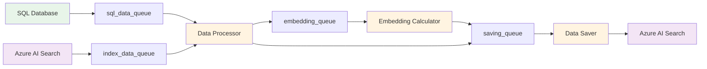

# Indexer - Semantic Search Index Synchronization

**Last Updated:** 2025-12-17  
**Audience:** Business Analysts, QA Professionals  
**Related:** [Solution Overview](01-solution-overview.md) | [Semantic Search Stage](06-semantic-search-stage.md)

## Overview

The Indexer is a background service that synchronizes product data from the SQL database to Azure AI Search, enabling fast semantic search capabilities for the invoice processing pipeline. It maintains a search index with vector embeddings that allow the system to find similar products based on meaning rather than just exact text matches.

The indexer runs as a standalone process (typically as a scheduled job) and uses a multi-threaded architecture to efficiently process large volumes of product data. It handles incremental updates, detecting which records need to be created, updated, or deleted in the search index.

## Key Concepts

### Azure AI Search
Microsoft's cloud-based search service that provides full-text search, vector search, and hybrid search capabilities. The indexer populates this service with product data.

### Vector Embeddings
Numerical representations of text (product descriptions) that capture semantic meaning. These embeddings allow the system to find similar products even when the exact words don't match. For example, "insulating sleeve" and "insulation bushing" would have similar embeddings.

### Hybrid Search
A search approach that combines:
- **Vector Search**: Finds semantically similar items using embeddings
- **Keyword Search**: Finds exact or partial text matches
- **Semantic Ranking**: Re-ranks results based on relevance

### Multi-Threaded Architecture
The indexer uses multiple threads working in parallel:
- **Data Readers**: Fetch data from SQL and Azure AI Search
- **Data Processor**: Compares and determines what needs updating
- **Embedding Calculator**: Generates vector embeddings for descriptions
- **Data Saver**: Writes changes to Azure AI Search
- **Queue Monitor**: Tracks progress and performance

### Incremental Synchronization
Rather than rebuilding the entire index each time, the indexer compares SQL data with existing index data and only processes changes (creates, updates, deletes). This makes the process much faster for routine updates.

## Python Modules

### indexer/semantic_search_indexer.py
Main indexer implementation with multi-threaded processing.

**Key Classes:**

- `Indexer` - Main orchestrator class
  - `__init__(config, rebuild, max_records)` - Initialize with configuration
  - `run()` - Start the indexing process
  - `prepare_index()` - Create or rebuild the search index
  - `create_search_index()` - Define index schema and configuration

**Thread Methods:**

- `sql_data_reader()` - Reads product data from SQL database
- `index_data_reader()` - Reads existing data from search index
- `data_processor()` - Compares SQL and index data, determines actions
- `embedding_calculator()` - Generates vector embeddings for descriptions
- `data_saver()` - Writes changes to search index with retry logic
- `queue_monitor()` - Monitors queue sizes and progress

**Helper Methods:**

- `_process_sql_data_async()` - Async helper for SQL data fetching
- `_compare_and_update_record()` - Compares timestamps to detect changes
- `_queue_create_record()` - Prepares new records for creation
- `_queue_delete_record()` - Prepares records for deletion
- `_process_embedding_batch()` - Calculates embeddings in batches
- `_save_batch()` - Saves batch of documents with quota retry logic
- `_is_quota_error()` - Detects Azure Search quota errors
- `_terminate_process()` - Signals all threads to stop on critical error
- `_drain_queues()` - Empties queues to prevent further processing

**Utility Classes:**

- `ProgressTracker` - Tracks and reports processing progress
  - `update(increment)` - Update progress counter
  - `final_report()` - Generate final statistics

**Entry Points:**

- `run_indexing(config, rebuild, max_records)` - Programmatic entry point
- `main_cli()` - Command-line interface entry point

### azure_search_utils.py
Utilities for interacting with Azure AI Search.

**Key Methods:**

- `create_index()` - Creates search index with schema
- `delete_index()` - Deletes existing index
- `index_exists()` - Checks if index exists
- `upload_documents()` - Uploads batch of documents to index
- `search()` - Performs search queries
- `create_vector_search_config()` - Configures vector search settings
- `create_semantic_search_config()` - Configures semantic search settings

### llm.py
LLM client wrapper for generating embeddings.

**Key Methods:**

- `get_embeddings(texts)` - Generates vector embeddings for text list

### sql_utils.py
SQL database utilities for data retrieval.

**Key Methods:**

- `get_all_index_data(sdp, batch_size)` - Async generator that yields product data batches

## Configuration

The indexer is configured through the `config.yaml` file and Azure App Configuration:

### Indexer Settings (config.yaml)

```yaml
INDEXER_SETTINGS:
  batch_size: 400                    # Records per batch for processing
  max_queue_size: 4000               # Maximum queue size (10x batch_size)
  min_sql_records: 100000            # Minimum records required from SQL
  max_quota_retries: 5               # Max retries for quota errors
  quota_retry_delay_minutes: 10      # Delay between quota retries
```

### Configuration Parameters

| Parameter | Type | Description | Default |
|-----------|------|-------------|---------|
| `batch_size` | int | Number of records to process in each batch | 400 |
| `max_queue_size` | int | Maximum size of inter-thread queues | 4000 |
| `min_sql_records` | int | Safety check: minimum records expected from SQL | 100000 |
| `max_quota_retries` | int | Maximum retry attempts for quota errors | 5 |
| `quota_retry_delay_minutes` | int | Minutes to wait between quota retries | 10 |

### Azure AI Search Configuration

The indexer requires Azure AI Search credentials configured in the Config object:

- **Endpoint**: Azure AI Search service URL
- **Index Name**: Name of the search index to create/update
- **API Key**: Authentication key for Azure AI Search
- **Embedding Dimensions**: Dimension size for vector embeddings (1536 for text-embedding-3-large)

### Embedding Model Configuration

- **Model**: text-embedding-3-large (Azure OpenAI)
- **Dimensions**: 1536
- **Purpose**: Generate semantic vector representations of product descriptions

## Business Logic

### Index Schema

The search index contains the following fields for each product:

**Key Field:**
- `DescriptionID` (String, Key) - Unique identifier combining ItemID and DescriptionID

**Product Fields:**
- `ItemID` (Int32) - Product item identifier
- `MfrName` (String) - Manufacturer name
- `MfrPartNum` (String) - Manufacturer part number (original)
- `MfrPartNumExact` (String) - Part number with separators removed (-, /, .)
- `MfrPartNumPrefix` (String) - Part number for prefix matching (n-gram indexed)
- `UPC` (String) - UPC barcode
- `AKPartNum` (String) - AKS internal part number
- `UNSPSC` (String) - UNSPSC classification code
- `ItemSourceName` (String) - Source of item data
- `ItemLastModified` (DateTimeOffset) - Last modification timestamp for item

**Description Fields:**
- `ItemDescription` (String) - Product description text
- `ItemDescription_vector` (Collection<Single>) - Vector embedding of description (1536 dimensions)
- `DescSourceName` (String) - Source of description data
- `DescLastModified` (DateTimeOffset) - Last modification timestamp for description

### Custom Analyzers

The index uses custom text analyzers for specialized search behavior:

**ngram_front_analyzer:**
- Purpose: Enable prefix matching for part numbers
- Tokenizer: keyword_v2 (treats input as single token)
- Token Filters: lowercase, front_edgeNGram (6-30 characters)
- Example: "T B 425" generates tokens: "t b 42", "t b 425"

**custom_keyword_analyzer:**
- Purpose: Exact matching with case-insensitivity
- Tokenizer: keyword_v2
- Token Filters: lowercase
- Example: "T&B-425" becomes "t&b-425" (single token)

### Vector Search Configuration

**Algorithm**: HNSW (Hierarchical Navigable Small World)
- **m**: 8 (number of bi-directional links per node)
- **ef_construction**: 600 (size of dynamic candidate list during index build)
- **ef_search**: 800 (size of dynamic candidate list during search)
- **metric**: cosine (similarity measure)

These settings are optimized for text-embedding-3-large (1536 dimensions) and balance accuracy with performance.

### Incremental Update Logic

The indexer uses a merge-based approach to synchronize data:

1. **Read Both Sources**
   - SQL data reader fetches product records from database
   - Index data reader fetches existing records from search index
   - Both sources are sorted by ItemID and DescriptionID

2. **Compare Records**
   - Data processor compares records from both sources
   - Uses composite key (ItemID + DescriptionID) for matching

3. **Determine Actions**
   - **Create**: SQL record exists, index record doesn't exist
   - **Update**: Both exist, but SQL timestamps are newer
   - **Delete**: Index record exists, SQL record doesn't exist
   - **No Action**: Both exist with same timestamps

4. **Timestamp Comparison**
   - `ItemLastModified`: Triggers update of item-level fields (manufacturer, part number, UPC, UNSPSC)
   - `DescLastModified`: Triggers update of description and recalculation of embedding

5. **Embedding Calculation**
   - Only calculated for new records or when description changes
   - Expensive operation, so avoided when possible

### Data Flow Through Queues



**Queue Flow:**

1. **sql_data_queue**: Holds records read from SQL database
2. **index_data_queue**: Holds records read from search index
3. **embedding_queue**: Holds records that need embeddings calculated
4. **saving_queue**: Holds records ready to be saved to index

**Queue Sizes:**
- Maximum size: 4000 records (configurable)
- Prevents memory overflow
- Provides backpressure when downstream processing is slow

### Batch Processing

All operations are performed in batches for efficiency:

**Batch Size**: 400 records (configurable)

**Batching Benefits:**
- Reduces API calls to Azure AI Search
- Improves embedding calculation efficiency
- Amortizes network overhead

**Batch Operations:**
- SQL reads: Fetch 400 records at a time
- Index reads: Fetch 400 records at a time
- Embedding calculation: Process 400 descriptions at once
- Index writes: Upload 400 documents at once

## Processing Flow

### Startup Sequence

1. **Initialize Configuration**
   - Load settings from config.yaml
   - Connect to SQL database
   - Connect to Azure AI Search
   - Initialize LLM client for embeddings

2. **Prepare Index**
   - Check if index exists
   - If `--rebuild` flag set, delete existing index
   - Create index with schema if doesn't exist
   - Configure vector search and semantic search

3. **Start Worker Threads**
   - SQL Data Reader thread
   - Index Data Reader thread
   - Data Processor thread
   - Embedding Calculator thread
   - Data Saver thread
   - Queue Monitor thread

4. **Begin Processing**
   - Threads start reading and processing data
   - Queues fill with records
   - Progress is tracked and reported

### Main Processing Loop

**SQL Data Reader:**
1. Query SQL database for all product records
2. Fetch records in batches of 400
3. Put each record into sql_data_queue
4. Report progress every 5% or 5000 records
5. Signal completion when all records read

**Index Data Reader:**
1. Query Azure AI Search for all existing records
2. Fetch records in batches of 400, sorted by ItemID and DescriptionID
3. Use composite key filtering for pagination
4. Put each record into index_data_queue
5. Signal completion when all records read

**Data Processor:**
1. Get one record from sql_data_queue
2. Get one record from index_data_queue
3. Compare composite keys (ItemID + DescriptionID)
4. Determine action:
   - If SQL key < Index key: Create SQL record
   - If SQL key > Index key: Delete index record
   - If keys match: Compare timestamps
     - If SQL timestamps newer: Update record
     - If timestamps same: No action
5. Queue appropriate action
6. Repeat until both queues empty
7. Signal completion

**Embedding Calculator:**
1. Get records from embedding_queue
2. Accumulate into batch of 400
3. Extract description text from each record
4. Call LLM API to generate embeddings for batch
5. Add embeddings back to records
6. Put records into saving_queue
7. Repeat until embedding_queue empty
8. Signal completion

**Data Saver:**
1. Get records from saving_queue
2. Accumulate into batch of 400
3. Prepare documents for Azure AI Search:
   - Convert numpy arrays to lists
   - Handle null values
   - Set appropriate @search.action (upload, merge, delete)
4. Upload batch to Azure AI Search
5. Handle quota errors with retry logic
6. Update metrics (created, updated, deleted counts)
7. Repeat until saving_queue empty
8. Complete when all records saved

**Queue Monitor:**
1. Every 30 seconds, log queue sizes
2. Log processing metrics (processed, created, updated, deleted, embeddings)
3. Check if all processing complete
4. Stop when all threads signal completion

### Shutdown Sequence

1. **Wait for Completion**
   - All threads signal completion via threading events
   - Main thread waits for all worker threads to finish

2. **Calculate Final Statistics**
   - Total processing time
   - Records processed from SQL
   - Records created in index
   - Records updated in index
   - Records deleted from index
   - Embeddings calculated

3. **Log Results**
   - Success or failure status
   - Final statistics
   - Any errors encountered

4. **Return Status**
   - True for success
   - False for failure

## Error Handling

### Quota Error Handling

Azure AI Search has rate limits that can be exceeded during large indexing operations.

**Detection:**
- Catch `HttpResponseError` exceptions
- Check if error message contains "quota has been exceeded"

**Retry Logic:**
1. Detect quota error during batch upload
2. Wait for configured delay (default: 10 minutes)
3. Retry the same batch
4. Repeat up to max retries (default: 5)
5. If still failing after max retries, terminate process

**Configuration:**
- `max_quota_retries`: Maximum retry attempts (5)
- `quota_retry_delay_minutes`: Delay between retries (10 minutes)

**During Retry Wait:**
- Check termination event every second
- Allow graceful shutdown if requested
- Log warning messages about quota status

### Circuit Breaker Pattern

The indexer implements a circuit breaker to prevent cascading failures:

**Termination Event:**
- Shared flag across all threads
- Set when critical error detected
- Checked before blocking operations

**Critical Errors:**
- SQL connection failure
- Azure AI Search connection failure
- Insufficient SQL data (below minimum threshold)
- Persistent quota errors
- Unexpected exceptions in any thread

**Termination Process:**
1. Set termination event flag
2. Set all completion events (prevent deadlocks)
3. Drain all queues (prevent "missing embedding" errors)
4. Log termination reason
5. All threads check flag and exit gracefully

### Safety Checks

**Minimum SQL Records Check:**
- Purpose: Prevent accidental deletion of index data
- Threshold: 100,000 records (configurable)
- Behavior: If SQL returns fewer records than threshold, terminate immediately
- Rationale: Protects against SQL query errors or database issues

**Connection Error Handling:**
- SQL connection errors: Set flag, terminate all threads
- Index connection errors: Set flag, terminate all threads
- Prevents partial updates that could corrupt index

### Error Recovery

**Queue Draining:**
- When termination signaled, empty all queues
- Prevents downstream threads from processing stale data
- Avoids "missing embedding" errors

**Graceful Shutdown:**
- All threads check termination event regularly
- Exit loops cleanly when event set
- Join threads to ensure complete shutdown

**Metrics Preservation:**
- Final statistics logged even on failure
- Helps diagnose issues
- Shows how much work completed before failure

## Dependencies

### Required Services

1. **SQL Database (SDP)**
   - Purpose: Source of product data
   - Tables: Product items, descriptions, manufacturers
   - Dependency: Must be accessible and contain data
   - Failure Impact: Indexer cannot run without SQL data

2. **Azure AI Search**
   - Purpose: Destination for indexed data
   - Dependency: Service must be provisioned and accessible
   - Failure Impact: Cannot create or update index

3. **Azure OpenAI**
   - Purpose: Generate vector embeddings
   - Model: text-embedding-3-large
   - Dependency: Deployment must be available
   - Failure Impact: Cannot calculate embeddings for new/updated descriptions

### Module Dependencies

- `config.py` - Configuration management
- `sdp.py` - SQL database connection
- `azure_search_utils.py` - Azure AI Search operations
- `llm.py` - LLM client for embeddings
- `sql_utils.py` - SQL query utilities
- `utils.py` - General utilities (remove_separators, etc.)

### Used By

- **SEMANTIC_SEARCH Stage** - Depends on indexer having populated the search index
- **Invoice Processing Pipeline** - Requires up-to-date index for semantic matching

### Execution Schedule

The indexer typically runs as:
- **Scheduled Job**: Nightly or weekly updates
- **Manual Execution**: After bulk data imports
- **Command Line**: For testing or troubleshooting

## Examples

### Example 1: Full Index Rebuild

**Scenario**: Initial setup or major schema change requires complete rebuild.

**Command:**
```bash
python indexer/semantic_search_indexer.py --rebuild
```

**Process:**
1. Delete existing index (if exists)
2. Create new index with schema
3. Read all 500,000 products from SQL
4. Generate embeddings for all descriptions
5. Upload all records to new index

**Duration**: ~2-3 hours for 500,000 products

**Output:**
```
Starting indexer run...
Deleting existing index due to rebuild flag...
Creating search index...
Found 500000 records in SQL database.
SQL data processing: 25000/500000 records (5.0%), 125.5 records/sec, est. 3780s remaining
...
Embedding calculator completed. Generated embeddings for 500000 documents.
Data saver completed processing loop. Received 500000 documents.
--- Final Indexer Run Statistics ---
Outcome: Completed Successfully
Total processing time: 02h:15m:33s
Total records processed: 500000
Records created in index: 500000
Records updated in index: 0
Records deleted from index: 0
Embeddings calculated: 500000
```

### Example 2: Incremental Update

**Scenario**: Daily update to sync recent changes.

**Command:**
```bash
python indexer/semantic_search_indexer.py
```

**Process:**
1. Index already exists, skip creation
2. Read all 500,000 products from SQL
3. Read all 500,000 existing records from index
4. Compare timestamps to find changes
5. Only process changed records (e.g., 1,000 updates)
6. Generate embeddings only for updated descriptions
7. Upload only changed records

**Duration**: ~15-20 minutes for 1,000 changes

**Output:**
```
Starting indexer run...
Search index already exists. Proceeding with data synchronization.
Found 500000 records in SQL database.
Index data reader completed. Found 500000 records in index.
Data processor completed. Processed 500000 records.
Total SQL records: 500000, Total index records: 500000
Records to create: 50, update: 950, delete: 25
Embedding calculator completed. Generated embeddings for 1000 documents.
--- Final Indexer Run Statistics ---
Outcome: Completed Successfully
Total processing time: 00h:18m:42s
Total records processed: 500000
Records created in index: 50
Records updated in index: 950
Records deleted from index: 25
Embeddings calculated: 1000
```

### Example 3: Limited Test Run

**Scenario**: Testing indexer with small dataset.

**Command:**
```bash
python indexer/semantic_search_indexer.py --max 1000
```

**Process:**
1. Process only first 1,000 records from SQL
2. Compare with first 1,000 records from index
3. Useful for testing without full data load

**Duration**: ~2-3 minutes

**Output:**
```
Starting indexer run...
Found 500000 records in SQL database.
Reached max records limit (1000). Stopping SQL data reader.
SQL data reader finished processing 1000/500000 records.
Data processor completed. Processed 1000 records.
--- Final Indexer Run Statistics ---
Outcome: Completed Successfully
Total processing time: 00h:02m:15s
Total records processed: 1000
Records created in index: 10
Records updated in index: 15
Records deleted from index: 5
Embeddings calculated: 25
```

### Example 4: Quota Error with Retry

**Scenario**: Azure AI Search quota exceeded during large upload.

**Process:**
1. Indexer uploads batch of 400 documents
2. Azure AI Search returns quota error
3. Indexer waits 10 minutes
4. Retries the same batch
5. Succeeds on retry

**Log Output:**
```
Saving batch of 400 documents
Azure Search quota exceeded for batch ID 140234567890. Waiting 10 minutes before retry 1/5...
[10 minutes later]
Batch ID 140234567890: Attempting upload, retry 2/6
Batch ID 140234567890: Upload API call succeeded after 1 retries.
Batch ID 140234567890: Metrics counts: Created=400, Updated=0, Deleted=0
```

### Example 5: Insufficient SQL Data Error

**Scenario**: SQL query returns unexpectedly few records (potential database issue).

**Process:**
1. SQL data reader queries database
2. Receives only 50,000 records (below 100,000 minimum)
3. Indexer detects safety violation
4. Terminates immediately to protect index
5. Does not delete any existing index data

**Log Output:**
```
Starting indexer run...
Found 50000 records in SQL database.
SQL database returned 50000 records, which is less than the required minimum of 100000.
Stopping indexer to protect search index data.
Critical error detected. Terminating all processing.
Draining queues to prevent further processing...
--- Final Indexer Run Statistics ---
Outcome: Terminated Due to Error(s)
Total processing time: 00h:00m:15s
Total records processed: 0
Records created in index: 0
Records updated in index: 0
Records deleted from index: 0
Embeddings calculated: 0
```

## Performance Characteristics

### Throughput

**Full Rebuild:**
- ~125-150 records/second
- Bottleneck: Embedding calculation (API rate limits)
- 500,000 records: 2-3 hours

**Incremental Update:**
- ~400-500 records/second (for comparison only)
- ~125-150 records/second (for records needing embeddings)
- 1,000 changes: 15-20 minutes

### Resource Usage

**Memory:**
- Queue sizes: 4,000 records × 4 queues = ~16,000 records in memory
- Each record: ~2-5 KB
- Total: ~80-100 MB for queues
- Embeddings: 1536 dimensions × 4 bytes × batch size = ~2.5 MB per batch

**CPU:**
- Moderate usage across 6 threads
- Spikes during embedding calculation
- Most time spent waiting on I/O

**Network:**
- SQL queries: Moderate bandwidth
- Azure AI Search uploads: Moderate bandwidth
- Azure OpenAI embedding API: High request rate

### Optimization Strategies

**Batch Size:**
- Larger batches: Fewer API calls, more memory
- Smaller batches: More API calls, less memory
- Default 400 is balanced for most scenarios

**Queue Size:**
- Larger queues: More buffering, smoother flow
- Smaller queues: Less memory, more backpressure
- Default 4,000 (10× batch size) works well

**Thread Count:**
- Fixed at 6 threads (5 workers + 1 monitor)
- More threads wouldn't help (I/O bound)
- Fewer threads would slow processing

## Monitoring and Troubleshooting

### Progress Monitoring

**Queue Monitor Output (every 30 seconds):**
```
[QUEUE SIZES] SQL Data: 3200; Index Data: 2800; Embedding: 1600; Saving: 800
[PROGRESS] Processed: 125000, Created: 1200, Updated: 3500, Deleted: 150, Embeddings: 4700
```

**Interpretation:**
- Queue sizes show data flow through pipeline
- If queues consistently full: Downstream bottleneck
- If queues consistently empty: Upstream bottleneck
- Progress shows cumulative metrics

### Common Issues

**Issue: Slow Embedding Calculation**
- Symptom: embedding_queue stays full, saving_queue stays empty
- Cause: Azure OpenAI rate limits
- Solution: Reduce batch_size or increase quota

**Issue: Quota Errors**
- Symptom: Repeated "quota exceeded" messages
- Cause: Azure AI Search rate limits
- Solution: Increase quota_retry_delay_minutes or upgrade tier

**Issue: Memory Usage High**
- Symptom: System running out of memory
- Cause: Queue sizes too large
- Solution: Reduce max_queue_size

**Issue: SQL Connection Timeout**
- Symptom: "SQL connection error" in logs
- Cause: Database unavailable or network issue
- Solution: Check database status, retry later

**Issue: Index Not Updating**
- Symptom: Records processed but not appearing in index
- Cause: Timestamps not newer than existing records
- Solution: Check SQL data timestamps, force rebuild if needed

### Health Checks

**Before Running:**
- SQL database accessible
- Azure AI Search service available
- Azure OpenAI deployment available
- Sufficient quota on all services

**During Execution:**
- Monitor queue sizes for bottlenecks
- Watch for error messages in logs
- Check progress reports for reasonable throughput

**After Completion:**
- Verify final statistics match expectations
- Check index record count matches SQL count
- Test search functionality with sample queries
