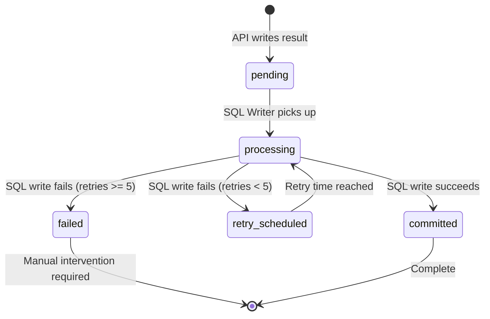
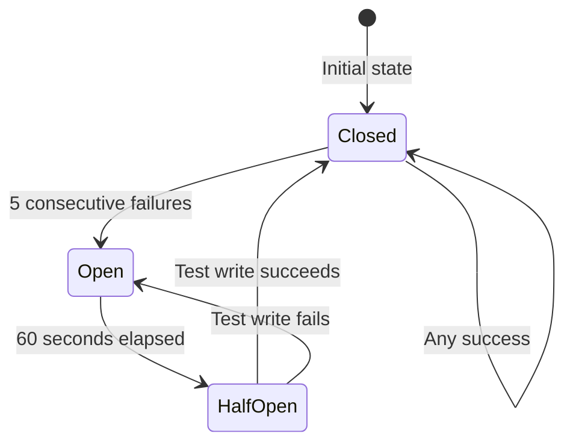

# SQL Writer - Background Database Update Service

**Last Updated:** 2025-12-17  
**Audience:** Business Analysts, QA Professionals  
**Related:** [Solution Overview](01-solution-overview.md) | [Processing Pipeline](01-solution-overview.md#processing-flow)

## Overview

The SQL Writer Service is a background service that asynchronously writes AI processing results from Cosmos DB to the SQL database. It operates independently from the main API processing, ensuring that database writes don't block API responses and that failed writes can be retried without affecting the user experience.

The service continuously polls Cosmos DB for completed processing documents, extracts the results, and updates the corresponding invoice detail records in the SQL database. It implements sophisticated error handling including retry logic with exponential backoff, circuit breaker pattern for SQL outages, and poison pill handling for documents that repeatedly fail.

## Key Concepts

### Asynchronous Processing
The SQL Writer runs in a separate background thread, completely independent from the FastAPI API thread. This separation ensures:
- API responses are fast (results written to Cosmos DB immediately)
- Database writes happen in the background
- Failed writes can be retried without user impact
- System remains responsive even during database issues

### Cosmos DB as Message Queue
Cosmos DB serves as a durable message queue between the API and SQL Writer:
- API writes processing results to Cosmos DB with status "pending"
- SQL Writer polls for documents with status "pending" or "retry_scheduled"
- After successful SQL write, document status updated to "committed"
- Failed writes marked for retry or as "failed" (poison pill)

### Retry Logic with Exponential Backoff
When SQL writes fail, the service doesn't give up immediately:
- First retry: Wait 2 minutes
- Second retry: Wait 4 minutes
- Third retry: Wait 8 minutes
- Fourth retry: Wait 16 minutes
- Fifth retry: Wait 32 minutes
- Maximum wait: 1 hour (capped)
- After 5 retries: Mark as poison pill

### Circuit Breaker Pattern
Prevents cascading failures during SQL outages:
- **Closed State**: Normal operation, all writes attempted
- **Open State**: After 5 consecutive failures, stop attempting writes for 60 seconds
- **Half-Open State**: After 60 seconds, try one write to test if SQL is back
- If test succeeds: Return to closed state
- If test fails: Return to open state for another 60 seconds

### Poison Pill Handling
Documents that fail after maximum retries are marked as "poison pills":
- Status set to "failed" in Cosmos DB
- Invoice line status set to "AI-ERROR" in SQL (if possible)
- Error details logged for manual review
- Document won't be retried automatically
- Requires manual intervention to resolve


### Duplicate Invoice Detail Handling
The SQL Writer handles duplicate invoice details (same invoice number, different detail IDs):
- Main invoice detail processed first
- Duplicate IDs processed sequentially (one at a time)
- All duplicates updated with same values as main detail
- Sequential processing prevents SQL deadlocks
- All writes must succeed for document to be marked "committed"

## Python Modules

### sql_writer.py
Main SQL Writer Service implementation.

**Key Class:**

- `SqlWriterService` - Background service for writing to SQL
  - `__init__(config, sdp, cdb)` - Initialize with configuration and database connections
  - `start()` - Start the background service thread
  - `stop()` - Stop the service gracefully
  - `is_running()` - Check if service is running

**Main Loop:**

- `_run_loop()` - Main orchestrator that polls Cosmos DB and dispatches work
  - Polls Cosmos DB for pending documents
  - Submits documents to thread pool for processing
  - Handles results as they complete (producer-consumer pattern)
  - Implements circuit breaker checks
  - Handles Cosmos DB connection errors

**Document Processing:**

- `_process_single_document(doc)` - Processes one document
  - Validates document structure
  - Extracts invoice detail IDs and results
  - Calls SQL write operations
  - Marks document as committed on success
  - Raises exception on failure (caught by orchestrator)

- `_process_sql_writes(main_id, duplicate_ids, results)` - Async SQL writes
  - Writes main invoice detail
  - Writes duplicate invoice details sequentially
  - All operations in single event loop

**Error Handling:**

- `_handle_processing_failure(doc, e, partition_key)` - Orchestrates error handling
  - Records failure for circuit breaker
  - Determines if retry or poison pill
  - Calls appropriate handler

- `_schedule_retry(doc, e, partition_key)` - Schedules document for retry
  - Increments retry count
  - Calculates backoff time
  - Updates Cosmos DB with retry_scheduled status
  - Sets retry_after timestamp

- `_handle_poison_pill(doc, e, partition_key)` - Marks document as failed
  - Attempts to set SQL status to AI-ERROR
  - Marks document as "failed" in Cosmos DB
  - Logs error details for manual review

**Circuit Breaker:**

- `_check_circuit_breaker()` - Checks if operations should proceed
  - Returns True if closed or half-open
  - Returns False if open (with timeout check)

- `_record_success()` - Records successful operation
  - Resets consecutive failure count
  - Closes circuit breaker if half-open

- `_record_failure()` - Records failed operation
  - Increments consecutive failure count
  - Opens circuit breaker after threshold
  - Records failure timestamp

**Utilities:**

- `_get_backoff_time(retry_count)` - Calculates exponential backoff
  - Formula: min(3600, 120 * 2^retry_count)
  - Returns seconds to wait before retry

- `_get_thread_loop()` - Gets or creates event loop for thread
  - Prevents "Event loop is closed" errors
  - Maintains persistent loop per worker thread

### sql_utils.py
SQL database utilities for writing invoice data.

**Key Methods:**

- `update_invoice_detail_and_tracking_values_by_id()` - Updates single invoice detail
  - Updates IVCE_DTL table with extracted values
  - Upserts IVCE_TRKG_MSTR table with tracking data
  - Handles duplicate flag and parent detail ID

- `bulk_update_invoice_line_status()` - Updates status for multiple invoice details
  - Used to set AI-ERROR status for poison pills
  - Updates multiple records in single transaction

### worker.py
Worker thread management (starts SQL Writer).

**Key Methods:**

- `Worker.start_worker_thread()` - Starts supervisor and worker threads
  - Starts SQL Writer Service
  - Starts invoice processing workers

## Configuration

The SQL Writer is configured through the `config.yaml` file and Azure App Configuration:

### SQL Writer Settings (config.yaml)

```yaml
SQL_WRITER_SETTINGS:
  batch_size: 25                     # Documents per batch from Cosmos DB
  poll_interval_seconds: 5           # Seconds between Cosmos DB polls
  max_workers: 1                     # Thread pool size (MUST be 1 for production)
```

### Configuration Parameters

| Parameter | Type | Description | Default | Recommendation |
|-----------|------|-------------|---------|----------------|
| `batch_size` | int | Number of documents to fetch per poll | 25 | 25-50 for balanced throughput |
| `poll_interval_seconds` | int/float | Seconds to wait between polls when no documents | 5 | 5-10 seconds |
| `max_workers` | int | Thread pool size for parallel processing | 1 | **MUST be 1 to prevent SQL deadlocks** |

### Hard-Coded Constants

These are defined in the `SqlWriterService` class:

| Constant | Value | Description |
|----------|-------|-------------|
| `CIRCUIT_BREAKER_THRESHOLD` | 5 | Consecutive failures before opening circuit |
| `CIRCUIT_BREAKER_TIMEOUT` | 60 | Seconds to wait before half-open attempt |
| `MAX_RETRIES` | 5 | Maximum retry attempts per document |
| `INITIAL_BACKOFF` | 120 | Initial backoff time in seconds (2 minutes) |
| `MAX_BACKOFF` | 3600 | Maximum backoff time in seconds (1 hour) |

### Environment-Specific Behavior

**Local Environment:**
- Filters documents by `sys_name` from config (e.g., "kirill", "john")
- Allows multiple developers to work independently
- Each developer only processes their own documents

**Web Environment (Dev/Prod):**
- Filters documents by `sys_name = 'web'`
- Processes all production API requests
- Single SQL Writer instance per environment

## Business Logic

### Document Status Flow



### Document Structure in Cosmos DB

Each document contains:

**Request Details:**
- `id`: Unique request ID (also partition key)
- `total_invoice_detail_ids`: Number of details in request
- `api_request_uuid`: UUID from API call
- `sys_name`: System name (web, local user name)

**Invoice Details from RPA:**
- `IVCE_DTL_UID`: Main invoice detail ID
- `IVCE_NUM`: Invoice number
- `ITM_LDSC`: Item description
- Other RPA-provided fields

**Process Output:**
- `manufacturer_name`: Extracted manufacturer
- `part_number`: Extracted part number
- `unspsc`: Extracted UNSPSC code
- `invoice_line_status`: RC-AI, DS1, or AI_ERROR
- Confidence scores and stage information

**Post-Processing:**
- `duplicate_detail_uids`: List of duplicate invoice detail IDs

**SQL Writer Metadata:**
- `status`: pending, retry_scheduled, committed, failed
- `retry_count`: Number of retry attempts
- `retry_after`: Timestamp when retry should occur
- `last_error`: Error message from last failure
- `committed_at`: Timestamp when committed
- `failed_at`: Timestamp when marked as poison pill

### Polling Logic

The SQL Writer continuously polls Cosmos DB with this query:

```sql
WHERE (
  (c.sql_writer.status = 'pending') OR 
  (c.sql_writer.status = 'retry_scheduled' AND c.sql_writer.retry_after <= {current_timestamp})
) AND c.request_details.sys_name = 'web'
```

**Query Explanation:**
- Fetches documents with status "pending" (never attempted)
- Fetches documents with status "retry_scheduled" where retry time has passed
- Filters by sys_name for environment isolation
- Orders by creation time (oldest first)
- Limits to batch_size (e.g., 25 documents)

**Batch Size Optimization:**
- If full batch fetched (e.g., 25 documents), query total count to estimate queue depth
- Logs "Approximately X more documents are pending" for visibility
- Helps operators understand backlog size

### Processing Flow

1. **Poll Cosmos DB**
   - Check circuit breaker state
   - If open, wait for timeout
   - Query for pending/retry documents
   - Fetch batch (e.g., 25 documents)

2. **Submit to Thread Pool**
   - Submit all documents to ThreadPoolExecutor
   - Process results as they complete (producer-consumer)
   - Allows fetching next batch while processing current batch

3. **Process Each Document**
   - Validate document structure
   - Extract invoice detail IDs (main + duplicates)
   - Extract processing results
   - Write to SQL database
   - Mark as committed in Cosmos DB

4. **Handle Success**
   - Update Cosmos DB status to "committed"
   - Record committed_at timestamp
   - Record success for circuit breaker
   - Log success message

5. **Handle Failure**
   - Record failure for circuit breaker
   - Check retry count
   - If < 5 retries: Schedule retry with backoff
   - If >= 5 retries: Mark as poison pill

6. **Repeat**
   - Continue polling until service stopped
   - Sleep for poll_interval if no documents found

### SQL Write Operations

For each document, the SQL Writer performs these operations:

**Main Invoice Detail:**
1. Update `IVCE_DTL` table:
   - `CLN_MFR_AI_NM`: Manufacturer name
   - `CLN_MFR_PRT_NUM`: Part number
   - `UNSPSC_CD`: UNSPSC code
   - `UPC_CD`: UPC code
   - `AKS_PRT_NUM`: AKS part number
   - `ITM_AI_LDSC`: Cleaned description
   - `IVCE_LNE_STAT`: Invoice line status
   - `DATA_VRFN_IND`: Verification flag
   - `WEB_SRCH_URL`: Web search URL
   - Confidence scores and stage information

2. Upsert `IVCE_TRKG_MSTR` table:
   - All extracted values
   - Processing timestamps
   - Stage results
   - Confidence scores

**Duplicate Invoice Details:**
- Same operations as main detail
- Processed sequentially (one at a time)
- `PRNT_IVCE_DTL_ID` set to main detail ID
- Prevents SQL deadlocks from concurrent updates

### Exponential Backoff Calculation

The backoff time increases exponentially with each retry:

```
backoff_time = min(MAX_BACKOFF, INITIAL_BACKOFF * 2^retry_count)
```

**Examples:**
- Retry 0 (first failure): min(3600, 120 * 2^0) = 120 seconds (2 minutes)
- Retry 1: min(3600, 120 * 2^1) = 240 seconds (4 minutes)
- Retry 2: min(3600, 120 * 2^2) = 480 seconds (8 minutes)
- Retry 3: min(3600, 120 * 2^3) = 960 seconds (16 minutes)
- Retry 4: min(3600, 120 * 2^4) = 1920 seconds (32 minutes)
- Retry 5: min(3600, 120 * 2^5) = 3600 seconds (1 hour, capped)

**Rationale:**
- Short initial delay for transient errors
- Longer delays for persistent issues
- Cap prevents excessive wait times
- Gives SQL database time to recover

### Circuit Breaker State Machine



**State Behaviors:**

**Closed (Normal Operation):**
- All writes attempted
- Failures increment counter
- After 5 consecutive failures, transition to Open

**Open (Circuit Tripped):**
- No writes attempted
- Wait 60 seconds
- Log "Circuit breaker is open. Retrying in Xs."
- After 60 seconds, transition to Half-Open

**Half-Open (Testing):**
- Allow one write attempt
- If succeeds: Reset counter, transition to Closed
- If fails: Transition back to Open for another 60 seconds

**Benefits:**
- Prevents overwhelming failed SQL server
- Gives SQL time to recover
- Automatic recovery when SQL comes back
- Reduces log spam during outages

## Error Handling

### Retry Logic

**When Retry is Triggered:**
- SQL connection timeout
- SQL query timeout
- SQL deadlock (should not happen with max_workers=1)
- SQL constraint violation
- Any exception during SQL write

**Retry Process:**
1. Catch exception in `_process_single_document()`
2. Call `_handle_processing_failure()`
3. Record failure for circuit breaker
4. Check retry count
5. If < 5: Call `_schedule_retry()`
6. Calculate backoff time
7. Update Cosmos DB:
   - status = "retry_scheduled"
   - retry_count += 1
   - retry_after = current_time + backoff
   - last_error = error message
   - last_error_at = current timestamp
8. Document will be picked up again when retry_after time passes

**Retry Guarantees:**
- Document not lost (persisted in Cosmos DB)
- Retry time enforced (won't retry too soon)
- Error details preserved (for debugging)
- Exponential backoff prevents overwhelming SQL

### Poison Pill Handling

**When Poison Pill is Triggered:**
- Document has been retried 5 times
- All retries failed
- No more automatic retries will occur

**Poison Pill Process:**
1. Attempt to set SQL status to AI-ERROR
   - Extracts main and duplicate invoice detail IDs
   - Calls `bulk_update_invoice_line_status()`
   - Sets `IVCE_LNE_STAT = 'AI-ERROR'` for all IDs
   - If this fails, logs critical error (requires manual review)

2. Mark document as failed in Cosmos DB:
   - status = "failed"
   - error = error message
   - failed_at = current timestamp
   - retry_count = 5
   - final_error = SQL update error (if applicable)

3. Log warning for manual review

**Critical Edge Case:**
If the SQL update to AI-ERROR also fails:
- Document marked as "failed" in Cosmos DB
- SQL record remains in stale state (e.g., DS1 or RC-AI)
- Logged as "MANUAL REVIEW" required
- Operator must manually update SQL record

**Manual Intervention:**
- Query Cosmos DB for documents with status="failed"
- Review error messages
- Fix underlying issue (e.g., data validation, SQL schema)
- Manually update SQL record if needed
- Optionally reset document to "pending" to retry

### Circuit Breaker Error Handling

**Consecutive Failure Tracking:**
- Each failure increments `consecutive_failures` counter
- Each success resets counter to 0
- Counter persists across polling cycles

**Opening the Circuit:**
- After 5 consecutive failures, circuit opens
- Log: "Circuit breaker opening after 5 consecutive failures"
- All subsequent writes blocked for 60 seconds
- Prevents cascading failures

**Half-Open Testing:**
- After 60 seconds, allow one write
- If succeeds: Log "Circuit breaker closing after successful operation"
- If fails: Log "Circuit breaker reopening after failed test"

**Benefits:**
- Protects SQL database from overload
- Automatic recovery when SQL healthy
- Reduces error log spam
- Gives operators time to fix issues

### Cosmos DB Connection Error Handling

**Polling Errors:**
- If Cosmos DB query fails, increment `consecutive_cosmos_failures`
- Calculate backoff: same formula as retry logic
- Wait backoff time before retrying
- Log error with retry information

**Critical Errors:**
- Unexpected exceptions in main loop
- Increment `consecutive_cosmos_failures`
- Calculate backoff
- Log as CRITICAL
- Continue running (don't crash service)

**Recovery:**
- Service continues running even during Cosmos DB outages
- Automatically recovers when Cosmos DB available
- No manual intervention required

### Duplicate Handling

**Sequential Processing:**
- Main invoice detail written first
- Duplicate IDs written one at a time
- All in same event loop (same thread)
- Prevents SQL deadlocks

**Failure Scenarios:**

**Main Detail Fails:**
- Entire document fails
- No duplicates written
- Document scheduled for retry
- All writes will be retried together

**Duplicate Fails:**
- Entire document fails
- Main detail write rolled back (if in transaction)
- Document scheduled for retry
- All writes will be retried together

**Partial Success Not Allowed:**
- Either all writes succeed or all fail
- Ensures data consistency
- Duplicates always match main detail

## Dependencies

### Required Services

1. **Cosmos DB**
   - Purpose: Message queue for processing results
   - Container: AI_PROCESS_LOGS
   - Dependency: Must be accessible for reads and writes
   - Failure Impact: Service cannot poll for documents or update status

2. **SQL Database (SDP)**
   - Purpose: Destination for invoice detail updates
   - Tables: IVCE_DTL, IVCE_TRKG_MSTR
   - Dependency: Must be accessible for writes
   - Failure Impact: Writes fail, documents scheduled for retry, circuit breaker may open

### Module Dependencies

- `config.py` - Configuration management
- `sdp.py` - SQL database connection
- `cdb.py` - Cosmos DB connection
- `sql_utils.py` - SQL write operations
- `constants.py` - Status constants (DataStates)
- `logger.py` - Logging
- `utils.py` - Utility functions (timestamps)

### Depends On

- **API Processing** - Creates documents in Cosmos DB with status "pending"
- **AI Pipeline** - Generates processing results written to Cosmos DB

### Used By

- **Reporting Systems** - Read invoice detail data from SQL
- **Data Stewards** - Review invoice details with DS1 status
- **Downstream Systems** - Consume invoice data from SQL

## Examples

### Example 1: Successful Processing

**Scenario**: Document processed successfully on first attempt.

**Initial Document in Cosmos DB:**
```json
{
  "id": "2025-12-17 10:30:00.000000-06:00-0001-1421549",
  "request_details": {
    "id": "2025-12-17 10:30:00.000000-06:00-0001",
    "sys_name": "web"
  },
  "invoice_details_from_rpa": {
    "IVCE_DTL_UID": 1421549
  },
  "process_output": {
    "manufacturer_name": "THOMAS & BETTS",
    "part_number": "425",
    "unspsc": "39131711",
    "invoice_line_status": "RC-AI"
  },
  "post-processing": {
    "duplicate_detail_uids": []
  },
  "sql_writer": {
    "status": "pending",
    "retry_count": 0
  }
}
```

**Processing:**
1. SQL Writer polls Cosmos DB
2. Finds document with status "pending"
3. Extracts invoice detail ID: 1421549
4. Writes to SQL database successfully
5. Updates Cosmos DB status to "committed"

**Final Document:**
```json
{
  "sql_writer": {
    "status": "committed",
    "retry_count": 0,
    "committed_at": "2025-12-17 10:30:15.123456-06:00"
  }
}
```

**Log Output:**
```
SQL Writer: Found 1 documents to process.
SQL Writer: Successfully processed and committed doc ID 2025-12-17 10:30:00.000000-06:00-0001-1421549.
```

### Example 2: Transient Error with Retry

**Scenario**: SQL connection timeout on first attempt, succeeds on retry.

**Initial Attempt:**
1. SQL Writer picks up document
2. SQL connection times out
3. Exception caught
4. Document scheduled for retry

**Cosmos DB After First Failure:**
```json
{
  "sql_writer": {
    "status": "retry_scheduled",
    "retry_count": 1,
    "retry_after": 1734454920.0,
    "last_error": "Connection timeout",
    "last_error_at": "2025-12-17 10:30:00.000000-06:00"
  }
}
```

**Log Output:**
```
SQL Writer: Failed to process document ID 2025-12-17 10:30:00.000000-06:00-0001-1421549. Error: Connection timeout
SQL Writer: Scheduling document ID 2025-12-17 10:30:00.000000-06:00-0001-1421549 for retry 1/5 after 120s backoff
SQL Writer: Successfully scheduled retry for doc ID 2025-12-17 10:30:00.000000-06:00-0001-1421549.
```

**Retry Attempt (2 minutes later):**
1. SQL Writer polls Cosmos DB
2. Finds document with retry_after <= current_time
3. Processes document successfully
4. Updates status to "committed"

**Final Document:**
```json
{
  "sql_writer": {
    "status": "committed",
    "retry_count": 1,
    "committed_at": "2025-12-17 10:32:05.123456-06:00"
  }
}
```

### Example 3: Circuit Breaker Opens

**Scenario**: SQL database goes down, circuit breaker opens after 5 failures.

**Processing:**
1. Document 1 fails - consecutive_failures = 1
2. Document 2 fails - consecutive_failures = 2
3. Document 3 fails - consecutive_failures = 3
4. Document 4 fails - consecutive_failures = 4
5. Document 5 fails - consecutive_failures = 5, circuit opens

**Log Output:**
```
SQL Writer: Failed to process document ID doc1. Error: Connection refused
SQL Writer: Failed to process document ID doc2. Error: Connection refused
SQL Writer: Failed to process document ID doc3. Error: Connection refused
SQL Writer: Failed to process document ID doc4. Error: Connection refused
SQL Writer: Failed to process document ID doc5. Error: Connection refused
SQL Writer: Circuit breaker opening after 5 consecutive failures
SQL Writer: Circuit breaker is open. Retrying in 60.0s.
[60 seconds pass]
SQL Writer: Circuit breaker entering half-open state
[Test write succeeds]
SQL Writer: Circuit breaker closing after successful operation
```

**Result:**
- First 5 documents scheduled for retry
- No writes attempted for 60 seconds
- After 60 seconds, test write succeeds
- Circuit closes, normal operation resumes

### Example 4: Poison Pill

**Scenario**: Document fails 5 times, marked as poison pill.

**Retry History:**
- Attempt 1: Fails, retry in 2 minutes
- Attempt 2: Fails, retry in 4 minutes
- Attempt 3: Fails, retry in 8 minutes
- Attempt 4: Fails, retry in 16 minutes
- Attempt 5: Fails, retry in 32 minutes
- Attempt 6: Fails, mark as poison pill

**Poison Pill Process:**
1. Attempt to set SQL status to AI-ERROR
2. Mark document as "failed" in Cosmos DB

**Final Document:**
```json
{
  "sql_writer": {
    "status": "failed",
    "retry_count": 5,
    "error": "SQL Writer: Failed to process document after 5 retries: Data validation error",
    "failed_at": "2025-12-17 11:45:00.000000-06:00"
  }
}
```

**Log Output:**
```
SQL Writer: Failed to process document ID doc1. Error: Data validation error
SQL Writer: Attempting to set AI-ERROR status in SQL for detail IDs: [1421549]
SQL Writer: Successfully set AI-ERROR status in SQL for detail IDs: [1421549]
SQL Writer: Successfully marked poison pill for doc ID doc1.
```

**Manual Review Required:**
- Query Cosmos DB for status="failed"
- Review error message
- Fix data validation issue
- Manually update SQL if needed
- Reset to "pending" to retry (optional)

### Example 5: Duplicate Invoice Details

**Scenario**: Document with 1 main detail and 3 duplicates.

**Document:**
```json
{
  "invoice_details_from_rpa": {
    "IVCE_DTL_UID": 1421549
  },
  "post-processing": {
    "duplicate_detail_uids": [1421550, 1421551, 1421552]
  }
}
```

**Processing:**
1. Write main detail 1421549
2. Write duplicate 1421550 (sequential)
3. Write duplicate 1421551 (sequential)
4. Write duplicate 1421552 (sequential)
5. All succeed, mark as committed

**SQL Updates:**
- 4 records updated in IVCE_DTL
- 4 records upserted in IVCE_TRKG_MSTR
- All duplicates have PRNT_IVCE_DTL_ID = 1421549
- All have same extracted values

**Log Output:**
```
SQL Writer: Found 1 documents to process.
SQL Writer: Successfully processed and committed doc ID doc1.
```

**Note**: Individual SQL writes not logged, only final success.

## Performance Characteristics

### Throughput

**Normal Operation:**
- ~5-10 documents per second
- Depends on SQL database performance
- Batch size affects throughput

**With Duplicates:**
- Slower due to sequential processing
- Each duplicate adds ~100-200ms
- 10 duplicates: ~1-2 seconds per document

**During Retries:**
- Throughput reduced by backoff delays
- Documents wait in queue during backoff
- Circuit breaker further reduces throughput

### Latency

**End-to-End Latency:**
- API response: < 1 second (writes to Cosmos DB)
- SQL write: 5-15 seconds (poll interval + processing)
- Total: 6-16 seconds from API call to SQL update

**Retry Latency:**
- First retry: +2 minutes
- Second retry: +4 minutes
- Third retry: +8 minutes
- Fourth retry: +16 minutes
- Fifth retry: +32 minutes

### Resource Usage

**Memory:**
- Minimal (< 100 MB)
- Thread pool size: 1 worker
- Batch size: 25 documents in memory

**CPU:**
- Low usage
- Most time spent waiting on I/O
- Spikes during batch processing

**Network:**
- Cosmos DB queries: Moderate
- SQL writes: Moderate
- Total: Low to moderate

## Monitoring and Troubleshooting

### Health Checks

**Service Status:**
- Check if thread is alive: `sql_writer.is_running()`
- Should always return True during normal operation
- If False, service crashed or was stopped

**Cosmos DB Queue Depth:**
- Query count of documents with status="pending" or "retry_scheduled"
- High count indicates backlog
- May need to increase batch_size or add more workers (not recommended)

**Circuit Breaker State:**
- Check logs for "Circuit breaker opening" messages
- Indicates SQL database issues
- Should automatically recover

### Common Issues

**Issue: Documents Not Being Processed**
- Symptom: Documents stuck in "pending" status
- Possible Causes:
  - SQL Writer service not running
  - Circuit breaker open
  - Cosmos DB connection issue
- Solution: Check service status, check logs for errors

**Issue: High Retry Rate**
- Symptom: Many documents with status="retry_scheduled"
- Possible Causes:
  - SQL database performance issues
  - Network connectivity problems
  - Data validation errors
- Solution: Check SQL database health, review error messages

**Issue: Poison Pills Accumulating**
- Symptom: Many documents with status="failed"
- Possible Causes:
  - Persistent data validation errors
  - SQL schema changes
  - Bug in SQL write logic
- Solution: Review error messages, fix underlying issue, manually reprocess

**Issue: Circuit Breaker Frequently Opening**
- Symptom: Repeated "Circuit breaker opening" messages
- Possible Causes:
  - SQL database overloaded
  - SQL database down
  - Network issues
- Solution: Check SQL database health, scale up resources

**Issue: Slow Processing**
- Symptom: Long delay between API call and SQL update
- Possible Causes:
  - Large batch size
  - Many duplicates per document
  - SQL database slow
- Solution: Reduce batch_size, optimize SQL queries, scale SQL database

### Operational Procedures

**Restarting the Service:**
1. Call `sql_writer.stop()`
2. Wait for graceful shutdown (up to 30 seconds)
3. Call `sql_writer.start()`
4. Verify service is running

**Reprocessing Failed Documents:**
1. Query Cosmos DB for status="failed"
2. Review error messages
3. Fix underlying issue
4. Update document status to "pending"
5. Service will automatically reprocess

**Clearing Backlog:**
1. Check queue depth
2. If high, consider temporarily increasing batch_size
3. Monitor circuit breaker state
4. Reduce batch_size after backlog cleared

**Manual SQL Updates:**
1. Query Cosmos DB for failed documents
2. Extract invoice detail IDs
3. Manually update SQL records
4. Mark Cosmos DB documents as "committed" (optional)
