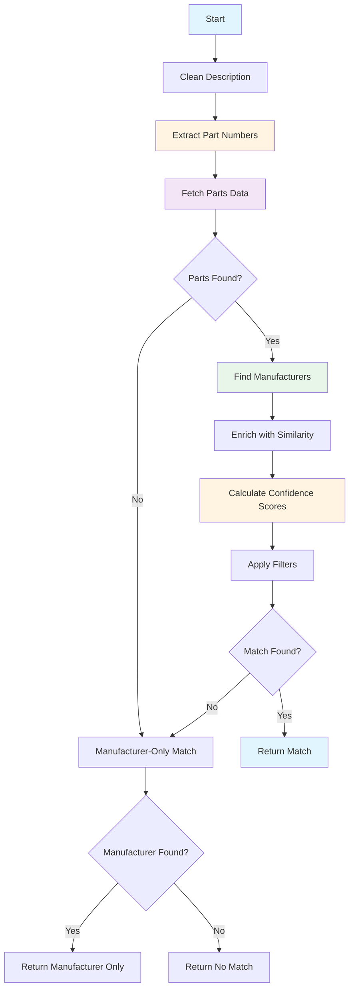

# COMPLETE_MATCH Stage - Exact Matching from Database

**Last Updated:** 2025-12-17  
**Audience:** Business Analysts, QA Professionals  
**Related:** [Solution Overview](01-solution-overview.md) | [CONTEXT_VALIDATOR Stage](05-context-validator-stage.md) | [SEMANTIC_SEARCH Stage](06-semantic-search-stage.md)

## Overview

The COMPLETE_MATCH stage performs exact matching against the product database to find products that match the invoice description. Unlike semantic search which finds similar products, this stage looks for exact part number matches and manufacturer name matches in the description text.

This stage is typically the third extraction stage in the pipeline (after CLASSIFICATION and SEMANTIC_SEARCH). It provides high-confidence results when exact matches are found, and its results are validated by the CONTEXT_VALIDATOR stage to ensure the matched product is contextually appropriate for the invoice description.

## Key Concepts

### Exact Matching
The stage searches for exact text matches of:
- **Part Numbers**: Alphanumeric codes like "T B 425", "LT50", "39131711"
- **Manufacturer Names**: Company names like "THOMAS & BETTS", "ABB", "EATON"

Unlike semantic search which understands meaning, exact matching requires the text to appear in the description.

### Part Number Extraction
The stage uses pattern matching to identify potential part numbers in the description:
- Alphanumeric sequences (letters + numbers)
- Minimum length requirements
- Special character handling (-, /, .)
- Context-aware extraction (avoids dates, measurements)

**Example:**
- "T&B 425 1-1/4 INSULATING SLEEVE" → Extracts: ["T B 425", "425", "1-1/4"]

### Manufacturer Name Detection
The stage maintains a dictionary of known manufacturer names and their variants:
- Clean names: "THOMAS & BETTS"
- Unclean variants: "T&B", "THOMAS AND BETTS", "T B"
- Parent-child relationships: "ABB" is parent of "THOMAS & BETTS"

The stage searches the description for any variant and maps it to the clean name.

### Database Querying
Two data sources available:
- **SQL Database**: Direct queries to product tables
- **Azure AI Search**: Hybrid search with fallback
- Configurable via `exact_match_source` setting

### Confidence Scoring
Multi-factor scoring system that considers:
- **Part Number Match**: Length, quality, detection accuracy
- **Manufacturer Match**: Exact vs. partial, relationship type (direct, parent, child)
- **UNSPSC Match**: Data source reliability
- **Description Similarity**: Cosine similarity between embeddings

### Manufacturer Relationship Types
The stage determines the relationship between manufacturers:
- **DIRECT**: Same clean name (e.g., "THOMAS & BETTS" = "THOMAS & BETTS")
- **PARENT**: First is parent of second (e.g., "ABB" is parent of "THOMAS & BETTS")
- **CHILD**: First is child of second (e.g., "THOMAS & BETTS" is child of "ABB")
- **SIBLING**: Share same parent but different (e.g., "THOMAS & BETTS" and "BALDOR" both under "ABB")
- **NOT_EQUIVALENT**: No relationship

### Fallback Logic
If no part number match found:
- Fall back to manufacturer-only match
- Return manufacturer name with confidence score
- No part number or UNSPSC returned
- Lower confidence than full match

### Verification Flag
Indicates if the matched product is verified:
- Set to true if match meets high confidence thresholds
- Requires strong part number and manufacturer match
- Used to determine final invoice line status


## Python Modules

### ai_stages.py
Stage implementation that orchestrates complete matching.

**Key Method:**

- `AIStages.check_complete_match(sdp, ai_engine_cache, ivce_dtl, stage_number, sub_stage_code)` - Main entry point
  - Validates and cleans description
  - Calls analyze_description() to find matches
  - Processes match results or falls back to manufacturer-only
  - Returns stage results with confidence scores

**Helper Methods:**

- `_process_match_dataframe(match_df)` - Converts DataFrame to match result dict
  - Extracts relevant fields
  - Removes empty/null values
  - Returns clean dictionary

- `_populate_success_details(match_result, cleaned_description)` - Populates stage details
  - Extracts manufacturer, part number, UNSPSC
  - Adds confidence scores
  - Includes description and flags

### matching_utils.py
Core matching logic with manufacturer detection and part number extraction.

**Main Function:**

- `analyze_description(sdp, llm, description, data_source, search_utils, desc_embedding)` - Orchestrates matching
  - Cleans description
  - Generates or uses provided embedding
  - Extracts part numbers
  - Fetches parts data with fallback
  - Finds manufacturers in description
  - Enriches parts data with similarity scores
  - Returns filtered results

**Part Number Extraction:**

- `extract_part_numbers(description)` - Extracts potential part numbers
  - Uses regex patterns
  - Filters by length and format
  - Returns list of candidates and UIPNCs (Unique Independent Part Number Candidates)

**Data Fetching:**

- `get_parts_data_with_fallback(sdp, part_numbers, primary_source, search_utils)` - Fetches parts data
  - Tries primary source (database or azure_search)
  - Falls back to secondary source on failure
  - Returns DataFrame with part information

- `get_parts_data(sdp, part_numbers)` - Queries SQL database
  - Searches by part number with separator removal
  - Returns matching products

**Manufacturer Processing:**

- `read_manufacturer_data(sdp)` - Loads manufacturer mapping
  - Reads from database
  - Returns dictionary: {UncleanName: {CleanName, ParentCleanName, BeginningOnlyFlag}}

- `find_manufacturers_in_description(manufacturer_dict, description)` - Finds manufacturers
  - Searches description for manufacturer variants
  - Returns {CleanName: UncleanName} for found manufacturers

- `update_manufacturer_dict(manufacturer_dict, parts_df)` - Updates dictionary
  - Adds new manufacturers from parts data
  - Maintains clean/unclean mappings

**Data Enrichment:**

- `enrich_parts_data(parts_df, manufacturer_dict, manufacturers_in_desc, description, llm, desc_embedding)` - Enriches parts
  - Adds CleanName and UncleanName columns
  - Determines MfrNameMatchType
  - Calculates DescriptionSimilarity using embeddings
  - Returns enriched DataFrame

- `keep_highest_similarity_rows(result_df)` - Deduplicates by ItemID
  - Keeps row with highest DescriptionSimilarity per ItemID
  - Returns filtered DataFrame

**Manufacturer-Only Fallback:**

- `process_manufacturer_dict(manufacturers_in_desc, description)` - Creates manufacturer-only match
  - Selects best manufacturer from those found
  - Returns DataFrame with manufacturer info only
  - No part number or UNSPSC

### matching_scores.py
Confidence score calculation and match selection.

**Main Function:**

- `best_match_score(result_df, manufacturers_in_desc, description, full_manufacturer_data_dict, uipnc_list)` - Selects best match
  - Calculates initial confidence scores
  - Normalizes part numbers
  - Applies sequential filters
  - Adjusts scores based on rules
  - Returns top-scoring record

**Scoring:**

- `calculate_initial_confidence_scores(...)` - Calculates confidence scores
  - Part number confidence: Base + length + match quality + UIPNC bonus/penalty
  - Manufacturer confidence: Base + relationship type + description similarity
  - UNSPSC confidence: Base + data source reliability
  - Returns DataFrame with score columns

**Filtering:**

- `filter_by_unclean_name(result_df)` - Filters by manufacturer match
  - Keeps only rows with matching manufacturer
  - Removes non-matching manufacturers

- `filter_by_description_similarity(result_df)` - Filters by similarity
  - Removes rows below similarity threshold
  - Keeps most similar matches

- `filter_by_part_number_substring(result_df)` - Filters by part number
  - Removes part numbers that are substrings of others
  - Prefers longer, more specific part numbers

- `filter_and_adjust_by_confidence(result_df)` - Filters and adjusts scores
  - Applies confidence thresholds
  - Adjusts scores based on match quality
  - Returns filtered and adjusted DataFrame

**Verification:**

- `check_and_set_verified_flag(result_df)` - Sets verification flag
  - Checks if match meets verification criteria
  - Sets IsVerified column
  - Returns DataFrame with flag

- `apply_final_score_capping(result_df)` - Caps confidence scores
  - Applies maximum score limits
  - Ensures scores don't exceed 100
  - Returns DataFrame with capped scores

### sql_utils.py
SQL database queries for parts data.

**Key Methods:**

- `get_parts_by_part_numbers(sdp, part_numbers)` - Queries parts by part number
  - Searches with separator removal
  - Returns matching products

### azure_search_utils.py
Azure AI Search queries for parts data.

**Key Methods:**

- `get_parts_data_from_index(part_numbers)` - Searches index for parts
  - Uses hybrid search (vector + keyword)
  - Returns matching products

## Configuration

The COMPLETE_MATCH stage is configured through the `confidences.yaml` file:

### Configuration Structure

```yaml
COMPLETE_MATCH:
  COMPLETE_MATCH:
    PART_NUMBER_CONFIDENCE:
      base_weight: 30
      weight: 25
      manufacturer_weight: 15
      desc_sim_weight: 10
      uipnc_match_bonus: 10
      uipnc_penalty_unit: 5
      min_threshold: 50
    
    MANUFACTURER_CONFIDENCE:
      base_weight: 40
      part_weight: 20
      weight: 20
      desc_sim_weight: 10
      min_threshold: 60
    
    UNSPSC_CONFIDENCE:
      base_weight: 30
      part_weight: 20
      manufacturer_weight: 20
      desc_sim_weight: 10
      min_threshold: 50
```

### Configuration Parameters

**PART_NUMBER_CONFIDENCE:**

| Parameter | Type | Description | Default |
|-----------|------|-------------|---------|
| `base_weight` | int | Base points for having a part number | 30 |
| `weight` | int | Points for part number length and quality | 25 |
| `manufacturer_weight` | int | Points for manufacturer match | 15 |
| `desc_sim_weight` | int | Points for description similarity | 10 |
| `uipnc_match_bonus` | int | Bonus if part number is a UIPNC | 10 |
| `uipnc_penalty_unit` | int | Penalty per additional UIPNC | 5 |
| `min_threshold` | int | Minimum confidence to return | 50 |

**MANUFACTURER_CONFIDENCE:**

| Parameter | Type | Description | Default |
|-----------|------|-------------|---------|
| `base_weight` | int | Base points for having a manufacturer | 40 |
| `part_weight` | int | Points for part number match | 20 |
| `weight` | int | Points for manufacturer relationship type | 20 |
| `desc_sim_weight` | int | Points for description similarity | 10 |
| `min_threshold` | int | Minimum confidence to return | 60 |

**UNSPSC_CONFIDENCE:**

| Parameter | Type | Description | Default |
|-----------|------|-------------|---------|
| `base_weight` | int | Base points for having a UNSPSC | 30 |
| `part_weight` | int | Points for part number match | 20 |
| `manufacturer_weight` | int | Points for manufacturer match | 20 |
| `desc_sim_weight` | int | Points for description similarity | 10 |
| `min_threshold` | int | Minimum confidence to return | 50 |

### Application Configuration

From `config.yaml`:

```yaml
EXACT_MATCH_SOURCE: azure_search  # or "database"
```

## Business Logic

### Processing Flow



### Step-by-Step Processing

**1. Description Cleaning**
- Remove extra whitespace
- Normalize text
- Prepare for pattern matching

**2. Part Number Extraction**
- Apply regex patterns to find alphanumeric sequences
- Filter by minimum length (typically 3-4 characters)
- Remove separators (-, /, .) for matching
- Identify UIPNCs (Unique Independent Part Number Candidates)

**Example:**
```
Description: "T&B 425 1-1/4 INSULATING SLEEVE"
Extracted: ["T B 425", "425", "1-1/4"]
UIPNCs: ["425"] (most likely actual part number)
```

**3. Parts Data Fetching**
- Query primary data source (database or azure_search)
- Search for products with matching part numbers
- If primary fails, try fallback source
- Return DataFrame with product information

**4. Manufacturer Detection**
- Load manufacturer mapping dictionary
- Search description for manufacturer variants
- Map unclean names to clean names
- Update dictionary with new manufacturers from parts data

**Example:**
```
Description: "T&B 425 1-1/4 INSULATING SLEEVE"
Found: {"THOMAS & BETTS": "T&B"}
```

**5. Data Enrichment**
- Add CleanName and UncleanName columns
- Determine MfrNameMatchType (DIRECT, PARENT, CHILD, etc.)
- Calculate DescriptionSimilarity using embeddings
- Keep highest similarity row per ItemID

**6. Confidence Score Calculation**

**Part Number Confidence:**
```
score = base_weight (30)
      + length_quality_points (0-25)
      + manufacturer_match_points (0-15)
      + description_similarity_points (0-10)
      + uipnc_bonus (10 if UIPNC)
      - uipnc_penalty (5 * num_other_uipncs)
```

**Manufacturer Confidence:**
```
score = base_weight (40)
      + part_number_match_points (0-20)
      + relationship_type_points (0-20)
      + description_similarity_points (0-10)
```

**UNSPSC Confidence:**
```
score = base_weight (30)
      + part_number_match_points (0-20)
      + manufacturer_match_points (0-20)
      + description_similarity_points (0-10)
```

**7. Sequential Filtering**

**Filter 1: Manufacturer Match**
- Keep only rows where manufacturer in description matches product manufacturer
- Remove non-matching manufacturers

**Filter 2: Description Similarity**
- Remove rows below similarity threshold (typically 0.7)
- Keep most similar matches

**Filter 3: Part Number Substring**
- If part number A is substring of part number B, remove A
- Prefer longer, more specific part numbers
- Example: Remove "425" if "T B 425" exists

**Filter 4: Confidence Thresholds**
- Remove rows below minimum confidence thresholds
- Part number: ≥ 50
- Manufacturer: ≥ 60
- UNSPSC: ≥ 50

**8. Verification Flag**
- Set IsVerified = true if:
  - Part number confidence ≥ 80
  - Manufacturer confidence ≥ 80
  - Description similarity ≥ 0.85
- Otherwise IsVerified = false

**9. Score Capping**
- Cap all scores at 100
- Apply final adjustments
- Return top-scoring record

**10. Fallback to Manufacturer-Only**
- If no part match found but manufacturers detected
- Select best manufacturer from those found
- Return manufacturer name with confidence
- No part number or UNSPSC

### Confidence Calculation Examples

**Example 1: Strong Match**

Input:
- Part number "T B 425" found in description
- Part number "T B 425" found in database
- Manufacturer "THOMAS & BETTS" found in both
- Description similarity: 0.92
- Part number is a UIPNC
- Only 1 UIPNC in description

Part Number Confidence:
```
30 (base)
+ 25 (full length match)
+ 15 (manufacturer match)
+ 9 (similarity 0.92 * 10)
+ 10 (UIPNC bonus)
- 0 (no other UIPNCs)
= 89
```

Manufacturer Confidence:
```
40 (base)
+ 20 (part number match)
+ 20 (DIRECT relationship)
+ 9 (similarity 0.92 * 10)
= 89
```

UNSPSC Confidence:
```
30 (base)
+ 20 (part number match)
+ 20 (manufacturer match)
+ 9 (similarity 0.92 * 10)
= 79
```

IsVerified: true (all scores ≥ 80, similarity ≥ 0.85)

**Example 2: Ambiguous Part Numbers**

Input:
- Part numbers "425", "1-1/4", "T B 425" found in description
- Part number "425" found in database
- Manufacturer "THOMAS & BETTS" found in both
- Description similarity: 0.85
- Part number "425" is a UIPNC
- 3 UIPNCs total in description

Part Number Confidence:
```
30 (base)
+ 20 (partial length match)
+ 15 (manufacturer match)
+ 8 (similarity 0.85 * 10)
+ 10 (UIPNC bonus)
- 10 (2 other UIPNCs * 5)
= 73
```

Manufacturer Confidence:
```
40 (base)
+ 20 (part number match)
+ 20 (DIRECT relationship)
+ 8 (similarity 0.85 * 10)
= 88
```

IsVerified: false (part number < 80)

**Example 3: Parent Manufacturer**

Input:
- Part number "LT50" found
- Manufacturer "ABB" found in description
- Product manufacturer "THOMAS & BETTS" (child of ABB)
- Description similarity: 0.80

Manufacturer Confidence:
```
40 (base)
+ 20 (part number match)
+ 15 (PARENT relationship, not DIRECT)
+ 8 (similarity 0.80 * 10)
= 83
```

IsVerified: false (not DIRECT relationship)

### Manufacturer Relationship Scoring

The stage adjusts manufacturer confidence based on relationship type:

| Relationship | Points | Example |
|--------------|--------|---------|
| DIRECT | 20 | "THOMAS & BETTS" = "THOMAS & BETTS" |
| PARENT | 15 | "ABB" is parent of "THOMAS & BETTS" |
| CHILD | 10 | "THOMAS & BETTS" is child of "ABB" |
| SIBLING | 5 | "THOMAS & BETTS" and "BALDOR" share parent "ABB" |
| NOT_EQUIVALENT | 0 | No relationship |

**Rationale:**
- DIRECT match is strongest (exact same company)
- PARENT match is strong (parent company owns product)
- CHILD match is moderate (subsidiary makes product)
- SIBLING match is weak (related but different companies)
- NOT_EQUIVALENT is no match

## Dependencies

### Required Services

1. **SQL Database (SDP)**
   - Purpose: Primary source for product data
   - Tables: Product items, manufacturer mappings
   - Dependency: Must be accessible
   - Failure Impact: Falls back to Azure AI Search if configured

2. **Azure AI Search** (Optional)
   - Purpose: Alternative/fallback source for product data
   - Dependency: Index populated by Indexer
   - Failure Impact: Falls back to SQL database if configured

3. **Azure OpenAI** (Optional)
   - Purpose: Calculate description similarity using embeddings
   - Dependency: Embedding from SEMANTIC_SEARCH stage or generate new
   - Failure Impact: Similarity scoring skipped, matching continues

### Module Dependencies

- `matching_utils.py` - Core matching logic
- `matching_scores.py` - Confidence calculation
- `sql_utils.py` - SQL database queries
- `azure_search_utils.py` - Azure AI Search queries
- `constants.py` - Stage names, field names, enums
- `utils.py` - Text cleaning
- `logger.py` - Logging

### Depends On

- **CLASSIFICATION Stage** - Provides cleaned description
- **SEMANTIC_SEARCH Stage** (Optional) - Provides embedding for similarity calculation

### Used By

- **CONTEXT_VALIDATOR Stage** - Validates the match is contextually appropriate
- **Final Consolidation** - May use manufacturer/part number/UNSPSC if highest confidence

## Output Fields

The stage returns the following fields:

| Field | Type | Description | Example |
|-------|------|-------------|---------|
| `MfrName` | string | Clean manufacturer name | "THOMAS & BETTS" |
| `ManufacturerNameConfidenceScore` | int | Confidence score (0-100) | 89 |
| `MfrPartNum` | string | Manufacturer part number | "425" |
| `PartNumberConfidenceScore` | int | Confidence score (0-100) | 89 |
| `UNSPSC` | string | UNSPSC code (8 digits) | "39131711" |
| `UNSPSCConfidenceScore` | int | Confidence score (0-100) | 79 |
| `UPC` | string | UPC barcode (if available) | "78621000425" |
| `AKPartNum` | string | AKS internal part number (if available) | "AK10433053" |
| `IsVerified` | boolean | Whether match is verified | true |
| `IsMfrClean` | boolean | Whether manufacturer name is clean | true |
| `IsMfrDirect` | boolean | Whether manufacturer relationship is DIRECT | true |
| `DescriptionSimilarity` | float | Cosine similarity (0-1) | 0.92 |
| `matched_description` | string | Matched product description | "1-1/4 Inch Insuliner Sleeve..." |
| `description` | string | Cleaned invoice description | "t b 425 1-1/4 insulating sleeve" |

**Manufacturer-Only Match Fields:**
- Only `MfrName` and `ManufacturerNameConfidenceScore` returned
- No part number, UNSPSC, or UPC
- Lower confidence than full match

## Examples

### Example 1: Strong Exact Match

**Input:**
```
Description: "T&B 425 1-1/4 INSULATING SLEEVE"
```

**Processing:**

1. **Part Number Extraction:**
   - Extracted: ["T B 425", "425", "1-1/4"]
   - UIPNCs: ["425"]

2. **Database Query:**
   - Found product with part number "425"
   - Manufacturer: "THOMAS & BETTS"
   - UNSPSC: "39131711"
   - UPC: "78621000425"

3. **Manufacturer Detection:**
   - Found "T&B" in description
   - Mapped to "THOMAS & BETTS"

4. **Confidence Calculation:**
   - Part Number: 89 (strong match, UIPNC, no ambiguity)
   - Manufacturer: 89 (DIRECT match, high similarity)
   - UNSPSC: 79 (good match)

5. **Verification:**
   - IsVerified: true (all criteria met)

**Output:**
```json
{
  "MfrName": "THOMAS & BETTS",
  "ManufacturerNameConfidenceScore": 89,
  "MfrPartNum": "425",
  "PartNumberConfidenceScore": 89,
  "UNSPSC": "39131711",
  "UNSPSCConfidenceScore": 79,
  "UPC": "78621000425",
  "IsVerified": true,
  "IsMfrClean": true,
  "IsMfrDirect": true,
  "DescriptionSimilarity": 0.92,
  "matched_description": "1-1/4 Inch Insuliner Sleeve, Nylon for Use with Rigid/IMC/EMT Conduit",
  "description": "t b 425 1-1/4 insulating sleeve"
}
```

### Example 2: Manufacturer-Only Match (No Part Number)

**Input:**
```
Description: "THOMAS & BETTS ELECTRICAL SUPPLIES"
```

**Processing:**

1. **Part Number Extraction:**
   - No valid part numbers found

2. **Database Query:**
   - No products found (no part numbers to search)

3. **Manufacturer Detection:**
   - Found "THOMAS & BETTS" in description

4. **Fallback to Manufacturer-Only:**
   - Return manufacturer with confidence

**Output:**
```json
{
  "MfrName": "THOMAS & BETTS",
  "ManufacturerNameConfidenceScore": 75,
  "IsVerified": false,
  "IsMfrClean": true,
  "IsMfrDirect": true,
  "description": "thomas betts electrical supplies"
}
```

### Example 3: Parent Manufacturer Relationship

**Input:**
```
Description: "ABB LT50 LIQUIDTIGHT CONNECTOR"
```

**Processing:**

1. **Part Number Extraction:**
   - Extracted: ["LT50"]

2. **Database Query:**
   - Found product with part number "LT50"
   - Manufacturer: "THOMAS & BETTS" (child of ABB)

3. **Manufacturer Detection:**
   - Found "ABB" in description
   - ABB is parent of THOMAS & BETTS

4. **Confidence Calculation:**
   - Part Number: 85
   - Manufacturer: 83 (PARENT relationship, not DIRECT)
   - UNSPSC: 75

5. **Verification:**
   - IsVerified: false (not DIRECT relationship)

**Output:**
```json
{
  "MfrName": "THOMAS & BETTS",
  "ManufacturerNameConfidenceScore": 83,
  "MfrPartNum": "LT50",
  "PartNumberConfidenceScore": 85,
  "UNSPSC": "39131705",
  "UNSPSCConfidenceScore": 75,
  "IsVerified": false,
  "IsMfrClean": true,
  "IsMfrDirect": false,
  "DescriptionSimilarity": 0.88,
  "description": "abb lt50 liquidtight connector"
}
```

### Example 4: Ambiguous Part Numbers (Multiple UIPNCs)

**Input:**
```
Description: "CONDUIT FITTINGS 1/2 3/4 1 INCH SIZES"
```

**Processing:**
1. **Part Number Extraction:**
   - Extracted: ["1/2", "3/4", "1"]
   - UIPNCs: ["1/2", "3/4", "1"] (all potential part numbers)

2. **Database Query:**
   - Found products for all three part numbers

3. **Confidence Calculation:**
   - Each part number penalized for ambiguity
   - Part Number: 60-65 (penalty for 3 UIPNCs)
   - Manufacturer: 70-75
   - UNSPSC: 65-70

4. **Filtering:**
   - All matches have moderate confidence
   - Select highest scoring

**Output:**
```json
{
  "MfrName": "EATON",
  "ManufacturerNameConfidenceScore": 75,
  "MfrPartNum": "1/2",
  "PartNumberConfidenceScore": 65,
  "UNSPSC": "39131705",
  "UNSPSCConfidenceScore": 70,
  "IsVerified": false,
  "IsMfrClean": true,
  "IsMfrDirect": true,
  "DescriptionSimilarity": 0.78,
  "description": "conduit fittings 1/2 3/4 1 inch sizes"
}
```

### Example 5: No Match Found

**Input:**
```
Description: "RANDOM ELECTRICAL ITEM XYZ999"
```

**Processing:**

1. **Part Number Extraction:**
   - Extracted: ["XYZ999"]

2. **Database Query:**
   - No products found with part number "XYZ999"

3. **Manufacturer Detection:**
   - No known manufacturers found in description

4. **Fallback:**
   - No manufacturer-only match possible

**Output:**
```json
{
  "message": "No match found for invoice item",
  "description": "random electrical item xyz999"
}
```

## Performance Characteristics

### Throughput
- ~200-300 descriptions per second
- Bottleneck: Database queries or Azure AI Search
- Part number extraction is fast (< 10ms)

### Latency
- Part number extraction: 5-10ms
- Database query: 50-200ms
- Manufacturer detection: 10-20ms
- Confidence calculation: 10-20ms
- Total: 75-250ms per description

### Accuracy
- Exact part number match: Very high accuracy (> 95%)
- Manufacturer-only match: Moderate accuracy (70-80%)
- Ambiguous part numbers: Lower accuracy (60-70%)

### Resource Usage
- Memory: Minimal (< 50 MB per request)
- CPU: Low (mostly I/O bound)
- Network: Moderate (database or search queries)

## Monitoring and Troubleshooting

### Common Issues

**Issue: No Matches Found**
- Symptom: Stage returns no match
- Possible Causes:
  - Part numbers not in database
  - Manufacturer names not in mapping
  - Part number extraction failed
- Solution: Check database coverage, update manufacturer mapping, review extraction patterns

**Issue: Wrong Product Matched**
- Symptom: Incorrect product returned
- Possible Causes:
  - Multiple products with same part number
  - Ambiguous part numbers in description
  - Manufacturer mismatch
- Solution: Review confidence scores, check CONTEXT_VALIDATOR results, improve part number extraction

**Issue: Low Confidence Scores**
- Symptom: Matches below verification threshold
- Possible Causes:
  - Weak part number match
  - Parent/child manufacturer relationship
  - Low description similarity
- Solution: Review scoring configuration, check manufacturer relationships, improve description quality

**Issue: Manufacturer-Only Matches**
- Symptom: Frequent fallback to manufacturer-only
- Possible Causes:
  - Part numbers not extracted correctly
  - Part numbers not in database
  - Description lacks part numbers
- Solution: Improve part number extraction, expand database coverage, request better descriptions

**Issue: Database Query Failures**
- Symptom: Fallback to Azure AI Search
- Possible Causes:
  - Database connection timeout
  - Database unavailable
  - Query errors
- Solution: Check database status, review query logs, verify connection settings

### Health Checks

**Before Stage Runs:**
- SQL database accessible
- Azure AI Search available (if fallback configured)
- Manufacturer mapping loaded

**During Execution:**
- Monitor database query latency
- Check part number extraction success rate
- Verify confidence score distributions

**After Completion:**
- Verify match found or appropriate fallback
- Check confidence scores reasonable
- Confirm verification flag set correctly

### Debugging Tips

**Enable Debug Logging:**
```python
logger.setLevel(logging.DEBUG)
```

**Check Part Number Extraction:**
- Log extracted part numbers
- Verify UIPNCs identified correctly
- Check for false positives (dates, measurements)

**Verify Database Results:**
- Log query results
- Check number of products found
- Verify manufacturer names match

**Review Confidence Calculations:**
- Log individual score components
- Verify weights applied correctly
- Check threshold comparisons

**Test Manufacturer Detection:**
- Log found manufacturers
- Verify clean/unclean mappings
- Check relationship types
