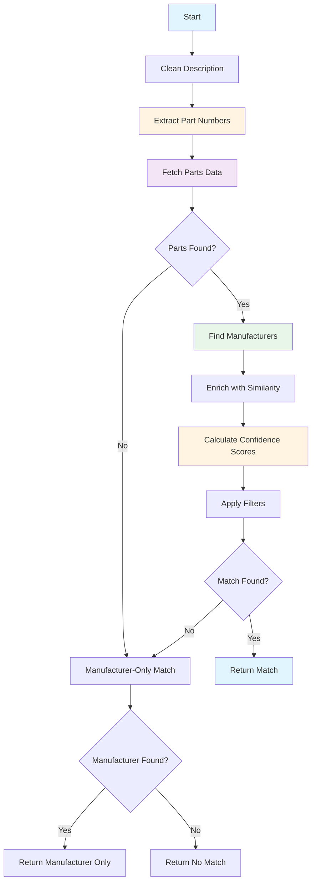

# COMPLETE_MATCH Stage - Exact Matching from Database

**Last Updated:** 2025-12-19
**Author:** Kirill Levtov
**Related:** [Solution Overview](01-solution-overview.md) | [CONTEXT_VALIDATOR Stage](05-context-validator-stage.md) | [SEMANTIC_SEARCH Stage](06-semantic-search-stage.md)

## Overview

The COMPLETE_MATCH stage performs exact matching against the product database to find products that match the invoice description. Unlike semantic search which finds similar products, this stage looks for exact part number matches and manufacturer name matches in the description text.

This stage is typically the third extraction stage in the pipeline (after CLASSIFICATION and SEMANTIC_SEARCH). It provides high-confidence results when exact matches are found, and its results are validated by the CONTEXT_VALIDATOR stage to ensure the matched product is contextually appropriate for the invoice description.

## Key Concepts

### Exact Matching
The stage searches for exact text matches of:
- **Part Numbers**: Alphanumeric codes like "TB425", "LT50", "39131711"
- **Manufacturer Names**: Company names like "THOMAS & BETTS", "ABB", "EATON"

Unlike semantic search which understands meaning, exact matching requires the text to appear in the description.

### Part Number Logic

The stage employs a sophisticated engine (`PartNumberExtractor`) to identify, validate, and score part numbers. This process goes beyond simple regex matching to ensure robustness against formatting variations and ambiguity.

#### 1. Extraction & Search Variations
The system uses multiple regex "rulesets" to find alphanumeric sequences. To maximize database recall, it generates multiple query variations for every candidate found:
- **Raw Match**: The exact sequence found in the text (e.g., "CAT-6").
- **Normalized Match**: The sequence with separators removed (e.g., "CAT6").
- **Dot Handling**: Variations specific to dot separators (e.g., "1.25" vs "125").

This ensures that if the invoice says "CAT-6" but the database lists "CAT6" (or vice versa), a match is found.

#### 2. Unique Independent Part Number Candidates (UIPNC)
The **UIPNC** is a critical concept used to calculate ambiguity penalties in the confidence score.
- **Definition**: A UIPNC is a "maximal" part number candidate that is not a substring of another candidate in the same description.
- **Purpose**: To distinguish between *true ambiguity* (two different parts) and *overlap ambiguity* (one part contained inside another).
- **Logic**:
  - The system extracts all valid candidates.
  - It sorts them by length (descending).
  - It accepts a candidate only if it is not a substring of an already accepted UIPNC.

**Example**:
- Input: "TYPE-12345"
- **Extracted Variants**: "TYPE-12345", "TYPE12345", "12345".
- **UIPNC Result**: Only **["TYPE12345"]**.
- *Why*: "12345" is a substring of the longer match "TYPE12345". Although "12345" is still used for database lookups (to find the product), it is excluded from the UIPNC list. This ensures the confidence score is not penalized for "finding multiple parts" when there is actually only one specific item.

#### 3. Effective Length Calculation
Confidence scoring uses "Effective Length" rather than raw character count to assess the quality of a match. High effective length implies a specific, non-generic part number.
- **Formula**:
  `Effective Length = Raw Length - Penalties + Bonuses`
- **Penalties**:
  - **Separators**: Characters like `-`, `/`, and `.` do not contribute to the effective length. (e.g., "12-34" has a raw length of 5 but an effective length of 4, treating it equally to "1234").
  - **Repetition**: Excessive repeating characters (e.g., "11111") trigger penalties, reducing the effective length to reflect that repetitive sequences are often generic.
- **Bonuses**:
  - **Complexity**: Presence of multiple capital letters adds points, as alphanumeric combinations are statistically more unique than pure numbers.

### Manufacturer Name Detection
The stage maintains a dictionary of known manufacturer names and their variants:
- Clean names: "THOMAS & BETTS"
- Unclean variants: "T&B", "THOMAS AND BETTS", "T B"
- Parent-child relationships: "ABB" is parent of "THOMAS & BETTS"

The stage searches the description for any variant and maps it to the clean name.

### False Positive Manufacturer Prevention
The system implements a safeguard to prevent unfair penalties when a description contains brand names that are legitimately part of the product's specification (e.g., "Replaces GE", "Fits Square D").

**Logic:**
Before treating a found manufacturer name as a **conflict** during scoring, the system checks if that name appears as a whole word within the **Database Item Description** of the matched part.
- **If Found in DB Description**: The name is flagged as a "False Positive" and ignored. It does not trigger a conflict penalty.
- **If Not Found**: The name is treated as a generic competitor and penalizes the confidence score.

**Example:**
- **Input**: "PHILIPS F32T8/TL841 REPLACES GE F32T8/SP41"
- **Match**: Manufacturer="PHILIPS", Part="F32T8/TL841".
- **Found in Text**: "PHILIPS" (Match) and "GE" (Potential Conflict).
- **Check**: Does "GE" appear in the official PHILIPS database description?
  - *Scenario A (DB Desc: "32W T8 4100K LAMP")*: "GE" is NOT in description. -> **Penalty Applied**.
  - *Scenario B (DB Desc: "32W T8 LAMP REPLACES GE/SYLVANIA")*: "GE" IS in description. -> **No Penalty** (False Positive).

### Database Querying
Two data sources are available, with **Azure AI Search** being the default and recommended source for performance:

- **Azure AI Search (Default)**: Uses exact filtering logic to identify records where the `MfrPartNum` matches the extracted candidates. It does **not** use vector/hybrid search in this stage; it relies on strict filtering to ensure exact matches.
- **SQL Database**: Executes direct SQL queries against product tables.
- **Configuration**: Controlled via the `exact_match_source` setting.

**Fallback Mechanism:**
The system implements a robust fallback strategy. If the primary source (e.g., Azure AI Search) fails due to connection issues or errors, the system automatically retries the query against the secondary source (e.g., SQL Database), ensuring high availability.

### Confidence Scoring
A multi-factor scoring system determines the best match quality:
- **Part Number Match**: Derived from **Effective Length** (rewarding complexity, penalizing separators/repetition) and **Ambiguity** (penalizing if multiple independent part number candidates are found).
- **Manufacturer Match**: Evaluates whether the manufacturer is explicitly found in the description, handling aliases (e.g., "T&B") and checking for conflicts with other brand names.
- **UNSPSC Match**: Base score derived largely from the reliability of the data source.
- **Description Similarity**: Uses vector embeddings to calculate the cosine similarity between the input text and the database item description.

### Manufacturer Relationship Types
The stage determines the relationship between manufacturers:
- **DIRECT**: Same clean name (e.g., "THOMAS & BETTS" = "THOMAS & BETTS")
- **PARENT**: First is parent of second (e.g., "ABB" is parent of "THOMAS & BETTS")
- **CHILD**: First is child of second (e.g., "THOMAS & BETTS" is child of "ABB")
- **SIBLING**: Share same parent but different (e.g., "THOMAS & BETTS" and "BALDOR" both under "ABB")
- **NOT_EQUIVALENT**: No relationship

### Fallback Logic
If no part number match found:
- Fall back to manufacturer-only match
- Return manufacturer name with confidence score
- No part number or UNSPSC returned
- Lower confidence than full match

### Verification Flag
The `is_verified_flag` indicates a definitive match against a master data source. It is set to 'Y' (True) only when **all** of the following conditions are met:

1.  **Trusted Data Source**: The product was matched against a verified dataset (**IDEA** or **TRD_SVC**). Matches against the invoice history pipeline do not qualify.
2.  **Explicit Match**: Both Manufacturer Name and Part Number were explicitly identified in the description and matched the database.
3.  **Uniqueness**: Exactly one unique combination of Manufacturer and Part Number was found. Ambiguous matches (multiple candidates) result in a flag of 'N'.


## Python Modules

### ai_stages.py
Stage implementation that orchestrates complete matching.

**Key Method:**

- `AIStages.check_complete_match(sdp, ai_engine_cache, ivce_dtl, stage_number, sub_stage_code)` - Main entry point
  - Validates and cleans description
  - Calls analyze_description() to find matches
  - Processes match results or falls back to manufacturer-only
  - Returns stage results with confidence scores

**Helper Methods:**

- `_process_match_dataframe(match_df)` - Converts DataFrame to match result dict
  - Extracts relevant fields
  - Removes empty/null values
  - Returns clean dictionary

- `_populate_success_details(match_result, cleaned_description)` - Populates stage details
  - Extracts manufacturer, part number, UNSPSC
  - Adds confidence scores
  - Includes description and flags

### matching_utils.py
Core matching logic with manufacturer detection and part number extraction.

**Main Function:**

- `analyze_description(sdp, llm, description, data_source, search_utils, desc_embedding)` - Orchestrates matching
  - Cleans description
  - Generates or uses provided embedding
  - Extracts part numbers
  - Fetches parts data with fallback
  - Finds manufacturers in description
  - Enriches parts data with similarity scores
  - Returns filtered results

**Part Number Extraction:**

- `extract_part_numbers(description)` - Extracts potential part numbers
  - Uses regex patterns
  - Filters by length and format
  - Returns list of candidates and UIPNCs (Unique Independent Part Number Candidates)

**Data Fetching:**

- `get_parts_data_with_fallback(sdp, part_numbers, primary_source, search_utils)` - Fetches parts data
  - Tries primary source (database or azure_search)
  - Falls back to secondary source on failure
  - Returns DataFrame with part information

- `get_parts_data(sdp, part_numbers)` - Queries SQL database
  - Searches by part number with separator removal
  - Returns matching products

**Manufacturer Processing:**

- `read_manufacturer_data(sdp)` - Loads and caches manufacturer mapping logic.
  - **Business Logic**:
    - Queries the SQL database for all active manufacturer mapping records.
    - Constructs a high-performance lookup dictionary to normalize manufacturer aliases (e.g., "T&B" -> "THOMAS & BETTS").
    - Handles parent/child relationships (e.g., mapping "THOMAS & BETTS" to parent "ABB").
    - Applies "False Positive" prevention logic: Records with `BeginningOnlyFlag=True` are only considered valid matches if found at the very start of the description.

  - **Data Structure**:
    - Returns a `SpecialCharIgnoringDict` (custom dictionary that ignores special characters in keys).
    - **Key**: `UncleanName` (The alias or variant found in text).
    - **Value**: A dictionary containing:
      - `CleanName`: The standardized official manufacturer name.
      - `ParentCleanName`: The standardized name of the parent company (if applicable).
      - `BeginningOnlyFlag`: Boolean indicating if the alias is position-sensitive.

  - **Caching**:
    - Implements an internal module-level cache (`_manufacturer_data_cache`) with a configurable Time-To-Live (TTL, default 1 hour).
    - Uses a threading lock to ensure only one thread queries the database for cache population, even under high concurrency.
    - This optimized caching strategy means the database is queried only once per hour, regardless of the number of invoice lines processed.

- `find_manufacturers_in_description(manufacturer_dict, description)` - Finds manufacturers
  - Searches description for manufacturer variants
  - Returns {CleanName: UncleanName} for found manufacturers

- `update_manufacturer_dict(manufacturer_dict, parts_df)` - Updates dictionary
  - Adds new manufacturers from parts data
  - Maintains clean/unclean mappings

**Data Enrichment:**

- `enrich_parts_data(parts_df, manufacturer_dict, manufacturers_in_desc, description, llm, desc_embedding)` - Enriches parts
  - Adds CleanName and UncleanName columns
  - Determines MfrNameMatchType
  - Calculates DescriptionSimilarity using embeddings
  - Returns enriched DataFrame

- `keep_highest_similarity_rows(result_df)` - Deduplicates by ItemID
  - Keeps row with highest DescriptionSimilarity per ItemID
  - Returns filtered DataFrame

**Manufacturer-Only Fallback:**

- `process_manufacturer_dict(manufacturers_in_desc, description)` - Creates manufacturer-only match
  - Selects best manufacturer from those found
  - Returns DataFrame with manufacturer info only
  - No part number or UNSPSC

### matching_scores.py
Confidence score calculation and match selection.

**Main Function:**

- `best_match_score(result_df, manufacturers_in_desc, description, full_manufacturer_data_dict, uipnc_list)` - Selects best match
  - Calculates initial confidence scores
  - Normalizes part numbers
  - Applies sequential filters
  - Adjusts scores based on rules
  - Returns top-scoring record

**Scoring:**

- `calculate_initial_confidence_scores(...)` - Calculates confidence scores
  - Part number confidence: Base + length + match quality + UIPNC bonus/penalty
  - Manufacturer confidence: Base + relationship type + description similarity
  - UNSPSC confidence: Base + data source reliability
  - Returns DataFrame with score columns

**Filtering:**

- `filter_by_unclean_name(result_df)` - Filters by manufacturer match
  - Keeps only rows with matching manufacturer
  - Removes non-matching manufacturers

- `filter_by_description_similarity(result_df)` - Filters by similarity
  - Removes rows below similarity threshold
  - Keeps most similar matches

- `filter_by_part_number_substring(result_df)` - Filters by part number
  - Removes part numbers that are substrings of others
  - Prefers longer, more specific part numbers

- `filter_and_adjust_by_confidence(result_df)` - Filters and adjusts scores
  - Applies confidence thresholds
  - Adjusts scores based on match quality
  - Returns filtered and adjusted DataFrame

**Verification:**

- `check_and_set_verified_flag(result_df)` - Sets verification flag
  - Checks if match meets verification criteria
  - Sets IsVerified column
  - Returns DataFrame with flag

- `apply_final_score_capping(result_df)` - Caps confidence scores
  - Applies maximum score limits
  - Ensures scores don't exceed 100
  - Returns DataFrame with capped scores

### sql_utils.py
SQL database queries for parts data.

**Key Methods:**

- `get_parts_by_part_numbers(sdp, part_numbers)` - Queries parts by part number
  - Searches with separator removal
  - Returns matching products

### azure_search_utils.py
Azure AI Search queries for parts data.

**Key Methods:**

- `get_parts_data_from_index(part_numbers)` - Searches index for parts
  - Uses **exact filtering** on `MfrPartNum` (or specific fields) to identify candidates matching the extracted part numbers.
  - Retrieves product details including the `ItemDescription_vector` (embeddings).
  - These embeddings are used subsequently to calculate **cosine similarity** between the input description and the matched product description, which is a key input for confidence scoring.

## Configuration

The COMPLETE_MATCH stage is configured through the `confidences.yaml` file:

### Configuration Structure

```yaml
COMPLETE_MATCH:
  COMPLETE_MATCH:
    PART_NUMBER_CONFIDENCE:
      base_weight: 30
      weight: 25
      manufacturer_weight: 15
      desc_sim_weight: 10
      uipnc_match_bonus: 10
      uipnc_penalty_unit: 5
      min_threshold: 50

    MANUFACTURER_CONFIDENCE:
      base_weight: 40
      part_weight: 20
      weight: 20
      desc_sim_weight: 10
      min_threshold: 60

    UNSPSC_CONFIDENCE:
      base_weight: 30
      part_weight: 20
      manufacturer_weight: 20
      desc_sim_weight: 10
      min_threshold: 50
```

### Configuration Parameters

**PART_NUMBER_CONFIDENCE:**

| Parameter | Type | Description | Default |
|-----------|------|-------------|---------|
| `base_weight` | int | Base points for having a part number | 30 |
| `weight` | int | Points for part number length and quality | 25 |
| `manufacturer_weight` | int | Points for manufacturer match | 15 |
| `desc_sim_weight` | int | Points for description similarity | 10 |
| `uipnc_match_bonus` | int | Bonus if part number is a UIPNC | 10 |
| `uipnc_penalty_unit` | int | Penalty per additional UIPNC | 5 |
| `min_threshold` | int | Minimum confidence to return | 50 |

**MANUFACTURER_CONFIDENCE:**

| Parameter | Type | Description | Default |
|-----------|------|-------------|---------|
| `base_weight` | int | Base points for having a manufacturer | 40 |
| `part_weight` | int | Points for part number match | 20 |
| `weight` | int | Points for manufacturer relationship type | 20 |
| `desc_sim_weight` | int | Points for description similarity | 10 |
| `min_threshold` | int | Minimum confidence to return | 60 |

**UNSPSC_CONFIDENCE:**

| Parameter | Type | Description | Default |
|-----------|------|-------------|---------|
| `base_weight` | int | Base points for having a UNSPSC | 30 |
| `part_weight` | int | Points for part number match | 20 |
| `manufacturer_weight` | int | Points for manufacturer match | 20 |
| `desc_sim_weight` | int | Points for description similarity | 10 |
| `min_threshold` | int | Minimum confidence to return | 50 |

### Application Configuration

From `config.yaml`:

```yaml
EXACT_MATCH_SOURCE: azure_search  # or "database"
```

## Business Logic

### Processing Flow



### Step-by-Step Processing

**1. Description Cleaning**
- Remove extra whitespace
- Normalize text
- Prepare for pattern matching

**2. Part Number Extraction**
- Apply regex patterns to find alphanumeric sequences
- Filter by minimum length (4 characters)
- Remove separators (-, /, .) for matching
- Identify UIPNCs (Unique Independent Part Number Candidates)

**Example:**
```
Description: "T&B 54855 1-1/4 INSULATING SLEEVE"
Extracted Candidates: ["54855"]
UIPNCs: ["54855"]
```
*Note: "1-1/4" is excluded because it matches a measurement pattern.*

**3. Parts Data Fetching**
- **Query Generation**: To maximize recall against inconsistent database formatting, the system generates multiple query variations for every extracted part number candidate:
  - **Raw Match**: The exact sequence found in the text (e.g., "CAT-6").
  - **Normalized Match**: The sequence with separators removed (e.g., "CAT6").
  - **Dot Handling**: Variations handling decimal points (e.g., queries for both "10.25" and "1025" to catch formatting differences).
- **Execution**: Queries the primary data source (default: Azure AI Search) using the full list of variations.
- **Fallback**: If the primary source fails (connection error/timeout), the system automatically retries the query against the secondary source (SQL Database).
- **Result**: Returns a unified DataFrame containing all products that matched *any* of the generated variations.

**4. Manufacturer Detection**
- Load manufacturer mapping dictionary
- Search description for manufacturer variants
- Map unclean names to clean names
- Update dictionary with new manufacturers from parts data

**Example:**
```
Description: "T&B 425 1-1/4 INSULATING SLEEVE"
Found: {"THOMAS & BETTS": "T&B"}
```

**5. Data Enrichment**
- **Clean Name Mapping**: Maps the raw `MfrName` from the database to the standardized `CleanName` and `UncleanName` using the cached manufacturer dictionary.
- **Match Type Classification**: Determines the `MfrNameMatchType` to categorize the clarity of the manufacturer match:
  - **SINGLE_MATCH**: The part is linked to a manufacturer found in the text, and *all* other manufacturers found in the text are equivalent (no conflicts).
  - **MULTIPLE_MATCHES_ONE_VALID**: The part is linked to a manufacturer, but the text *also* contains unrelated/conflicting manufacturer names.
  - **NO_VALID_MATCHES**: The part could not be linked to any specific manufacturer found in the text.
  - **NO_MANUFACTURERS_FOUND**: No known manufacturer names were identified in the text.
- **Similarity Calculation**: Calculates `DescriptionSimilarity` (cosine similarity) between the input description's embedding and the database item's embedding.
- **Deduplication**: Filters to keep only the highest similarity row per unique `ItemID`.

**6. Confidence Score Calculation**

**Part Number Confidence:**
```text
score = base_weight (30)
      + [points_from_effective_length (0-100) * weight (0.25)]
      + [manufacturer_match_points * manufacturer_weight]
      + [description_similarity_points * desc_sim_weight]

Where points_from_effective_length includes:
  + Base points for length
  + UIPNC Bonus (if the part is a Unique Independent Candidate)
  - Ambiguity Penalty (based on ratio of total UIPNC lengths to this part's length)
```
*Note: The ambiguity penalty is calculated as `(Sum of all UIPNC lengths / Matched Part Length) - 1`. This penalizes matches proportionally when the description contains multiple distinct part number candidates.*

**Manufacturer Confidence:**
```
score = base_weight (40)
      + part_number_match_points (0-20)
      + relationship_type_points (0-20)
      + description_similarity_points (0-10)
```

**UNSPSC Confidence:**
```
score = base_weight (30)
      + part_number_match_points (0-20)
      + manufacturer_match_points (0-20)
      + description_similarity_points (0-10)
```

**7. Sequential Filtering**

The system applies a series of filters to refine the candidate list:

**Filter 1: Explicit Manufacturer Priority (`filter_by_unclean_name`)**
- Prioritizes matches where the manufacturer name was explicitly found in the description.
- **Logic**: For a given part number, if *any* candidate record has an explicitly matched manufacturer (`UncleanName` is populated), all other records for that same part number *without* an explicit manufacturer match are removed.

**Filter 2: Description Similarity Cleanup (`filter_by_description_similarity`)**
- A conditional filter that removes low-quality matches only when high-quality matches exist.
- **Logic**: If any candidate has a description similarity score above the `high_threshold` (e.g., 0.95), the system removes candidates in the same group that fall below the `low_threshold` (e.g., 0.8). This ensures that "noise" matches don't dilute the confidence of strong matches.

**Filter 3: Part Number Substring (`filter_by_part_number_substring`)**
- Removes ambiguous substring matches within the same manufacturer group.
- **Logic**: If Part A ("54855") is a substring of Part B ("54855B"), and both are candidates for the same manufacturer, Part A is removed. The system prefers the longer, more specific part number match.

**Filter 4: Confidence-Based Filtering (`filter_and_adjust_by_confidence`)**
- Applies relative and absolute confidence checks.
- **Step A (Relative)**: Sorts candidates by score. Removes any candidate whose score is significantly lower than the top score (controlled by `top_score_relative_filter_factor`).
- **Step B (Adjustment)**: Adjusts the top candidate's score based on the strength of competing candidates (e.g., penalties for ambiguity).
- **Step C (Absolute)**: Checks if the top candidate meets the minimum confidence threshold for at least one field. If not, the match is discarded.

**8. Verification Flag Logic**
The `is_verified_flag` is not based on confidence scores. It is a strict data integrity check.
- **Set to 'Y' (True) ONLY if:**
  1.  **Explicit Manufacturer**: The manufacturer was explicitly found in the description (`UncleanName` is populated).
  2.  **Unique Match**: Exactly one candidate record remains after filtering.
  3.  **Trusted Source**: The candidate record comes from a verified source (`IDEA` or `TRD_SVC`).
- Otherwise, the flag is set to 'N'.

**9. Score Capping**
- Applies specific business rules to cap scores for edge cases.
- **Implicit Match Cap**: If a match was found based on Part Number alone (without the Manufacturer Name appearing in the text), the Manufacturer Confidence Score is capped (default: 90) to reflect the implicit nature of the match.

**10. Fallback to Manufacturer-Only**
- If the filtering process results in no part number matches (empty results):
- The system checks if any manufacturers were identified in the description.
- If yes, it selects the best manufacturer candidate.
- Returns the Manufacturer Name with a calculated confidence score.
- **Note**: Part Number and UNSPSC confidence scores are explicitly set to 0.

### Confidence Calculation Examples

**Example 1: Strong Match (No Ambiguity)**

**Input:**
- Description: "T&B 54855 1-1/4 INSULATING SLEEVE"
- Extracted Part Number: "54855" (Length: 5)
- Found Manufacturer: "T&B" (mapped to "THOMAS & BETTS")
- **UIPNCs**: ["54855"] (Only one candidate found)
- **Source**: IDEA (Trusted)

**Part Number Confidence Calculation:**
1.  **Effective Length Points**: 45 points (for 5 characters).
2.  **UIPNC Bonus**: +10 points (It is a recognized candidate).
3.  **Ambiguity Penalty**: 0 points.
    - *Logic*: (Sum of all UIPNC lengths / Target Length) - 1
    - Calculation: (5 / 5) - 1 = 0.
4.  **Final Adjustment**: Score is high due to lack of ambiguity.

**Manufacturer Confidence Calculation:**
1.  **Primary Match**: "THOMAS & BETTS" found explicitly.
2.  **Conflicts**: None found.
3.  **Score**: High base score (typically 90) + adjustments.

**Result:**
- **IsVerified**: `True` (Unique explicit match from Trusted Source).
- **Status**: High confidence on all fields.

---

**Example 2: Ambiguous Match (Multiple Part Candidates)**

**Input:**
- Description: "EATON BR120 AND BR230 BREAKERS"
- Extracted Part Number: "BR120" (Length: 5)
- Found Manufacturer: "EATON"
- **UIPNCs**: ["BR120", "BR230"] (Two distinct candidates)

**Part Number Confidence Calculation:**
1.  **Effective Length Points**: 45 points (for 5 characters).
2.  **UIPNC Bonus**: +10 points.
3.  **Ambiguity Penalty**: Applied because multiple candidates exist.
    - *Logic*: (Sum of lengths / Target Length) - 1
    - Sum of lengths = 5 ("BR120") + 5 ("BR230") = 10.
    - Penalty Factor = (10 / 5) - 1 = 1.0.
    - **Penalty**: 1.0 * Penalty Unit (e.g., 5) = -5 points.
4.  **Impact**: The final confidence score is reduced to reflect that "BR120" is only one of the potential parts in the description.

**Result:**
- **IsVerified**: `False` (Likely fails uniqueness check if both parts match database records).

---

**Example 3: Parent/Child Manufacturer Relationship**

**Input:**
- Description: "ABB T&B 54855 CONNECTOR"
- Database Record: Manufacturer="THOMAS & BETTS", Part="54855"
- Found Manufacturers: "ABB" and "T&B"

**Manufacturer Confidence Calculation:**
1.  **Match**: "T&B" matches the database record ("THOMAS & BETTS").
2.  **Conflict Check**: The system checks "ABB".
    - Is "ABB" equivalent to "THOMAS & BETTS"? **Yes** (ABB is the Parent company).
    - **Result**: "ABB" is **not** treated as a conflict.
3.  **Score**: The score is calculated as if there were no conflicting manufacturers, resulting in high confidence.

**Result:**
- **IsVerified**: `True` (assuming "THOMAS & BETTS" is the unique explicit match found).
- *Note: If "ABB" were an unrelated competitor (e.g., "EATON"), it would be treated as a conflict, significantly lowering the manufacturer confidence score.*

### Manufacturer Conflict Resolution

The stage does not assign specific point values to different manufacturer relationships (e.g., Parent vs. Child). Instead, it uses relationship logic to distinguish between **valid context** and **conflicting manufacturers**.

**Logic:**
The system identifies all manufacturer names present in the invoice description. For a given database record being evaluated, it checks the relationship between the record's manufacturer and the other names found in the text.

- **Equivalent Manufacturers (No Penalty):**
  If a found name represents the same entity or a related corporate entity, it is **not** treated as a conflict. This prevents penalties when valid aliases or related brand names appear.
  - **DIRECT**: Exact match (e.g., "THOMAS & BETTS" and "T&B").
  - **PARENT**: Parent company (e.g., "ABB" owning "THOMAS & BETTS").
  - **CHILD**: Subsidiary (e.g., "THOMAS & BETTS" owned by "ABB").
  - **SIBLING**: Shared parent (e.g., "THOMAS & BETTS" and "BALDOR" under "ABB").

- **Conflicting Manufacturers (Penalty Applied):**
  - **NOT_EQUIVALENT**: If a found name has no relationship to the record's manufacturer (e.g., "EATON" appearing in a description for a "SQUARE D" part), it is treated as a **conflict**.
  - **Impact**: The presence of conflicting manufacturers triggers specific penalties in the confidence score calculation, reducing the likelihood of a false positive match.

## Dependencies

### Required Services

1. **SQL Database (SDP)**
   - Purpose: Primary source for product data
   - Tables: Product items, manufacturer mappings
   - Dependency: Must be accessible
   - Failure Impact: Falls back to Azure AI Search if configured

2. **Azure AI Search** (Optional)
   - Purpose: Alternative/fallback source for product data
   - Dependency: Index populated by Indexer
   - Failure Impact: Falls back to SQL database if configured

3. **Azure OpenAI** (Optional)
   - Purpose: Calculate description similarity using embeddings
   - Dependency: Embedding from SEMANTIC_SEARCH stage or generate new
   - Failure Impact: Similarity scoring skipped, matching continues

### Module Dependencies

- `matching_utils.py` - Core matching logic
- `matching_scores.py` - Confidence calculation
- `sql_utils.py` - SQL database queries
- `azure_search_utils.py` - Azure AI Search queries
- `constants.py` - Stage names, field names, enums
- `utils.py` - Text cleaning
- `logger.py` - Logging

### Depends On

- **CLASSIFICATION Stage** - Provides cleaned description
- **SEMANTIC_SEARCH Stage** (Optional) - Provides embedding for similarity calculation

### Used By

- **CONTEXT_VALIDATOR Stage** - Validates the match is contextually appropriate
- **Final Consolidation** - May use manufacturer/part number/UNSPSC if highest confidence

## Output Fields

The stage returns a structured object containing the extracted data, confidence scores, and metadata used for verification.

| Field | Type | Description | Example |
|-------|------|-------------|---------|
| `MfrName` | string | The standardized (Clean) manufacturer name. | "THOMAS & BETTS" |
| `MfrPartNum` | string | The manufacturer part number found in the database. | "54855" |
| `UNSPSC` | string | The UNSPSC classification code (8 digits). | "39131711" |
| `UPC` | string | The UPC barcode (if available in the match). | "78621000425" |
| `confidence_score` | object | Dictionary containing scores for `manufacturer_name`, `part_number`, and `unspsc`. | `{ "manufacturer_name": 90, ... }` |
| `matched_description` | string | The official product description from the database (used by Context Validator). | "1-1/4 Inch Insuliner Sleeve" |
| `item_source_name` | string | The source of the matched record (e.g., IDEA, TRD_SVC). Essential for verification. | "IDEA" |
| `is_verified_flag` | boolean | Indicates if the match meets strict verification criteria (Trusted Source + Unique + Explicit). | `true` |
| `is_mfr_direct_flag` | boolean | Indicates if the manufacturer found in text was an exact match vs. a parent/child alias. | `true` |
| `DescriptionSimilarity` | float | The cosine similarity score (0-1) between input and matched descriptions. | 0.92 |

**Manufacturer-Only Match Fields:**
- Returns `MfrName` and `ManufacturerNameConfidenceScore`.
- **Note:** `PartNumberConfidenceScore` and `UNSPSCConfidenceScore` are explicitly set to 0.
- The `ManufacturerNameConfidenceScore` can still be high (e.g., 90-100) if the manufacturer match is distinct and unambiguous, regardless of the missing part number.

## Examples

### Example 1: Strong Exact Match (Database & Text Agreement)

**Input:**
```
Description: "SIEMENS SIE B240 BREAKER 40A 2P 120/240V 10K BL"
```

**Processing:**
1.  **Part Number Extraction:**
    - Candidates: ["B240"].
2.  **Database Query:**
    - Match Found: `MfrPartNum="B240"`, `MfrName="SIEMENS"`.
    - Source: `TRD_SVC` (Trusted).
3.  **Manufacturer Detection:**
    - Found "SIEMENS" in description -> Maps to "SIEMENS" (DIRECT match).
4.  **Confidence Calculation:**
    - **Part Number**: 100 (Strong match, confirmed by Mfr presence).
    - **Manufacturer**: 100 (Direct match, no conflicts).
    - **UNSPSC**: 100 (Derived from trusted source).
5.  **Verification:**
    - **IsVerified**: `true` (Unique match + Trusted Source + Explicit Mfr).

**Output:**
```json
{
  "MfrName": "SIEMENS",
  "ManufacturerNameConfidenceScore": 100,
  "MfrPartNum": "B240",
  "PartNumberConfidenceScore": 100,
  "UNSPSC": "39121616",
  "UNSPSCConfidenceScore": 100,
  "UPC": "783643263574",
  "IsVerified": true,
  "IsMfrClean": true,
  "matched_description": "SIEM5 B240 2P 40A CKT BRKR",
  "description": "siemens sie b240 breaker 40a 2p 120/240v 10k bl"
}
```

### Example 2: Manufacturer-Only Match (No Part Match)

**Input:**
```
Description: "THOMAS AND BETTS T&B 425 1-1/4 INSULATING SLEEVE"
```

**Processing:**
1.  **Part Number Extraction:**
    - Candidates: ["425"] (May be filtered if logic requires >=4 chars, or no DB match found for "425" under T&B).
2.  **Database Query:**
    - No exact part number match found for "425" linked to T&B in this context.
3.  **Manufacturer Detection:**
    - Found "THOMAS AND BETTS" and "T&B".
    - Both map to "THOMAS & BETTS".
4.  **Fallback to Manufacturer-Only:**
    - **Manufacturer**: 100 (Strong explicit match).
    - **Part/UNSPSC**: 0 (No product-level match).

**Output:**
```json
{
  "MfrName": "THOMAS & BETTS",
  "ManufacturerNameConfidenceScore": 100,
  "MfrPartNum": null,
  "PartNumberConfidenceScore": 0,
  "UNSPSC": null,
  "UNSPSCConfidenceScore": 0,
  "IsVerified": false,
  "IsMfrClean": true,
  "description": "thomas and betts t b 425 1-1/4 insulating sleeve"
}
```

### Example 3: Contextual Invalidation (Lot/Kit)

**Input:**
```
Description: "ORBIT ORB SSB-4-A134 2417755 ASSEMBLY - SW1: SSB-T5 LVBS-4-134"
```

**Processing:**
1.  **Part Number Extraction:**
    - Candidates: ["SSB-4-A134", "SSB-T5", "LVBS-4-134", "2417755"].
2.  **Database Query:**
    - Found Match for "SSBT5" -> `MfrName="ORBIT INDUSTRIES"`.
    - **Matched Item**: "ORBT SSB-T5 TELESCOPING BRACKET".
3.  **Manufacturer Detection:**
    - Found "ORBIT" -> Maps to "ORBIT INDUSTRIES" (DIRECT).
4.  **Confidence Calculation:**
    - Scores are high (Mfr: 100, Part: 100).
5.  **Context Validation (Next Stage):**
    - The `CONTEXT_VALIDATOR` stage reviews this match.
    - **Verdict**: *Invalid*. The invoice describes an "ASSEMBLY" containing the bracket, but the match is just the component bracket.
    - **Result**: The high-confidence match is **invalidated** later in the pipeline.

**Output (Initial Match before Validation):**
```json
{
  "MfrName": "ORBIT INDUSTRIES",
  "ManufacturerNameConfidenceScore": 100,
  "MfrPartNum": "SSBT5",
  "PartNumberConfidenceScore": 100,
  "UNSPSC": "39121321",
  "UNSPSCConfidenceScore": 87,
  "UPC": "835243027992",
  "IsVerified": true,
  "matched_description": "ORBT SSB-T5 TELESCOPING BRACKET"
}
```
*(Note: This result will be flagged as `is_invalidated=true` by the Context Validator stage.)*

### Example 4: Ambiguous Match (Multiple Candidates)

**Input:**
```
Description: "SLTITE 034 UA 100B 3/4IN UL LIQUATITE"
```

**Processing:**
1.  **Part Number Extraction:**
    - Candidates: ["034", "100B"].
    - "034" is short/ambiguous.
2.  **Database Query:**
    - Found Match for "SLTITE" as manufacturer alias?
    - Match Found: `MfrName="COOPER ELECTRIC SUPPLY"`, `UncleanName="SLTITE"`.
3.  **Confidence Calculation:**
    - **Manufacturer**: 100 (Explicit match found).
    - **Part Number**: 0 (No clear part number match in DB).
4.  **Verification:**
    - **IsVerified**: `false` (No unique part number match).

**Output:**
```json
{
  "MfrName": "COOPER ELECTRIC SUPPLY",
  "ManufacturerNameConfidenceScore": 100,
  "PartNumberConfidenceScore": 0,
  "UNSPSC": null,
  "UNSPSCConfidenceScore": 0,
  "IsVerified": false,
  "description": "sltite 034 ua 100b 3/4in ul liquatite"
}
```

## Performance Characteristics

### Throughput
- **~10-20 descriptions per second** (per instance, assuming asynchronous execution).
- **Bottlenecks**:
  - **Azure AI Search / SQL Database**: The primary latency driver (~200-500ms per call).
  - **Azure OpenAI Embedding API**: Secondary I/O latency (~50-200ms).

### Latency Breakdown
- **Preprocessing & Extraction**: < 10ms (CPU bound).
- **Embedding Generation**: 50-200ms (External API call).
- **Data Lookup (Index/DB)**: 200-500ms (Network I/O).
- **Scoring & logic**: < 20ms (CPU bound).
- **Total Latency**: **~300-800ms per description**.

### Accuracy
- **Exact Part Number Match**: Very High Precision (> 98%), variable Recall (depends on data quality).
- **Manufacturer-Only Match**: Moderate (70-80%) - useful for categorization but not item identification.
- **Ambiguous Matches**: Lower (60-70%) - frequent false positives if multiple parts share the same number (e.g., common sequences like "120V" or "5000" that appear across many manufacturers).

### Resource Usage
- **Memory**: Moderate (~100-200 MB). Stores the cached Manufacturer Data dictionary.
- **CPU**: Low. Most time is spent awaiting I/O (Async/Await).
- **Network**: Moderate. Continuous traffic to Azure OpenAI and Azure AI Search/SQL.

## Monitoring and Troubleshooting

### Common Issues

**Issue: No Matches Found**
- Symptom: Stage returns no match
- Possible Causes:
  - Part numbers not in database
  - Manufacturer names not in mapping
  - Part number extraction failed
- Solution: Check database coverage, update manufacturer mapping, review extraction patterns

**Issue: Wrong Product Matched**
- Symptom: Incorrect product returned
- Possible Causes:
  - Multiple products with same part number
  - Ambiguous part numbers in description
  - Manufacturer mismatch
- Solution: Review confidence scores, check CONTEXT_VALIDATOR results, improve part number extraction

**Issue: Low Confidence Scores**
- Symptom: Matches below verification threshold
- Possible Causes:
  - Weak part number match
  - Parent/child manufacturer relationship
  - Low description similarity
- Solution: Review scoring configuration, check manufacturer relationships, improve description quality

**Issue: Low Confidence Scores**
- Symptom: Matches below verification threshold.
- Possible Causes:
  - Weak part number match (e.g., partial string match).
  - **Conflicting Manufacturer**: An unrelated manufacturer name (not a parent/child) was found in the description, triggering a penalty.
  - Low description similarity.
- Solution: Check if the "conflicting" manufacturer is actually a valid parent/child alias that is missing from the mapping database. Review scoring weights in configuration.

**Issue: Database Query Failures**
- Symptom: Fallback to Azure AI Search
- Possible Causes:
  - Database connection timeout
  - Database unavailable
  - Query errors
- Solution: Check database status, review query logs, verify connection settings

### Health Checks

**Before Stage Runs:**
- SQL database accessible
- Azure AI Search available (if fallback configured)
- Manufacturer mapping loaded

**During Execution:**
- Monitor database query latency
- Check part number extraction success rate
- Verify confidence score distributions

**After Completion:**
- Verify match found or appropriate fallback
- Check confidence scores reasonable
- Confirm verification flag set correctly

### Debugging Tips

**Enable Debug Logging:**
```python
logger.setLevel(logging.DEBUG)
```

**Check Part Number Extraction:**
- Log extracted part numbers
- Verify UIPNCs identified correctly
- Check for false positives (dates, measurements)

**Verify Database Results:**
- Log query results
- Check number of products found
- Verify manufacturer names match

**Review Confidence Calculations:**
- Log individual score components
- Verify weights applied correctly
- Check threshold comparisons

**Test Manufacturer Detection:**
- Log found manufacturers
- Verify clean/unclean mappings
- Check relationship types
