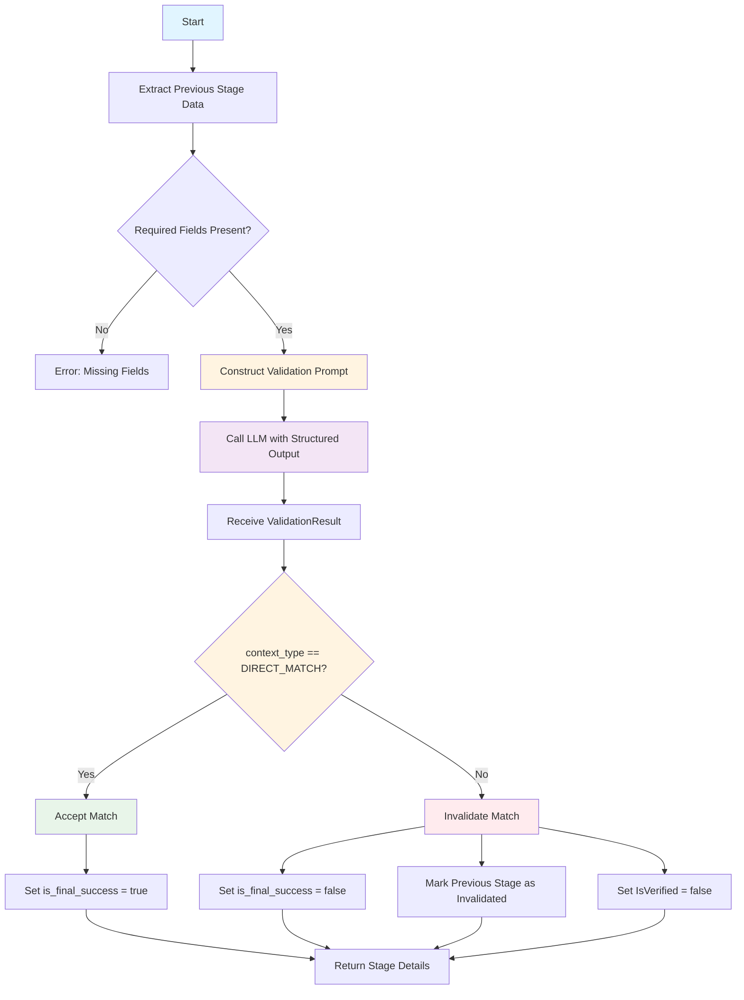

# CONTEXT_VALIDATOR Stage - Match Validation Logic

**Last Updated:** 2025-12-19
**Author:** Kirill Levtov
**Related:** [Solution Overview](01-solution-overview.md) | [COMPLETE_MATCH Stage](04-complete-match-stage.md) | [SEMANTIC_SEARCH Stage](06-semantic-search-stage.md)

## Overview

The CONTEXT_VALIDATOR stage validates the contextual relevance of matches found by previous stages (primarily COMPLETE_MATCH). While exact matching can find products with matching part numbers and manufacturers, it cannot determine if the matched product is actually what the invoice line is describing. This stage uses a Large Language Model (LLM) to understand the context and determine if the match is appropriate.

This is a **validation stage** - it doesn't extract new information but judges whether existing matches are contextually correct. It executes **only** when the `COMPLETE_MATCH` stage identifies a potential match that meets or exceeds its configured confidence thresholds. If the exact match result is too weak to trigger a stop, the pipeline skips validation and proceeds directly to subsequent extraction stages. If a match is invalidated, subsequent stages can provide alternative results.

## Key Concepts

### Contextual Validation
The stage answers the question: "Is the matched product actually what this invoice line is describing?"

**Example Problem:**
- Invoice: "Blade for Dewalt DW745 Table Saw"
- COMPLETE_MATCH finds: "Dewalt DW745 Table Saw" (exact match on "DW745")
- But the invoice is describing a **blade FOR the saw**, not the saw itself
- CONTEXT_VALIDATOR identifies this mismatch and invalidates the match

### Validation vs. Extraction
Unlike extraction stages that find new information, validation stages:
- Judge existing results from other stages
- Don't produce new manufacturer/part number/UNSPSC values
- Can invalidate matches to allow other stages to provide alternatives
- Use the `is_validation_stage` flag in their results

### Relationship Types
The LLM classifies the relationship between the invoice text and matched product into one of five categories:

1. **DIRECT_MATCH**: The invoice describes the matched item exactly.
   - **Example**: "Dewalt DW745 Table Saw" → Matched: "Dewalt DW745 Table Saw"
   - **Substitution Rule**: If the invoice says "Sub for [Old Item]" and the match is the **New Item**, it is a DIRECT_MATCH.
   - **UOM Rule**: Differences in packaging (e.g., "Box" vs "Each") are ignored if the core product is the same.

2. **REPLACEMENT_PART**: The invoice item is a component, spare part, or repair item intended **FOR** the matched item.
   - **Example**: "Blade for Dewalt DW745" → Matched: "Dewalt DW745 Table Saw"
   - **Grammar Rule**: The system looks for directional prepositions like "for", "fits", "used with", or "compatible with".

3. **ACCESSORY_PART**: The invoice item is an optional add-on for the matched item.
   - **Example**: "Carrying Case for Dewalt DW745" → Matched: "Dewalt DW745 Table Saw"

4. **LOT_OR_KIT**: The invoice describes a bundle, kit, or assembly, but the matched item is only one component of that group.
   - **Example**: "Saw Kit with Blade and Case" → Matched: "Dewalt DW745 Table Saw" (The match is incomplete).

5. **UNRELATED**: The match is incorrect or refers to a different product mentioned in the text (e.g., a reference item).
   - **Example (Mismatch)**: "3/4 Inch EMT Conduit" → Matched: "3/4 Inch Rigid Conduit" (Different product type).
   - **Example (Reference)**: "Replacement for Part X" → Matched: "Part X" (The match is the item being replaced, not the item being sold).


### Substitution Rule
Special handling for substitution scenarios:

**Rule:** If the invoice mentions "Sub for", "Replaces", "Alternative to", AND the matched item is the **new** item being supplied (not the reference item), this is a DIRECT_MATCH.

**Example:**
- Invoice: "Sub for Dewalt DW745 - New Model DW746"
- Matched: "Dewalt DW746 Table Saw"
- Classification: DIRECT_MATCH (DW746 is the new item being supplied)

**Counter-Example:**
- Invoice: "Sub for Dewalt DW745 - New Model DW746"
- Matched: "Dewalt DW745 Table Saw"
- Classification: UNRELATED (DW745 is the old item being replaced, not what's being supplied)

### UOM (Unit of Measure) Rule
Package quantity differences are ignored if the core product is the same:

**Example:**
- Invoice: "Box of 100 - Eaton Circuit Breakers"
- Matched: "Eaton Circuit Breaker (Each)"
- Classification: DIRECT_MATCH (same product, different packaging)

### Validation Outcomes

**Match Accepted (is_direct_match = true):**
- Only DIRECT_MATCH relationships are accepted
- The matched product is what the invoice is describing
- Confidence scores from COMPLETE_MATCH are preserved
- IsVerified flag remains true (if it was set)

**Match Invalidated (is_direct_match = false):**
- All other relationship types invalidate the match
- The matched product is NOT what the invoice is describing
- IsVerified flag is set to false
- The COMPLETE_MATCH stage is marked as invalidated
- Subsequent stages (SEMANTIC_SEARCH, FINETUNED_LLM, etc.) can provide alternatives

### Structured Output
The stage uses Azure OpenAI's structured output feature to guarantee valid JSON responses:
- LLM response is forced to conform to a Pydantic schema
- No parsing errors or malformed JSON
- Always returns `context_type` and `reason` fields
- Validation happens at the API level


## Python Modules

### ai_stages.py
Stage implementation that orchestrates context validation.

**Key Method:**

- `AIStages.validate_context(sdp, ai_engine_cache, ivce_dtl, previous_stage_details, stage_number, sub_stage_code)` - Main entry point
  - Extracts required data from previous stage results
  - Validates inputs (invoice text, matched manufacturer, part number, description)
  - Constructs prompt for LLM
  - Calls LLM to get structured validation result
  - Applies deterministic logic to classification
  - Populates stage details with validation outcome
  - Marks previous stage as invalidated if match fails

**Input Validation:**
- Checks for required fields: original_invoice_text, matched_mfr, matched_pn, matched_description
- Raises ValueError if any required field is missing
- Logs missing fields for debugging

**Validation Logic:**
```python
is_direct_match_flag = validation_result.context_type == MatchContextType.DIRECT_MATCH
```

**Invalidation Logic:**
```python
if not stage_details.is_final_success:
    if previous_stage_details.details.get(Logs.IS_VERIFIED) is True:
        previous_stage_details.details[Logs.IS_VERIFIED] = False
    previous_stage_details.is_invalidated = True
```

### prompts.py
Prompt templates for LLM validation.

**Key Method:**

- `Prompts.get_context_validator_prompt(invoice_text, mfr, pn, db_description)` - Constructs validation prompt
  - Formats invoice text and matched product information
  - Provides clear instructions for relationship classification
  - Includes substitution rule, UOM rule, and grammar rules
  - Returns formatted prompt string

**Prompt Structure:**
```
You are a procurement expert verifying if a database match is contextually correct.

Input Invoice Text: "{invoice_text}"
Matched Database Item: Manufacturer="{mfr}", PartNumber="{pn}", Description="{db_description}"

Task: Identify the PRIMARY ITEM being sold in the invoice text and determine its relationship to the Matched Database Item.

[Relationship type definitions and rules]
```

### llm.py
LLM client wrapper for structured output.

**Key Method:**

- `LLM.get_structured_response(prompt, output_model, client_type)` - Calls LLM with structured output
  - Selects appropriate LLM client based on client_type
  - Creates structured output chain using Pydantic schema
  - Invokes chain with prompt
  - Returns validated Pydantic model instance
  - Handles transient errors with retry logic

**Client Selection:**
```python
llm_client = self.client_map.get(client_type)
# For CONTEXT_VALIDATOR: uses aoai_context_validator client
```

**Structured Output:**
```python
structured_llm_chain = llm_client.with_structured_output(
    schema=output_model,
    method="function_calling",
    strict=True
)
```

### ai_schemas.py (Pydantic Models)
Defines the structured output schema.

**ValidationResult Model:**
```python
class ValidationResult(BaseModel):
    context_type: MatchContextType = Field(
        description="The classification of the relationship..."
    )
    reason: str = Field(
        description="A brief, clear explanation in 1-2 sentences..."
    )
```

**MatchContextType Enum:**
```python
class MatchContextType(str, Enum):
    DIRECT_MATCH = "DIRECT_MATCH"
    REPLACEMENT_PART = "REPLACEMENT_PART"
    ACCESSORY_PART = "ACCESSORY_PART"
    LOT_OR_KIT = "LOT_OR_KIT"
    UNRELATED = "UNRELATED"
```


## Configuration

The CONTEXT_VALIDATOR stage is configured through `config.yaml`:

### Configuration Structure

```yaml
OPENAI_DEPLOYMENT:
  CONTEXT_VALIDATOR:
    API_DEPLOYMENT: "gpt-4o-2024-08-06"
    API_KEY: "${AOAI_CONTEXT_VALIDATOR_API_KEY}"
    API_BASE_URL: "https://your-endpoint.openai.azure.com/"
    API_VERSION: "2024-08-01-preview"
```

### Configuration Parameters

| Parameter | Type | Description | Example |
|-----------|------|-------------|---------|
| `API_DEPLOYMENT` | string | Azure OpenAI deployment name | "gpt-4o-2024-08-06" |
| `API_KEY` | string | Azure OpenAI API key | "${AOAI_CONTEXT_VALIDATOR_API_KEY}" |
| `API_BASE_URL` | string | Azure OpenAI endpoint URL | "https://your-endpoint.openai.azure.com/" |
| `API_VERSION` | string | Azure OpenAI API version | "2024-08-01-preview" |

### LLM Settings

The stage uses specific LLM settings for validation:

```python
temperature=0.0  # Deterministic output
method="function_calling"  # Structured output
strict=True  # Enforce schema validation
```

**Temperature = 0.0:**
- Ensures consistent, deterministic responses
- No randomness in classification
- Same input always produces same output

**Function Calling:**
- Uses Azure OpenAI's function calling feature
- Forces response to match Pydantic schema
- Guarantees valid JSON structure

**Strict Mode:**
- Enforces strict schema validation
- Rejects responses that don't match schema
- Prevents parsing errors


## Business Logic

### Processing Flow



### Step-by-Step Processing

**1. Trigger Evaluation**
- The system checks if the `COMPLETE_MATCH` results meet the required confidence thresholds to potentially stop the pipeline.
- **If Thresholds Met**: The `CONTEXT_VALIDATOR` runs to verify the match before finalizing.
- **If Thresholds Not Met**: The validator is skipped, and the pipeline continues to the next extraction stage.

**2. Extract Previous Stage Data**

The stage extracts required information from the previous stage (typically COMPLETE_MATCH):

```python
original_invoice_text = ivce_dtl.ITM_LDSC
prev_details = previous_stage_details.details

matched_mfr = prev_details.get(Logs.MFR_NAME)
matched_pn = prev_details.get(Logs.PRT_NUM)
matched_description = prev_details.get("matched_description")
```

**Required Fields:**
- `original_invoice_text`: The raw invoice line description
- `matched_mfr`: Manufacturer name from the match
- `matched_pn`: Part number from the match
- `matched_description`: Product description from the database

**3. Input Validation**

Defensive validation ensures all required fields are present:

```python
if not (original_invoice_text and matched_mfr and matched_pn and matched_description):
    missing_fields = []
    if not original_invoice_text:
        missing_fields.append("original_invoice_text")
    # ... check other fields
    raise ValueError(f"Missing required inputs: {missing_fields}")
```

**Why This Matters:**
- LLM needs all context to make accurate judgment
- Missing fields would lead to incorrect validation
- Better to fail fast than produce wrong results

**4. Construct Validation Prompt**

The prompt provides the LLM with:
- Original invoice text (what the user wrote)
- Matched product information (what we found)
- Clear instructions for classification
- Rules for special cases (substitution, UOM)

**Example Prompt:**
```
You are a procurement expert verifying if a database match is contextually correct.

Input Invoice Text: "Blade for Dewalt DW745 Table Saw"
Matched Database Item: Manufacturer="DEWALT", PartNumber="DW745", Description="DEWALT DW745 10-INCH TABLE SAW"

Task: Identify the PRIMARY ITEM being sold in the invoice text and determine its relationship to the Matched Database Item.

[Relationship type definitions and rules]
```

**5. Call LLM with Structured Output**

The stage calls the LLM using Azure OpenAI's structured output feature:

```python
validation_result: ValidationResult = await self.llms.get_structured_response(
    prompt=prompt,
    output_model=ValidationResult,
    client_type=LLMClientType.CONTEXT_VALIDATOR
)
```

**Structured Output Benefits:**
- Guaranteed valid JSON response
- No parsing errors
- Always returns required fields
- Type-safe (Pydantic validation)

**6. Receive ValidationResult**

The LLM returns a structured response:

```python
{
    "context_type": "REPLACEMENT_PART",
    "reason": "The invoice describes a blade that is used with the DW745 saw, not the saw itself. The matched item is the saw, but the invoice is for a replacement part."
}
```

**7. Apply Deterministic Logic**

The stage applies simple logic to the LLM's classification:

```python
is_direct_match_flag = validation_result.context_type == MatchContextType.DIRECT_MATCH
```

**Only DIRECT_MATCH is accepted:**
- DIRECT_MATCH → Match accepted
- All others → Match invalidated

**8. Populate Stage Details**

The stage records the validation outcome:

```python
stage_details.status = Constants.SUCCESS_lower
stage_details.details = {
    Logs.END_TIME: get_current_datetime_cst(),
    "is_direct_match": is_direct_match_flag,
    "context_type": validation_result.context_type.value,
    "reason": validation_result.reason,
    "input_invoice_text": original_invoice_text,
    "input_matched_description": matched_description,
    "validated_stage_number": previous_stage_details.stage_number,
    "validated_stage_name": previous_stage_details.stage_name,
}
stage_details.is_final_success = is_direct_match_flag
```

**9. Invalidate Previous Stage (if needed)**

If the match is not a DIRECT_MATCH, the stage invalidates the previous stage:

```python
if not stage_details.is_final_success:
    # Clear the verification flag
    if previous_stage_details.details.get(Logs.IS_VERIFIED) is True:
        previous_stage_details.details[Logs.IS_VERIFIED] = False

    # Mark the stage as invalidated
    previous_stage_details.is_invalidated = True
```

**Impact of Invalidation:**
- The COMPLETE_MATCH results are marked as invalid (`is_invalidated=True`).
- The pipeline continues to subsequent extraction stages (e.g., **FINETUNED_LLM**, **WEB_SEARCH**) to find better alternatives.
- The invalidated match is excluded from the final "Best-Value Selection" process.
- The `is_verified_flag` is explicitly set to `false`.


### Relationship Classification Logic

The LLM uses sophisticated reasoning to classify relationships:

**DIRECT_MATCH Classification:**
- The invoice describes the matched item exactly
- Core product identity is the same
- Ignore packaging differences (Box vs Each)
- Handle substitution scenarios correctly

**REPLACEMENT_PART Classification:**
- Look for grammar patterns: "for", "fits", "used with", "compatible with"
- The matched item comes AFTER these words
- Example: "Blade FOR [Saw]" → Saw is matched item, blade is what's being sold

**ACCESSORY_PART Classification:**
- Optional add-ons or accessories
- Not essential for operation
- Examples: cases, chargers, straps, covers

**LOT_OR_KIT Classification:**
- Invoice describes multiple items together
- Matched item is only one component
- Bundle or kit scenario

**UNRELATED Classification:**
- Complete mismatch
- Matched item is the reference item being replaced (not the replacement)
- Different product entirely

### Special Case Handling

**Substitution Scenarios:**

The stage correctly handles substitution language:

**Scenario 1: New Item Matched**
```
Invoice: "Sub for DW745 - New Model DW746"
Matched: "Dewalt DW746 Table Saw"
Classification: DIRECT_MATCH
Reason: DW746 is the new item being supplied
```

**Scenario 2: Old Item Matched**
```
Invoice: "Sub for DW745 - New Model DW746"
Matched: "Dewalt DW745 Table Saw"
Classification: UNRELATED
Reason: DW745 is the old item being replaced, not what's being supplied
```

**UOM (Unit of Measure) Scenarios:**

The stage ignores packaging differences:

```
Invoice: "Box of 100 - Eaton Circuit Breakers"
Matched: "Eaton Circuit Breaker (Each)"
Classification: DIRECT_MATCH
Reason: Same product, different packaging quantity
```

**Grammar-Based Detection:**

The stage uses grammar to identify relationships:

```
Invoice: "Blade for Dewalt DW745"
Matched: "Dewalt DW745 Table Saw"
Classification: REPLACEMENT_PART
Reason: "for" indicates the blade is FOR the saw, not the saw itself
```

### Error Handling

**Missing Required Fields:**
```python
raise ValueError(f"Missing required inputs for context validation: {missing_fields}")
```
- Stage fails immediately
- Logs missing fields
- Does not attempt validation with incomplete data

**LLM API Errors:**
- Transient errors (rate limits, timeouts) are retried automatically
- Retry logic in `llm.py` handles exponential backoff
- Non-retryable errors are logged and raised as InvoiceProcessingError

**Unexpected Exceptions:**
```python
except Exception as e:
    logger.error(f"CONTEXT_VALIDATOR: Error during processing: {str(e)}", exc_info=True)
    stage_details.status = Constants.ERROR_lower
    stage_details.details = {
        Logs.END_TIME: get_current_datetime_cst(),
        Constants.MESSAGE: f"Unexpected error during context validation: {str(e)}",
        "is_direct_match": False,  # Fail safely
    }
    stage_details.is_final_success = False
```

**Fail-Safe Behavior:**
- On error, assume match is invalid (is_direct_match = False)
- Better to reject a good match than accept a bad one
- Subsequent stages can still provide alternatives


## Dependencies

### Required Services

1. **Azure OpenAI (CONTEXT_VALIDATOR Deployment)**
   - Purpose: LLM for contextual validation
   - Model: GPT-4o or similar
   - Dependency: Must be accessible
   - Failure Impact: Stage fails, match cannot be validated

2. **Previous Stage Results (COMPLETE_MATCH)**
   - Purpose: Provides match to validate
   - Required Fields: manufacturer, part number, matched description
   - Dependency: COMPLETE_MATCH must have found a match
   - Failure Impact: Stage skipped if no match to validate

### Module Dependencies

- `ai_stages.py` - Stage implementation
- `prompts.py` - Prompt templates
- `llm.py` - LLM client wrapper
- `ai_schemas.py` - Pydantic models for structured output
- `constants.py` - Stage names, field names, enums
- `logger.py` - Logging

### Depends On

- **COMPLETE_MATCH Stage** - Provides match to validate.
  - **Condition**: COMPLETE_MATCH must have found a match **AND** that match must meet the configured confidence thresholds.
  - **Reason**: There is no value in validating a low-confidence match that wouldn't be selected anyway.

### Used By

- **Final Consolidation** - Uses validation result to determine if COMPLETE_MATCH results should be used
- **Subsequent Stages** - If match invalidated, subsequent stages can provide alternatives

### Stage Execution Order

```
CLASSIFICATION → SEMANTIC_SEARCH → COMPLETE_MATCH → CONTEXT_VALIDATOR → FINETUNED_LLM → ...
```

**Key Points:**
- CONTEXT_VALIDATOR runs immediately after COMPLETE_MATCH
- Only runs if COMPLETE_MATCH found a match
- Validation happens before other extraction stages
- Allows subsequent stages to provide alternatives if match invalidated


## Output Fields

The stage returns the following fields:

| Field | Type | Description | Example |
|-------|------|-------------|---------|
| `is_direct_match` | boolean | Whether the match is a DIRECT_MATCH | true |
| `context_type` | string | Relationship classification | "DIRECT_MATCH" |
| `reason` | string | LLM's explanation (1-2 sentences) | "The invoice describes the matched item exactly." |
| `input_invoice_text` | string | Original invoice description | "Dewalt DW745 Table Saw" |
| `input_matched_description` | string | Matched product description | "Dewalt DW745 10-Inch Table Saw" |
| `validated_stage_number` | int | Stage number being validated | 5 |
| `validated_stage_name` | string | Stage name being validated | "COMPLETE_MATCH" |
| `is_validation_stage` | boolean | Flag indicating this is a validator | true |
| `is_final_success` | boolean | Whether validation passed | true |

**Validation Stage Flags:**
- `is_validation_stage`: Always true for this stage
- `is_final_success`: true if DIRECT_MATCH, false otherwise

**Impact on Previous Stage:**
- If `is_final_success` = false:
  - Previous stage's `IsVerified` flag set to false
  - Previous stage marked with `is_invalidated` = true
  - Previous stage results not used in final consolidation


## Examples

### Example 1: DIRECT_MATCH - Exact Product

**Input:**
```
Invoice Description: "Dewalt DW745 10-Inch Table Saw"
COMPLETE_MATCH Result:
  - Manufacturer: "Dewalt"
  - Part Number: "DW745"
  - Matched Description: "Dewalt DW745 10-Inch Compact Job-Site Table Saw with Site-Pro Modular Guarding System"
```

**LLM Analysis:**
- Invoice describes a Dewalt DW745 table saw
- Matched item is a Dewalt DW745 table saw
- Core product identity is identical
- Minor description differences (compact, job-site, guarding system) are details, not different products

**Output:**
```json
{
  "is_direct_match": true,
  "context_type": "DIRECT_MATCH",
  "reason": "The invoice describes the matched item exactly. Both refer to the Dewalt DW745 table saw.",
  "input_invoice_text": "Dewalt DW745 10-Inch Table Saw",
  "input_matched_description": "Dewalt DW745 10-Inch Compact Job-Site Table Saw with Site-Pro Modular Guarding System",
  "validated_stage_number": 5,
  "validated_stage_name": "COMPLETE_MATCH",
  "is_validation_stage": true,
  "is_final_success": true
}
```

**Result:**
- Match accepted
- COMPLETE_MATCH results preserved
- IsVerified flag remains true
- Final consolidation will use these values

---

### Example 2: REPLACEMENT_PART - Blade for Saw

**Input:**
```
Invoice Description: "Blade for Dewalt DW745 Table Saw"
COMPLETE_MATCH Result:
  - Manufacturer: "Dewalt"
  - Part Number: "DW745"
  - Matched Description: "Dewalt DW745 10-Inch Table Saw"
```

**LLM Analysis:**
- Invoice describes a **blade** that is used **for** the DW745 saw
- Matched item is the **saw itself**, not the blade
- Grammar pattern: "Blade FOR [Saw]" indicates the saw is the reference item
- The primary item being sold is the blade, not the saw

**Output:**
```json
{
  "is_direct_match": false,
  "context_type": "REPLACEMENT_PART",
  "reason": "The invoice describes a blade that is used with the DW745 saw, not the saw itself. The matched item is the saw, but the invoice is for a replacement part.",
  "input_invoice_text": "Blade for Dewalt DW745 Table Saw",
  "input_matched_description": "Dewalt DW745 10-Inch Table Saw",
  "validated_stage_number": 5,
  "validated_stage_name": "COMPLETE_MATCH",
  "is_validation_stage": true,
  "is_final_success": false
}
```

**Result:**
- Match invalidated
- COMPLETE_MATCH marked as `is_invalidated = true`
- IsVerified flag set to false
- Subsequent stages (SEMANTIC_SEARCH, FINETUNED_LLM, etc.) will provide alternatives
- Final consolidation will not use COMPLETE_MATCH results

---

### Example 3: ACCESSORY_PART - Case for Tool

**Input:**
```
Invoice Description: "Carrying Case for Dewalt DW745"
COMPLETE_MATCH Result:
  - Manufacturer: "Dewalt"
  - Part Number: "DW745"
  - Matched Description: "Dewalt DW745 10-Inch Table Saw"
```

**LLM Analysis:**
- Invoice describes a **carrying case** for the DW745
- Matched item is the **saw**, not the case
- The case is an optional accessory, not the primary product
- The primary item being sold is the case, not the saw

**Output:**
```json
{
  "is_direct_match": false,
  "context_type": "ACCESSORY_PART",
  "reason": "The invoice describes a carrying case that is an accessory for the DW745 saw. The matched item is the saw itself, not the case.",
  "input_invoice_text": "Carrying Case for Dewalt DW745",
  "input_matched_description": "Dewalt DW745 10-Inch Table Saw",
  "validated_stage_number": 5,
  "validated_stage_name": "COMPLETE_MATCH",
  "is_validation_stage": true,
  "is_final_success": false
}
```

**Result:**
- Match invalidated
- Subsequent stages will search for the actual case product

---

### Example 4: LOT_OR_KIT - Bundle with Multiple Items

**Input:**
```
Invoice Description: "Dewalt DW745 Table Saw Kit with Blade, Stand, and Case"
COMPLETE_MATCH Result:
  - Manufacturer: "Dewalt"
  - Part Number: "DW745"
  - Matched Description: "Dewalt DW745 10-Inch Table Saw"
```

**LLM Analysis:**
- Invoice describes a **kit** containing multiple items: saw, blade, stand, case
- Matched item is only the **saw**, not the complete kit
- The invoice is for a bundle, but the match is only one component
- The primary item being sold is the kit, not just the saw

**Output:**
```json
{
  "is_direct_match": false,
  "context_type": "LOT_OR_KIT",
  "reason": "The invoice describes a kit containing the DW745 saw plus additional items (blade, stand, case). The matched item is only the saw, not the complete kit.",
  "input_invoice_text": "Dewalt DW745 Table Saw Kit with Blade, Stand, and Case",
  "input_matched_description": "Dewalt DW745 10-Inch Table Saw",
  "validated_stage_number": 5,
  "validated_stage_name": "COMPLETE_MATCH",
  "is_validation_stage": true,
  "is_final_success": false
}
```

**Result:**
- Match invalidated
- Subsequent stages will search for the actual kit product

---

### Example 5: UNRELATED - Replacement Scenario (Old Item Matched)

**Input:**
```
Invoice Description: "Replacement for Dewalt DW745 - New Model DW746"
COMPLETE_MATCH Result:
  - Manufacturer: "Dewalt"
  - Part Number: "DW745"
  - Matched Description: "Dewalt DW745 10-Inch Table Saw"
```

**LLM Analysis:**
- Invoice describes a **replacement** for the DW745
- The new model is **DW746**, not DW745
- Matched item is the **old model** (DW745) being replaced
- The primary item being sold is the DW746, not the DW745
- The DW745 is just a reference to what's being replaced

**Output:**
```json
{
  "is_direct_match": false,
  "context_type": "UNRELATED",
  "reason": "The invoice describes a replacement for the DW745 (the new model is DW746). The matched item is the old model being replaced, not the new item being supplied.",
  "input_invoice_text": "Replacement for Dewalt DW745 - New Model DW746",
  "input_matched_description": "Dewalt DW745 10-Inch Table Saw",
  "validated_stage_number": 5,
  "validated_stage_name": "COMPLETE_MATCH",
  "is_validation_stage": true,
  "is_final_success": false
}
```

**Result:**
- Match invalidated
- Subsequent stages will search for DW746 (the actual product being supplied)

---

### Example 6: Substitution Rule - New Item Matched (DIRECT_MATCH)

**Input:**
```
Invoice Description: "Sub for DW745 - New Model DW746"
COMPLETE_MATCH Result:
  - Manufacturer: "Dewalt"
  - Part Number: "DW746"
  - Matched Description: "Dewalt DW746 10-Inch Table Saw"
```

**LLM Analysis:**
- Invoice mentions substitution: "Sub for DW745"
- The new model is DW746
- Matched item is **DW746** (the new item being supplied)
- **Substitution Rule:** If matched item is the new item, this is a DIRECT_MATCH
- The primary item being sold is the DW746, which matches

**Output:**
```json
{
  "is_direct_match": true,
  "context_type": "DIRECT_MATCH",
  "reason": "The invoice indicates a substitution where DW746 is the new model replacing DW745. The matched item is DW746, which is the new item being supplied.",
  "input_invoice_text": "Sub for DW745 - New Model DW746",
  "input_matched_description": "Dewalt DW746 10-Inch Table Saw",
  "validated_stage_number": 5,
  "validated_stage_name": "COMPLETE_MATCH",
  "is_validation_stage": true,
  "is_final_success": true
}
```

**Result:**
- Match accepted
- Substitution rule correctly applied
- COMPLETE_MATCH results preserved

---

### Example 7: UOM Rule - Packaging Difference (DIRECT_MATCH)

**Input:**
```
Invoice Description: "Box of 100 - Eaton BR120 Circuit Breakers 20A"
COMPLETE_MATCH Result:
  - Manufacturer: "Eaton"
  - Part Number: "BR120"
  - Matched Description: "Eaton BR120 Circuit Breaker 20 Amp (Each)"
```

**LLM Analysis:**
- Invoice describes a box of 100 circuit breakers
- Matched item is the same circuit breaker sold individually (Each)
- Core product identity is identical: Eaton BR120 20A circuit breaker
- Only difference is packaging quantity (Box of 100 vs Each)
- **UOM Rule:** Ignore packaging differences if core product is the same

**Output:**
```json
{
  "is_direct_match": true,
  "context_type": "DIRECT_MATCH",
  "reason": "The invoice and matched item describe the same Eaton BR120 circuit breaker. The only difference is packaging quantity (Box of 100 vs Each), which is ignored per UOM rule.",
  "input_invoice_text": "Box of 100 - BR120 Eaton Circuit Breakers 20A",
  "input_matched_description": "Eaton BR120 Circuit Breaker 20 Amp (Each)",
  "validated_stage_number": 5,
  "validated_stage_name": "COMPLETE_MATCH",
  "is_validation_stage": true,
  "is_final_success": true
}
```

**Result:**
- Match accepted
- UOM rule correctly applied
- Packaging differences ignored


## Performance Characteristics

### Throughput
- **~1-5 validations per second** (per processing thread).
- **Bottleneck**: Azure OpenAI API latency and concurrency limits.
- **Concurrency**: Throughput is strictly limited by the assigned Tokens-Per-Minute (TPM) quota on the Azure OpenAI deployment.

### Latency
- **LLM API call**: 500-2000ms (varies based on model load and response length).
- **Processing**: < 10ms (Prompt construction and JSON parsing).
- **Total**: **~500-2000ms per validation**.

### Accuracy
- **Qualitative Assessment**: Production reviews indicate **high accuracy** in distinguishing context.
- **Strengths**: The stage is particularly effective at identifying **Replacement Parts** (using grammar clues) and distinguishing **Unrelated** items where exact text matches are misleading (e.g., "Replacement for X").
- **Factors Affecting Accuracy**:
  - Clarity of the invoice description syntax.
  - Detail level of the matched database description.
  - LLM model capabilities (GPT-4o provides significantly better reasoning for complex relationships than earlier models).

### Resource Usage
- **Memory**: Minimal (< 10 MB per request).
- **CPU**: Low (Primary operation is I/O waiting for LLM response).
- **Network**: Moderate (Continuous outbound traffic to Azure OpenAI).
- **Cost**: Driven directly by Token Usage (Input + Output).

### Token Usage
- **Input (Prompt)**: ~200-400 tokens (Includes Rules, Substitution/UOM logic, and Item details).
- **Output (Response)**: ~50-100 tokens (Structured JSON format).
- **Total**: ~250-500 tokens per validation.


## Monitoring and Troubleshooting

### Common Issues

**Issue: Stage Skipped**
- Symptom: CONTEXT_VALIDATOR doesn't run
- Possible Causes:
  - COMPLETE_MATCH found no match
  - COMPLETE_MATCH stage failed
  - Missing required fields in COMPLETE_MATCH results
- Solution: Check COMPLETE_MATCH results, verify all required fields present

**Issue: All Matches Invalidated**
- Symptom: Every match classified as non-DIRECT_MATCH
- Possible Causes:
  - Invoice descriptions are ambiguous or poorly written
  - Matched products are consistently wrong
  - LLM prompt needs adjustment
- Solution: Review invoice descriptions, check COMPLETE_MATCH accuracy, analyze LLM reasoning

**Issue: False Positives (Bad Matches Accepted)**
- Symptom: Incorrect matches classified as DIRECT_MATCH
- Possible Causes:
  - LLM misunderstood context
  - Invoice description is misleading
  - Matched description is incomplete
- Solution: Review LLM reasoning, improve invoice descriptions, enhance matched descriptions

**Issue: False Negatives (Good Matches Rejected)**
- Symptom: Correct matches classified as non-DIRECT_MATCH
- Possible Causes:
  - LLM too strict in interpretation
  - Invoice description has extra details
  - UOM rule not applied correctly
- Solution: Review LLM reasoning, adjust prompt if needed, check for edge cases

**Issue: LLM API Errors**
- Symptom: Stage fails with API errors
- Possible Causes:
  - Rate limits exceeded
  - API endpoint unavailable
  - Authentication failure
  - Timeout
- Solution: Check API status, verify credentials, review rate limits, check retry logic

**Issue: Missing Required Fields**
- Symptom: ValueError raised about missing fields
- Possible Causes:
  - COMPLETE_MATCH didn't return matched_description
  - Previous stage results incomplete
  - Data extraction error
- Solution: Check COMPLETE_MATCH implementation, verify matched_description field populated

### Health Checks

**Before Stage Runs:**
- Azure OpenAI endpoint accessible
- CONTEXT_VALIDATOR deployment available
- API credentials valid
- COMPLETE_MATCH found a match to validate

**During Execution:**
- Monitor LLM API latency
- Check for API errors or rate limits
- Verify structured output schema validation
- Track validation outcomes (accept vs reject rates)

**After Completion:**
- Verify validation result recorded
- Check if previous stage invalidated (if applicable)
- Confirm is_final_success flag set correctly
- Review LLM reasoning for quality

### Debugging Tips

**Enable Debug Logging:**
```python
logger.setLevel(logging.DEBUG)
```

**Review LLM Reasoning:**
- Check the `reason` field in output
- Understand why LLM classified the relationship
- Look for patterns in misclassifications

**Test with Known Cases:**
- Create test cases with known correct classifications
- Verify LLM produces expected results
- Identify edge cases or failure modes

**Analyze Validation Rates:**
- Track percentage of matches accepted vs rejected
- High rejection rate may indicate COMPLETE_MATCH issues
- Low rejection rate may indicate validator too lenient

**Check Prompt Quality:**
- Review prompt construction
- Ensure all required information included
- Verify rules and examples are clear

**Monitor API Performance:**
- Track LLM API latency
- Check for rate limit errors
- Monitor token usage and costs
