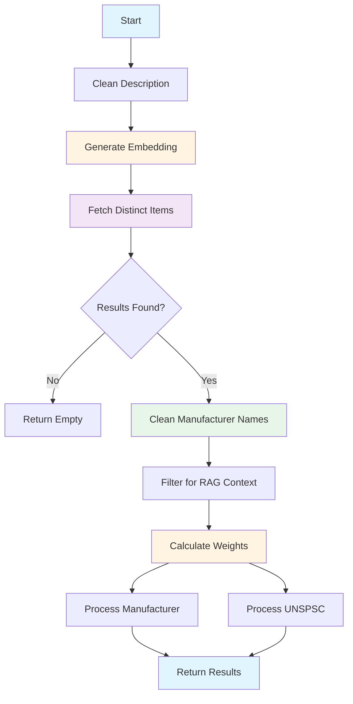

# SEMANTIC_SEARCH Stage - Vector-Based Similarity Search

**Last Updated:** 2025-12-22
**Author:** Kirill Levtov
**Related:** [Solution Overview](01-solution-overview.md) | [Indexer](02-indexer.md) | [FINETUNED_LLM Stage](07-finetuned-llm-stage.md)

## Overview

The SEMANTIC_SEARCH stage uses vector embeddings and Azure AI Search to find semantically similar products based on the invoice description. Unlike exact text matching, semantic search understands meaning - it can find "insulating sleeve" even when the invoice says "insulation bushing" because these concepts are semantically similar.

This stage is typically the first extraction stage in the pipeline (after classification). It provides initial estimates for manufacturer name and UNSPSC code that can be refined by subsequent stages. The stage also caches search results for use by the FINETUNED_LLM stage as RAG (Retrieval Augmented Generation) context.

## Key Concepts

### Vector Embeddings
Numerical representations of text that capture semantic meaning. Similar concepts have similar embeddings, even if the exact words differ. The system uses Azure OpenAI's text-embedding-3-large model (1536 dimensions) to convert invoice descriptions into embeddings.

**Example:**
- "T&B 425 insulating sleeve" → [0.123, -0.456, 0.789, ...]
- "Thomas & Betts 425 insulation bushing" → [0.125, -0.452, 0.791, ...]
- These embeddings are very similar (high cosine similarity)

### Hybrid Search
Combines two search approaches:
- **Vector Search**: Finds semantically similar items using embeddings
- **Keyword Search**: Finds exact or partial text matches
- Azure AI Search automatically combines both for better results

### Similarity Score
A value between 0 and 1 indicating how similar two embeddings are:
- 1.0 = Identical
- 0.9-0.99 = Very similar
- 0.8-0.89 = Similar
- 0.7-0.79 = Somewhat similar
- < 0.7 = Not very similar

The stage uses a configurable threshold (default: 0.75) to filter results.

### Weighted Scoring
Not all search results are equally important. The stage calculates exponential weights based on similarity scores:
- Higher similarity = Higher weight
- Weights emphasize top results
- Formula: `weight = exp(exp_factor * (score - mid_point))`

### UNSPSC Hierarchy
UNSPSC codes have a hierarchical structure:
- **Family** (4 digits + 0000): Broad category (e.g., "3913" = Electrical equipment)
- **Class** (6 digits + 00): Narrower category (e.g., "391300" = Conduit and fittings)
- **Commodity** (8 digits): Specific product (e.g., "39131711" = Insulating sleeves)

The stage considers all hierarchy levels and selects the most appropriate one based on confidence scores.

### RAG Context Caching
The stage caches top search results for use by the FINETUNED_LLM stage:
- Filters results by similarity threshold (default: 0.85)
- Deduplicates by manufacturer + UNSPSC combination
- Limits to top 3 diverse examples
- Provides real-world examples to guide LLM extraction


## Python Modules

### semantic_matching.py
Core semantic matching logic with weighted scoring and UNSPSC hierarchy handling.

**Main Function:**

- `semantic_match_by_description(description, azure_search_utils, sdp, llm)` - Performs semantic search
  - Accepts string description or pre-calculated embedding
  - Returns best match summary and top N raw results
  - Applies manufacturer name cleaning if SDP provided
  - Calculates weighted confidence scores

**Helper Functions:**

- `_get_embedding(description, llm)` - Gets or generates embedding
  - Returns embedding directly if already a list
  - Generates embedding using LLM if string

- `_fetch_distinct_items(...)` - Fetches distinct items from search index
  - Iteratively searches until target number of distinct ItemIDs found
  - Filters by similarity threshold
  - Excludes already-found items in subsequent queries
  - Returns highest-scoring document per ItemID

- `_filter_results_for_rag_context(results, min_similarity)` - Filters results for RAG
  - Applies similarity threshold (default: 0.85)
  - Deduplicates by manufacturer + UNSPSC
  - Limits to top 3 examples
  - Returns diverse, high-quality examples

- `_calculate_weights(results, mid_point, exp_factor)` - Calculates exponential weights
  - Formula: `weight = exp(exp_factor * (score - mid_point))`
  - Higher scores get exponentially higher weights
  - Emphasizes top results in confidence calculation

- `_process_manufacturer_with_weights(...)` - Determines best manufacturer
  - Groups results by manufacturer name
  - Calculates confidence: `max_score * (group_weight / total_weight) * 100`
  - Applies single match factor if only one result
  - Returns manufacturer with highest confidence

- `_process_unspsc_with_weights(...)` - Determines best UNSPSC
  - Generates UNSPSC variants (commodity, class, family)
  - Calculates confidence for each variant
  - Selects best variant using hierarchical rules
  - Applies single match factor if only one result

**UNSPSC Hierarchy Functions:**

- `_generate_unspsc_variants(results)` - Generates all UNSPSC variants
  - Original code (commodity level)
  - Class level (last 2 digits → 00)
  - Family level (last 4 digits → 0000)

- `_get_matching_rows_for_unspsc_variant(results, variant, level)` - Filters by variant
  - Level 3: Exact match
  - Level 2: First 6 digits match
  - Level 1: First 4 digits match

- `_select_best_unspsc_variant(...)` - Selects best UNSPSC using rules
  - Prioritizes more specific levels (commodity > class > family)
  - Checks against level thresholds
  - Requires generic level to be significantly better to override specific
  - Falls back to highest confidence if no threshold met

**Configuration:**

- `get_config()` - Loads configuration from confidences.yaml
  - Returns SEMANTIC_SEARCH section
  - Contains search parameters, weights, thresholds

### ai_stages.py
Stage implementation that orchestrates semantic search.

**Key Method:**

- `AIStages.check_semantic_match(sdp, ai_engine_cache, ivce_dtl, stage_number, sub_stage_code)` - Main entry point
  - Validates and cleans description
  - Generates embedding using LLM
  - Calls semantic_match_by_description()
  - Caches results for RAG context
  - Processes and returns stage results

**Helper Methods:**

- `_generate_description_embedding(cleaned_description, log_context)` - Generates embedding
  - Calls LLM.get_embeddings()
  - Returns 1536-dimension vector

- `_process_semantic_match_result(...)` - Processes successful match
  - Extracts manufacturer name, UNSPSC, confidence scores
  - Removes empty/null values
  - Populates stage_details

- `_handle_no_semantic_match(...)` - Handles no match found
  - Logs warning
  - Sets appropriate status

### azure_search_utils.py
Utilities for interacting with Azure AI Search.

**Key Methods:**

- `search(vector_query, filter_expression, select, top)` - Performs search
  - Executes hybrid search (vector + keyword)
  - Returns results as DataFrame
  - Includes similarity scores

### llm.py
LLM client wrapper for generating embeddings.

**Key Methods:**

- `get_embeddings(texts)` - Generates embeddings for text list
  - Calls Azure OpenAI text-embedding-3-large
  - Returns list of 1536-dimension vectors

## Configuration

The SEMANTIC_SEARCH stage is configured through the `confidences.yaml` file:

### Configuration Structure

```yaml
SEMANTIC_SEARCH:
  SEMANTIC_SEARCH:
    SEARCH:
      similarity_threshold: 0.75
      top_results: 5
      max_results: 25

    WEIGHTS:
      mid_point: 0.55
      exp_factor: 10

    CONFIDENCE:
      single_match_factor: 0.95
      min_confidence_threshold: 50
      single_match_similarity_threshold: 80

    UNSPSC:
      level_thresholds: [90, 80, 70, 60]
      generic_delta_percentage: 10

    RAG_CONTEXT:
      min_example_similarity: 0.85
```

### Configuration Parameters

**SEARCH Parameters:**

| Parameter | Type | Description | Default |
|-----------|------|-------------|---------|
| `similarity_threshold` | float | Minimum similarity score (0-1) to include result | 0.75 |
| `top_results` | int | Target number of distinct items to return | 5 |
| `max_results` | int | Maximum results to fetch per search iteration | 25 |

**WEIGHTS Parameters:**

| Parameter | Type | Description | Default |
|-----------|------|-------------|---------|
| `mid_point` | float | Point where similarity becomes meaningful | 0.55 |
| `exp_factor` | float | Controls steepness of exponential weighting curve | 10 |

**CONFIDENCE Parameters:**

| Parameter | Type | Description | Default |
|-----------|------|-------------|---------|
| `min_confidence_threshold` | int | Minimum confidence (0-100) to return result | 50 |
| `single_match_factor` | float | Multiplier for confidence when only one result found | 0.95 |
| `single_match_similarity_threshold` | int | Minimum similarity (0-100) for single match to be accepted | 80 |

**UNSPSC Parameters:**

| Parameter | Type | Description | Default |
|-----------|------|-------------|---------|
| `level_thresholds` | list[int] | Thresholds for each UNSPSC level when comparing different levels | [90, 80, 70, 60] |
| `generic_delta_percentage` | int | Percentage by which generic must exceed specific to be chosen | 10 |

**RAG_CONTEXT Parameters:**

| Parameter | Type | Description | Default |
|-----------|------|-------------|---------|
| `min_example_similarity` | float | Minimum similarity (0-1) for RAG examples | 0.85 |

## Business Logic

### Processing Flow



### Step-by-Step Processing

**1. Description Cleaning**
- Remove extra whitespace
- Normalize text
- Prepare for embedding generation

**2. Embedding Generation**
- Call Azure OpenAI text-embedding-3-large
- Convert description to 1536-dimension vector
- Cache embedding for subsequent stages

**3. Iterative Search for Distinct Items**
- Goal: Find 5 distinct ItemIDs above similarity threshold
- Process:
  1. Search for 25 candidates
  2. Filter by similarity threshold (0.75)
  3. Keep highest-scoring document per ItemID
  4. If < 5 distinct items found, search again excluding found ItemIDs
  5. Repeat until 5 distinct items or no more candidates

**4. Manufacturer Name Cleaning**
- If SDP connection provided, load manufacturer mapping
- Map unclean names to clean names (e.g., "T&B" → "THOMAS & BETTS")
- Set IsMfrClean flag if any names were cleaned

**5. RAG Context Filtering**
- Filter results by min_example_similarity (0.85)
- Deduplicate by manufacturer + UNSPSC combination
- Keep top 3 diverse examples
- Cache for FINETUNED_LLM stage

**6. Weight Calculation**
- For each result, calculate: `weight = exp(10 * (score - 0.55))`
- Example weights:
  - Score 0.95: weight = exp(10 * 0.40) = 54.60
  - Score 0.90: weight = exp(10 * 0.35) = 33.12
  - Score 0.85: weight = exp(10 * 0.30) = 20.09
  - Score 0.80: weight = exp(10 * 0.25) = 12.18

**7. Manufacturer Processing**
- Group results by manufacturer name
- For each manufacturer:
  - Sum weights of results containing it
  - Get max similarity score among those results
  - Calculate: `confidence = max_score * (group_weight / total_weight) * 100`
- Select manufacturer with highest confidence
- Apply single match factor (0.95) if only one result
- Return if confidence > 50

**8. UNSPSC Processing**
- Generate variants for each UNSPSC:
  - "39131711" (commodity)
  - "39131700" (class)
  - "39130000" (family)
- For each variant:
  - Find matching results at that hierarchy level
  - Sum weights of matching results
  - Get max similarity score
  - Calculate: `confidence = max_score * (variant_weight / total_weight) * 100`
- Select best variant using hierarchical rules
- Apply single match factor (0.95) if only one result
- Return if confidence > 50

### Confidence Calculation Formula

**Manufacturer Confidence:**
```
confidence = max_search_score * (sum_of_weights_for_mfr / total_weight) * 100
```

**UNSPSC Confidence:**
```
confidence = max_search_score * (sum_of_weights_for_variant / total_weight) * 100
```

**Single Match Adjustment:**
```
if only_one_result:
    confidence *= 0.95  # 0.95 = 5% penalty
```

**Example Calculation:**

**Parameters:**
- `mid_point`: 0.55
- `exp_factor`: 10

**Input Results:**
- Result 1: Score 0.92, MfrName "THOMAS & BETTS"
- Result 2: Score 0.88, MfrName "THOMAS & BETTS"
- Result 3: Score 0.82, MfrName "ABB"

**Weight Calculation:**
- Formula: `weight = exp(10 * (score - 0.55))`
- Result 1: `exp(10 * 0.37) = exp(3.7) ≈ 40.45`
- Result 2: `exp(10 * 0.33) = exp(3.3) ≈ 27.11`
- Result 3: `exp(10 * 0.27) = exp(2.7) ≈ 14.88`
- **Total Weight**: `40.45 + 27.11 + 14.88 = 82.44`

**Manufacturer "THOMAS & BETTS":**
- Group Weight: `40.45 + 27.11 = 67.56`
- Max Score: 0.92
- Confidence: `0.92 * (67.56 / 82.44) * 100`
- Calculation: `0.92 * 0.8195 * 100 ≈ 75.4`
- **Final Result**: **75**

**Manufacturer "ABB":**
- Group Weight: `14.88`
- Max Score: 0.82
- Confidence: `0.82 * (14.88 / 82.44) * 100`
- Calculation: `0.82 * 0.1805 * 100 ≈ 14.8`
- **Final Result**: **15**

### UNSPSC Hierarchy Selection Rules

The stage iterates through a list of confidence thresholds (`[90, 80, 70, 60]`) to select the best UNSPSC level (Commodity, Class, or Family). For each threshold level, it applies the following logic:

**1. Check Commodity Level (Most Specific)**
- Does any Commodity-level variant have a confidence score ≥ Current Threshold?
- **If Yes**: Select the highest scoring Commodity variant immediately.

**2. Check Class Level (Medium Specific)**
- Does any Class-level variant have a confidence score ≥ Current Threshold?
- **If Yes**: Compare it with the best available Commodity variant (regardless of threshold).
- **Selection Logic**:
  - Calculate Delta: `Class Score - Best Commodity Score`
  - Required Delta: `Best Commodity Score * generic_delta_percentage (10%)`
  - If `Delta < Required Delta`: Prefer **Commodity** (specificity wins).
  - Otherwise: Prefer **Class** (significant confidence gap justifies generic selection).

**3. Check Family Level (Least Specific)**
- Does any Family-level variant have a confidence score ≥ Current Threshold?
- **If Yes**: Compare it with the best available higher-level variant (Class or Commodity).
- **Selection Logic**: Apply the same Delta check (10%). Only choose Family if it is significantly more confident than the specific options.

**Fallback:**
- If the loop completes without selecting a variant (no level met any threshold), the system selects the variant with the absolute highest confidence score, regardless of hierarchy level.

**Rationale:**
- Prefer specific codes when confident
- Allow generic codes when significantly more confident
- Prevent over-generalization from weak signals

### Single Match Handling

When only one distinct item is found in the search results, special logic applies to prevent over-confidence in isolated matches.

**Special Threshold:**
- The single result must have a raw similarity score ≥ **0.80 (80%)**.
- If below this threshold, the result is discarded, and the stage returns no match.

**Confidence Adjustment:**
- **Factor**: `0.95` (Penalty).
- **Logic**: `Final Confidence = (Search Score * 100) * 0.95`.
- **Rationale**: A single match lacks corroboration from other data points. A slight penalty (5%) is applied to reflect this lack of consensus.

**Example:**
- **Input**: Single result found with Similarity Score **0.88**.
- **Base Confidence**: `0.88 * 100 = 88` (Since it is the only result, it holds 100% of the weight).
- **Adjustment**: `88 * 0.95 = 83.6`.
- **Final Confidence**: **84**.

## Dependencies

### Required Services

1. **Azure AI Search**
   - Purpose: Vector and keyword search
   - Index: Populated by Indexer with product data and embeddings
   - Dependency: Index must exist and contain data
   - Failure Impact: Stage fails, pipeline continues to next stage

2. **Azure OpenAI**
   - Purpose: Generate embeddings for descriptions
   - Model: text-embedding-3-large (1536 dimensions)
   - Dependency: Deployment must be available
   - Failure Impact: Cannot generate embedding, stage fails

3. **SQL Database (SDP)** (Optional)
   - Purpose: Manufacturer name cleaning/mapping
   - Dependency: Database accessible
   - Failure Impact: Names not cleaned, but processing continues

### Module Dependencies

- `azure_search_utils.py` - Azure AI Search operations
- `llm.py` - Embedding generation
- `matching_utils.py` - Manufacturer name mapping
- `constants.py` - Stage names, field names
- `utils.py` - YAML loading, text cleaning
- `logger.py` - Logging

### Depends On

- **Indexer** - Must have populated Azure AI Search index with product data and embeddings
- **CLASSIFICATION Stage** - Provides cleaned description

### Used By

- **FINETUNED_LLM Stage** - Uses cached RAG context examples
- **AI Engine** - Uses cached embedding for subsequent stages
- **Final Consolidation** - May use manufacturer/UNSPSC if highest confidence

## Output Fields

The stage returns the following fields:

| Field | Type | Description | Example |
|-------|------|-------------|---------|
| `MfrName` | string | Manufacturer name (cleaned if possible) | "THOMAS & BETTS" |
| `ManufacturerNameConfidenceScore` | int | Confidence score (0-100) | 75 |
| `IsMfrClean` | boolean | Whether manufacturer name was cleaned | true |
| `UNSPSC` | string | UNSPSC code (8 digits) | "39131711" |
| `UNSPSCConfidenceScore` | int | Confidence score (0-100) | 82 |
| `description` | string | Cleaned description | "thomas and betts t b 425..." |

**Note:** Only non-empty fields are returned. If no manufacturer or UNSPSC meets confidence threshold, those fields are omitted.

## Examples

### Example 1: High-Confidence Match

**Input:**
```
Description: "T&B 425 1-1/4 INSULATING SLEEVE"
```

**Processing:**

1. **Embedding Generation:**
   - Generate 1536-dimension vector.

2. **Search Results (Top 3 of 10):**
   - ItemID 1: Score 0.92, Mfr "T&B", UNSPSC "39131711"
   - ItemID 2: Score 0.88, Mfr "THOMAS AND BETTS", UNSPSC "39131711"
   - ItemID 3: Score 0.85, Mfr "THOMAS & BETTS", UNSPSC "39131711"

3. **Manufacturer Cleaning:**
   - All map to "THOMAS & BETTS". `IsMfrClean = true`.

4. **Weight Calculation:**
   - Formula: `weight = exp(10 * (score - 0.55))`
   - Result 1: `exp(3.7) ≈ 40.45`
   - Result 2: `exp(3.3) ≈ 27.11`
   - Result 3: `exp(3.0) ≈ 20.09`
   - **Total Weight**: `87.65`

5. **Manufacturer Processing:**
   - "THOMAS & BETTS": All 3 results.
   - Group Weight: `87.65`.
   - Max Score: `0.92`.
   - Confidence: `0.92 * (87.65 / 87.65) * 100 = 92`.

6. **UNSPSC Processing:**
   - All results have "39131711".
   - Confidence: `92`.
   - Meets threshold (≥ 70), selected.

**Output:**
```json
{
  "MfrName": "THOMAS & BETTS",
  "ManufacturerNameConfidenceScore": 92,
  "IsMfrClean": true,
  "UNSPSC": "39131711",
  "UNSPSCConfidenceScore": 92,
  "description": "t b 425 1-1/4 insulating sleeve"
}
```

### Example 2: Mixed Manufacturers

**Input:**
```
Description: "1-1/4 INSULATING SLEEVE"
```

**Search Results:**
- ItemID 1: Score 0.88, Mfr "THOMAS & BETTS", UNSPSC "39131711"
- ItemID 2: Score 0.85, Mfr "ABB", UNSPSC "39131711"
- ItemID 3: Score 0.82, Mfr "EATON", UNSPSC "39131711"

**Weight Calculation:**
- Result 1: `exp(10 * (0.88 - 0.55)) = exp(3.3) ≈ 27.11`
- Result 2: `exp(10 * (0.85 - 0.55)) = exp(3.0) ≈ 20.09`
- Result 3: `exp(10 * (0.82 - 0.55)) = exp(2.7) ≈ 14.88`
- **Total Weight**: `62.08`

**Manufacturer Processing:**
- **THOMAS & BETTS**:
  - Weight: 27.11
  - Max Score: 0.88
  - Confidence: `0.88 * (27.11 / 62.08) * 100 ≈ 38`
- **ABB**:
  - Weight: 20.09
  - Max Score: 0.85
  - Confidence: `0.85 * (20.09 / 62.08) * 100 ≈ 28`
- **EATON**:
  - Weight: 14.88
  - Max Score: 0.82
  - Confidence: `0.82 * (14.88 / 62.08) * 100 ≈ 20`

*Result*: All below threshold (50), no manufacturer returned.

**UNSPSC Processing:**
- All have "39131711".
- Group Weight: `62.08` (100% of total).
- Max Score: `0.88`.
- Confidence: `88`.
- Meets threshold, selected.

**Output:**
```json
{
  "UNSPSC": "39131711",
  "UNSPSCConfidenceScore": 88,
  "description": "1-1/4 insulating sleeve"
}
```

### Example 3: UNSPSC Hierarchy Selection

**Input:**
```
Description: "ELECTRICAL CONDUIT FITTING"
```

**Search Results:**
- R1: Score 0.85, UNSPSC "39131701" (specific fitting)
- R2: Score 0.84, UNSPSC "39131702" (different fitting)
- R3: Score 0.83, UNSPSC "39131703" (another fitting)
- R4: Score 0.82, UNSPSC "39121420" (different category)

**Weight Calculation:**
- R1: `exp(3.0) ≈ 20.09`
- R2: `exp(2.9) ≈ 18.17`
- R3: `exp(2.8) ≈ 16.44`
- R4: `exp(2.7) ≈ 14.88`
- **Total Weight**: `69.58`

**Confidence Calculation:**
- **Commodity "39131701"**:
  - Weight: 20.09
  - Max Score: 0.85
  - Confidence: `0.85 * (20.09 / 69.58) * 100 ≈ 25` (Below 70 threshold)
- **Class "39131700"**:
  - Matches R1, R2, R3.
  - Weight: `20.09 + 18.17 + 16.44 = 54.7`
  - Max Score: 0.85
  - Confidence: `0.85 * (54.7 / 69.58) * 100 ≈ 67` (Above 60 threshold)

**Selection Logic:**
- Best Commodity Confidence: 25.
- Best Class Confidence: 67.
- **Rule**: Class (67) is significantly better than Commodity (25).
- **Result**: Select Class "39131700".

**Output:**
```json
{
  "UNSPSC": "39131700",
  "UNSPSCConfidenceScore": 67,
  "description": "electrical conduit fitting"
}
```

### Example 4: Single Match with Low Similarity

**Input:**
```
Description: "RANDOM ELECTRICAL ITEM"
```

**Search Results:**
- ItemID 99: Score 0.76, Mfr "GENERIC", UNSPSC "39000000"

**Single Match Check:**
- Only 1 result found.
- Threshold Check: `0.76 < 0.80` (single_match_similarity_threshold).
- **Action**: Result rejected.

**Output:**
```json
{}
```

### Example 5: RAG Context Caching

**Input:**
```
Description: "THOMAS & BETTS CONDUIT CONNECTOR"
```

**Search Results (Top 5):**
- 1: Score 0.92, Mfr "T&B", UNSPSC "39131705"
- 2: Score 0.90, Mfr "T&B", UNSPSC "39131705" (Duplicate Mfr+UNSPSC)
- 3: Score 0.88, Mfr "T&B", UNSPSC "39131706"
- 4: Score 0.86, Mfr "ABB", UNSPSC "39131705"
- 5: Score 0.84, Mfr "EATON", UNSPSC "39131707"

**RAG Context Filtering:**
1. **Similarity Check (≥ 0.85)**: Items 1, 2, 3, 4 pass. Item 5 (0.84) is dropped.
2. **Deduplication (Mfr + UNSPSC)**:
   - Item 1: Keep.
   - Item 2: Drop (Same Mfr/UNSPSC as Item 1).
   - Item 3: Keep (Different UNSPSC).
   - Item 4: Keep (Different Mfr).
3. **Limit**: Top 3 items retained.

**Cached for RAG:**
```json
[
  {
    "ItemID": 1,
    "MfrName": "T&B",
    "MfrPartNum": "LT50",
    "UNSPSC": "39131705",
    "ItemDescription": "Liquidtight Connector 1/2 Inch",
    "@search.score": 0.92
  },
  {
    "ItemID": 3,
    "MfrName": "T&B",
    "MfrPartNum": "LT100",
    "UNSPSC": "39131706",
    "ItemDescription": "Liquidtight Connector 1 Inch",
    "@search.score": 0.88
  },
  {
    "ItemID": 4,
    "MfrName": "ABB",
    "MfrPartNum": "TC50",
    "UNSPSC": "39131705",
    "ItemDescription": "Terminal Connector 1/2 Inch",
    "@search.score": 0.86
  }
]
```

These examples will be used by FINETUNED_LLM stage as context.

## Performance Characteristics

### Throughput
- **~10-30 descriptions per second** (per instance, assuming asynchronous concurrency).
- **Bottlenecks**:
  - **Azure OpenAI Rate Limits**: Token-per-minute (TPM) quotas for embedding generation.
  - **Azure AI Search Latency**: Vector search queries, especially with filtering, can impact throughput.

### Latency Breakdown
- **Embedding Generation**: 200-500ms (External API call).
- **Search Operations**: 200ms - 1500ms.
  - *Note*: The stage uses an iterative search strategy. If the initial results don't yield enough distinct items, it executes additional queries with exclusion filters, increasing total latency.
- **Processing (Weights/Scoring)**: < 20ms (CPU bound).
- **Total Latency**: **~0.5 - 2.0 seconds per description**.

### Accuracy
- **High Similarity Matches (> 0.90)**: Very accurate; typically yields correct Manufacturer and UNSPSC.
- **Medium Similarity (0.80-0.90)**: Good accuracy; useful for categorization but requires validation.
- **Low Similarity (0.75-0.80)**: Moderate accuracy; often indicates a generic or ambiguous description.
- **Below Threshold (< 0.75)**: Filtered out to prevent noise.

### Resource Usage
- **Memory**: Moderate (~50-100 MB). Primarily determines queue depth for async tasks.
- **CPU**: Low. The process is I/O bound, waiting for external API responses.
- **Network**: Moderate to High. Continuous outbound traffic to Azure OpenAI (embeddings) and Azure AI Search (potentially multiple queries per item).

## Monitoring and Troubleshooting

### Common Issues

**Issue: No Results Found**
- Symptom: Stage returns empty results
- Possible Causes:
  - Index not populated
  - Similarity threshold too high
  - Description too generic
- Solution: Check index status, lower threshold, improve description

**Issue: Low Confidence Scores**
- Symptom: Results below minimum threshold (50)
- Possible Causes:
  - Poor description quality
  - No similar products in index
  - Weights configured incorrectly
- Solution: Review description, check index coverage, adjust weights

**Issue: Wrong Manufacturer Selected**
- Symptom: Incorrect manufacturer returned
- Possible Causes:
  - Multiple manufacturers with similar products
  - Manufacturer name not cleaned
  - Weights favor wrong results
- Solution: Check manufacturer mapping, adjust weights, review search results

**Issue: Generic UNSPSC Selected**
- Symptom: Family or class level returned instead of commodity
- Possible Causes:
  - No commodity meets threshold
  - Generic significantly more confident
  - Level thresholds too high
- Solution: Review thresholds, check search results, adjust generic_delta_percentage

**Issue: RAG Context Empty**
- Symptom: No examples cached for LLM
- Possible Causes:
  - All results below RAG similarity threshold (0.85)
  - No diverse examples found
- Solution: Lower min_example_similarity, check search quality

### Health Checks

**Before Stage Runs:**
- Azure AI Search index exists and populated
- Azure OpenAI embedding deployment available
- Sufficient quota on both services

**During Execution:**
- Monitor embedding generation latency
- Check search result counts
- Verify confidence scores reasonable

**After Completion:**
- Verify manufacturer and UNSPSC extracted
- Check confidence scores meet expectations
- Confirm RAG context cached if applicable

### Debugging Tips

**Enable Debug Logging:**
```python
logger.setLevel(logging.DEBUG)
```

**Check Search Results:**
- Log raw search results before processing
- Verify similarity scores
- Check manufacturer and UNSPSC values

**Verify Weights:**
- Log calculated weights
- Ensure exponential curve appropriate
- Check total weight calculation

**Test UNSPSC Selection:**
- Log all UNSPSC variants and confidences
- Verify hierarchy selection logic
- Check threshold comparisons

**Validate RAG Context:**
- Log filtered examples
- Verify diversity (different Mfr + UNSPSC)
- Check similarity threshold applied
