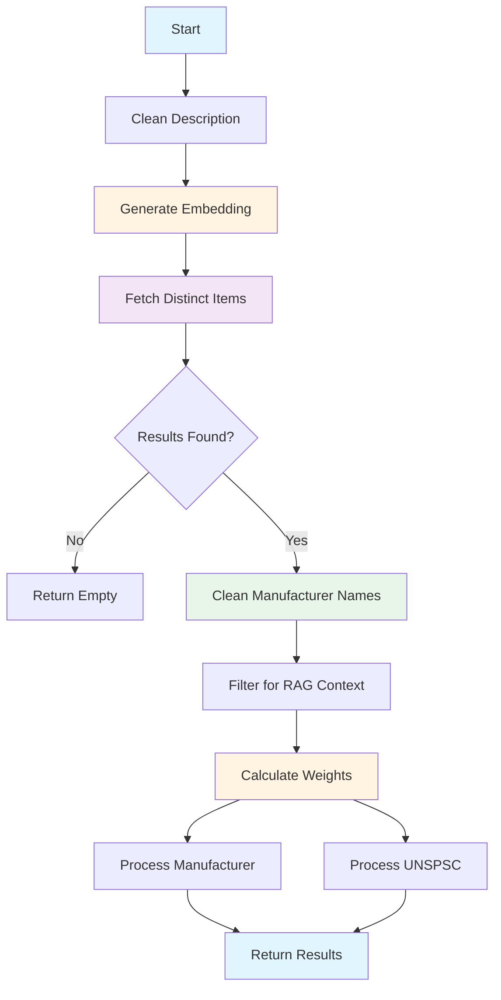

# SEMANTIC_SEARCH Stage - Vector-Based Similarity Search

**Last Updated:** 2025-12-17  
**Audience:** Business Analysts, QA Professionals  
**Related:** [Solution Overview](01-solution-overview.md) | [Indexer](02-indexer.md) | [FINETUNED_LLM Stage](07-finetuned-llm-stage.md)

## Overview

The SEMANTIC_SEARCH stage uses vector embeddings and Azure AI Search to find semantically similar products based on the invoice description. Unlike exact text matching, semantic search understands meaning - it can find "insulating sleeve" even when the invoice says "insulation bushing" because these concepts are semantically similar.

This stage is typically the first extraction stage in the pipeline (after classification). It provides initial estimates for manufacturer name and UNSPSC code that can be refined by subsequent stages. The stage also caches search results for use by the FINETUNED_LLM stage as RAG (Retrieval Augmented Generation) context.

## Key Concepts

### Vector Embeddings
Numerical representations of text that capture semantic meaning. Similar concepts have similar embeddings, even if the exact words differ. The system uses Azure OpenAI's text-embedding-3-large model (1536 dimensions) to convert invoice descriptions into embeddings.

**Example:**
- "T&B 425 insulating sleeve" → [0.123, -0.456, 0.789, ...]
- "Thomas & Betts 425 insulation bushing" → [0.125, -0.452, 0.791, ...]
- These embeddings are very similar (high cosine similarity)

### Hybrid Search
Combines two search approaches:
- **Vector Search**: Finds semantically similar items using embeddings
- **Keyword Search**: Finds exact or partial text matches
- Azure AI Search automatically combines both for better results

### Similarity Score
A value between 0 and 1 indicating how similar two embeddings are:
- 1.0 = Identical
- 0.9-0.99 = Very similar
- 0.8-0.89 = Similar
- 0.7-0.79 = Somewhat similar
- < 0.7 = Not very similar

The stage uses a configurable threshold (default: 0.75) to filter results.

### Weighted Scoring
Not all search results are equally important. The stage calculates exponential weights based on similarity scores:
- Higher similarity = Higher weight
- Weights emphasize top results
- Formula: `weight = exp(exp_factor * (score - mid_point))`

### UNSPSC Hierarchy
UNSPSC codes have a hierarchical structure:
- **Family** (4 digits + 0000): Broad category (e.g., "3913" = Electrical equipment)
- **Class** (6 digits + 00): Narrower category (e.g., "391300" = Conduit and fittings)
- **Commodity** (8 digits): Specific product (e.g., "39131711" = Insulating sleeves)

The stage considers all hierarchy levels and selects the most appropriate one based on confidence scores.

### RAG Context Caching
The stage caches top search results for use by the FINETUNED_LLM stage:
- Filters results by similarity threshold (default: 0.85)
- Deduplicates by manufacturer + UNSPSC combination
- Limits to top 3 diverse examples
- Provides real-world examples to guide LLM extraction


## Python Modules

### semantic_matching.py
Core semantic matching logic with weighted scoring and UNSPSC hierarchy handling.

**Main Function:**

- `semantic_match_by_description(description, azure_search_utils, sdp, llm)` - Performs semantic search
  - Accepts string description or pre-calculated embedding
  - Returns best match summary and top N raw results
  - Applies manufacturer name cleaning if SDP provided
  - Calculates weighted confidence scores

**Helper Functions:**

- `_get_embedding(description, llm)` - Gets or generates embedding
  - Returns embedding directly if already a list
  - Generates embedding using LLM if string

- `_fetch_distinct_items(...)` - Fetches distinct items from search index
  - Iteratively searches until target number of distinct ItemIDs found
  - Filters by similarity threshold
  - Excludes already-found items in subsequent queries
  - Returns highest-scoring document per ItemID

- `_filter_results_for_rag_context(results, min_similarity)` - Filters results for RAG
  - Applies similarity threshold (default: 0.85)
  - Deduplicates by manufacturer + UNSPSC
  - Limits to top 3 examples
  - Returns diverse, high-quality examples

- `_calculate_weights(results, mid_point, exp_factor)` - Calculates exponential weights
  - Formula: `weight = exp(exp_factor * (score - mid_point))`
  - Higher scores get exponentially higher weights
  - Emphasizes top results in confidence calculation

- `_process_manufacturer_with_weights(...)` - Determines best manufacturer
  - Groups results by manufacturer name
  - Calculates confidence: `max_score * (group_weight / total_weight) * 100`
  - Applies single match factor if only one result
  - Returns manufacturer with highest confidence

- `_process_unspsc_with_weights(...)` - Determines best UNSPSC
  - Generates UNSPSC variants (commodity, class, family)
  - Calculates confidence for each variant
  - Selects best variant using hierarchical rules
  - Applies single match factor if only one result

**UNSPSC Hierarchy Functions:**

- `_generate_unspsc_variants(results)` - Generates all UNSPSC variants
  - Original code (commodity level)
  - Class level (last 2 digits → 00)
  - Family level (last 4 digits → 0000)

- `_get_matching_rows_for_unspsc_variant(results, variant, level)` - Filters by variant
  - Level 3: Exact match
  - Level 2: First 6 digits match
  - Level 1: First 4 digits match

- `_select_best_unspsc_variant(...)` - Selects best UNSPSC using rules
  - Prioritizes more specific levels (commodity > class > family)
  - Checks against level thresholds
  - Requires generic level to be significantly better to override specific
  - Falls back to highest confidence if no threshold met

**Configuration:**

- `get_config()` - Loads configuration from confidences.yaml
  - Returns SEMANTIC_SEARCH section
  - Contains search parameters, weights, thresholds

### ai_stages.py
Stage implementation that orchestrates semantic search.

**Key Method:**

- `AIStages.check_semantic_match(sdp, ai_engine_cache, ivce_dtl, stage_number, sub_stage_code)` - Main entry point
  - Validates and cleans description
  - Generates embedding using LLM
  - Calls semantic_match_by_description()
  - Caches results for RAG context
  - Processes and returns stage results

**Helper Methods:**

- `_generate_description_embedding(cleaned_description, log_context)` - Generates embedding
  - Calls LLM.get_embeddings()
  - Returns 1536-dimension vector

- `_process_semantic_match_result(...)` - Processes successful match
  - Extracts manufacturer name, UNSPSC, confidence scores
  - Removes empty/null values
  - Populates stage_details

- `_handle_no_semantic_match(...)` - Handles no match found
  - Logs warning
  - Sets appropriate status

### azure_search_utils.py
Utilities for interacting with Azure AI Search.

**Key Methods:**

- `search(vector_query, filter_expression, select, top)` - Performs search
  - Executes hybrid search (vector + keyword)
  - Returns results as DataFrame
  - Includes similarity scores

### llm.py
LLM client wrapper for generating embeddings.

**Key Methods:**

- `get_embeddings(texts)` - Generates embeddings for text list
  - Calls Azure OpenAI text-embedding-3-large
  - Returns list of 1536-dimension vectors

## Configuration

The SEMANTIC_SEARCH stage is configured through the `confidences.yaml` file:

### Configuration Structure

```yaml
SEMANTIC_SEARCH:
  SEMANTIC_SEARCH:
    SEARCH:
      similarity_threshold: 0.75
      top_results: 10
      max_results: 50
    
    WEIGHTS:
      mid_point: 0.85
      exp_factor: 10
    
    CONFIDENCE:
      min_confidence_threshold: 50
      single_match_factor: 1.1
      single_match_similarity_threshold: 80
    
    UNSPSC:
      level_thresholds: [70, 60, 50]
      generic_delta_percentage: 15
    
    RAG_CONTEXT:
      min_example_similarity: 0.85
```

### Configuration Parameters

**SEARCH Parameters:**

| Parameter | Type | Description | Default |
|-----------|------|-------------|---------|
| `similarity_threshold` | float | Minimum similarity score (0-1) to include result | 0.75 |
| `top_results` | int | Target number of distinct items to return | 10 |
| `max_results` | int | Maximum results to fetch per search iteration | 50 |

**WEIGHTS Parameters:**

| Parameter | Type | Description | Default |
|-----------|------|-------------|---------|
| `mid_point` | float | Similarity score where weights start increasing significantly | 0.85 |
| `exp_factor` | float | Controls steepness of exponential weighting curve | 10 |

**CONFIDENCE Parameters:**

| Parameter | Type | Description | Default |
|-----------|------|-------------|---------|
| `min_confidence_threshold` | int | Minimum confidence (0-100) to return result | 50 |
| `single_match_factor` | float | Multiplier for confidence when only one result found | 1.1 |
| `single_match_similarity_threshold` | int | Minimum similarity (0-100) for single match to be accepted | 80 |

**UNSPSC Parameters:**

| Parameter | Type | Description | Default |
|-----------|------|-------------|---------|
| `level_thresholds` | list[int] | Confidence thresholds for commodity, class, family levels | [70, 60, 50] |
| `generic_delta_percentage` | int | Percentage by which generic must exceed specific to be chosen | 15 |

**RAG_CONTEXT Parameters:**

| Parameter | Type | Description | Default |
|-----------|------|-------------|---------|
| `min_example_similarity` | float | Minimum similarity (0-1) for RAG examples | 0.85 |

## Business Logic

### Processing Flow



### Step-by-Step Processing

**1. Description Cleaning**
- Remove extra whitespace
- Normalize text
- Prepare for embedding generation

**2. Embedding Generation**
- Call Azure OpenAI text-embedding-3-large
- Convert description to 1536-dimension vector
- Cache embedding for subsequent stages

**3. Iterative Search for Distinct Items**
- Goal: Find 10 distinct ItemIDs above similarity threshold
- Process:
  1. Search for 50 candidates
  2. Filter by similarity threshold (0.75)
  3. Keep highest-scoring document per ItemID
  4. If < 10 distinct items found, search again excluding found ItemIDs
  5. Repeat until 10 distinct items or no more candidates

**4. Manufacturer Name Cleaning**
- If SDP connection provided, load manufacturer mapping
- Map unclean names to clean names (e.g., "T&B" → "THOMAS & BETTS")
- Set IsMfrClean flag if any names were cleaned

**5. RAG Context Filtering**
- Filter results by min_example_similarity (0.85)
- Deduplicate by manufacturer + UNSPSC combination
- Keep top 3 diverse examples
- Cache for FINETUNED_LLM stage

**6. Weight Calculation**
- For each result, calculate: `weight = exp(10 * (score - 0.85))`
- Example weights:
  - Score 0.95: weight = exp(10 * 0.10) = 2.72
  - Score 0.90: weight = exp(10 * 0.05) = 1.65
  - Score 0.85: weight = exp(10 * 0.00) = 1.00
  - Score 0.80: weight = exp(10 * -0.05) = 0.61

**7. Manufacturer Processing**
- Group results by manufacturer name
- For each manufacturer:
  - Sum weights of results containing it
  - Get max similarity score among those results
  - Calculate: `confidence = max_score * (group_weight / total_weight) * 100`
- Select manufacturer with highest confidence
- Apply single match factor (1.1) if only one result
- Return if confidence > 50

**8. UNSPSC Processing**
- Generate variants for each UNSPSC:
  - "39131711" (commodity)
  - "39131700" (class)
  - "39130000" (family)
- For each variant:
  - Find matching results at that hierarchy level
  - Sum weights of matching results
  - Get max similarity score
  - Calculate: `confidence = max_score * (variant_weight / total_weight) * 100`
- Select best variant using hierarchical rules
- Apply single match factor (1.1) if only one result
- Return if confidence > 50

### Confidence Calculation Formula

**Manufacturer Confidence:**
```
confidence = max_search_score * (sum_of_weights_for_mfr / total_weight) * 100
```

**UNSPSC Confidence:**
```
confidence = max_search_score * (sum_of_weights_for_variant / total_weight) * 100
```

**Single Match Adjustment:**
```
if only_one_result:
    confidence *= 1.1
```

**Example Calculation:**

Given 3 search results:
- Result 1: Score 0.92, MfrName "THOMAS & BETTS", UNSPSC "39131711"
- Result 2: Score 0.88, MfrName "THOMAS & BETTS", UNSPSC "39131711"
- Result 3: Score 0.82, MfrName "ABB", UNSPSC "39121420"

Weights:
- Result 1: exp(10 * (0.92 - 0.85)) = exp(0.70) = 2.01
- Result 2: exp(10 * (0.88 - 0.85)) = exp(0.30) = 1.35
- Result 3: exp(10 * (0.82 - 0.85)) = exp(-0.30) = 0.74
- Total weight: 4.10

Manufacturer "THOMAS & BETTS":
- Group weight: 2.01 + 1.35 = 3.36
- Max score: 0.92
- Confidence: 0.92 * (3.36 / 4.10) * 100 = 75.4

Manufacturer "ABB":
- Group weight: 0.74
- Max score: 0.82
- Confidence: 0.82 * (0.74 / 4.10) * 100 = 14.8

Result: "THOMAS & BETTS" with confidence 75

### UNSPSC Hierarchy Selection Rules

The stage uses sophisticated rules to select the best UNSPSC level:

**Rule 1: Check Commodity Level (Most Specific)**
- If any commodity-level UNSPSC has confidence ≥ 70, choose the highest
- Example: "39131711" with confidence 75 → Selected

**Rule 2: Check Class Level (Medium Specific)**
- If no commodity meets threshold, check class level
- If class-level UNSPSC has confidence ≥ 60:
  - Compare with best commodity
  - If class is NOT significantly better (< 15% higher), use commodity
  - Otherwise use class
- Example: Class "39131700" confidence 65, Commodity "39131711" confidence 58
  - Delta: 65 - 58 = 7
  - Required delta: 58 * 0.15 = 8.7
  - 7 < 8.7, so use commodity "39131711"

**Rule 3: Check Family Level (Least Specific)**
- If no class meets threshold, check family level
- If family-level UNSPSC has confidence ≥ 50:
  - Compare with best higher level (class or commodity)
  - If family is NOT significantly better (< 15% higher), use higher level
  - Otherwise use family
- Example: Family "39130000" confidence 55, Class "39131700" confidence 45
  - Delta: 55 - 45 = 10
  - Required delta: 45 * 0.15 = 6.75
  - 10 > 6.75, so use family "39130000"

**Rule 4: Fallback to Highest Confidence**
- If no level meets any threshold, choose variant with highest confidence
- Regardless of hierarchy level

**Rationale:**
- Prefer specific codes when confident
- Allow generic codes when significantly more confident
- Prevent over-generalization from weak signals

### Single Match Handling

When only one distinct item is found:

**Special Threshold:**
- Must have similarity ≥ 0.80 (80%)
- If below, return no results
- Prevents low-quality single matches

**Confidence Boost:**
- Multiply confidence by 1.1 (10% boost)
- Rationale: Single match indicates unique/rare item
- Higher confidence justified

**Example:**
- Single result with score 0.88
- Manufacturer confidence: 75
- After boost: 75 * 1.1 = 82.5 → 83

## Dependencies

### Required Services

1. **Azure AI Search**
   - Purpose: Vector and keyword search
   - Index: Populated by Indexer with product data and embeddings
   - Dependency: Index must exist and contain data
   - Failure Impact: Stage fails, pipeline continues to next stage

2. **Azure OpenAI**
   - Purpose: Generate embeddings for descriptions
   - Model: text-embedding-3-large (1536 dimensions)
   - Dependency: Deployment must be available
   - Failure Impact: Cannot generate embedding, stage fails

3. **SQL Database (SDP)** (Optional)
   - Purpose: Manufacturer name cleaning/mapping
   - Dependency: Database accessible
   - Failure Impact: Names not cleaned, but processing continues

### Module Dependencies

- `azure_search_utils.py` - Azure AI Search operations
- `llm.py` - Embedding generation
- `matching_utils.py` - Manufacturer name mapping
- `constants.py` - Stage names, field names
- `utils.py` - YAML loading, text cleaning
- `logger.py` - Logging

### Depends On

- **Indexer** - Must have populated Azure AI Search index with product data and embeddings
- **CLASSIFICATION Stage** - Provides cleaned description

### Used By

- **FINETUNED_LLM Stage** - Uses cached RAG context examples
- **AI Engine** - Uses cached embedding for subsequent stages
- **Final Consolidation** - May use manufacturer/UNSPSC if highest confidence

## Output Fields

The stage returns the following fields:

| Field | Type | Description | Example |
|-------|------|-------------|---------|
| `MfrName` | string | Manufacturer name (cleaned if possible) | "THOMAS & BETTS" |
| `ManufacturerNameConfidenceScore` | int | Confidence score (0-100) | 75 |
| `IsMfrClean` | boolean | Whether manufacturer name was cleaned | true |
| `UNSPSC` | string | UNSPSC code (8 digits) | "39131711" |
| `UNSPSCConfidenceScore` | int | Confidence score (0-100) | 82 |
| `description` | string | Cleaned description | "thomas and betts t b 425..." |

**Note:** Only non-empty fields are returned. If no manufacturer or UNSPSC meets confidence threshold, those fields are omitted.

## Examples

### Example 1: High-Confidence Match

**Input:**
```
Description: "T&B 425 1-1/4 INSULATING SLEEVE"
```

**Processing:**

1. **Embedding Generation:**
   - Generate 1536-dimension vector

2. **Search Results (Top 3 of 10):**
   - ItemID 12345: Score 0.92, Mfr "T&B", UNSPSC "39131711", Desc "1-1/4 Inch Insuliner Sleeve"
   - ItemID 12346: Score 0.88, Mfr "THOMAS AND BETTS", UNSPSC "39131711", Desc "Insulating Sleeve 1.25 Inch"
   - ItemID 12347: Score 0.85, Mfr "THOMAS & BETTS", UNSPSC "39131711", Desc "Nylon Insulating Bushing"

3. **Manufacturer Cleaning:**
   - "T&B" → "THOMAS & BETTS"
   - "THOMAS AND BETTS" → "THOMAS & BETTS"
   - IsMfrClean = true

4. **Weight Calculation:**
   - Result 1: exp(10 * (0.92 - 0.85)) = 2.01
   - Result 2: exp(10 * (0.88 - 0.85)) = 1.35
   - Result 3: exp(10 * (0.85 - 0.85)) = 1.00
   - Total: 4.36

5. **Manufacturer Processing:**
   - "THOMAS & BETTS": All 3 results
   - Group weight: 4.36
   - Max score: 0.92
   - Confidence: 0.92 * (4.36 / 4.36) * 100 = 92

6. **UNSPSC Processing:**
   - All results have "39131711"
   - Commodity level confidence: 92
   - Meets threshold (≥ 70)
   - Selected: "39131711"

**Output:**
```json
{
  "MfrName": "THOMAS & BETTS",
  "ManufacturerNameConfidenceScore": 92,
  "IsMfrClean": true,
  "UNSPSC": "39131711",
  "UNSPSCConfidenceScore": 92,
  "description": "t b 425 1-1/4 insulating sleeve"
}
```

### Example 2: Mixed Manufacturers

**Input:**
```
Description: "1-1/4 INSULATING SLEEVE"
```

**Search Results:**
- ItemID 12345: Score 0.88, Mfr "THOMAS & BETTS", UNSPSC "39131711"
- ItemID 23456: Score 0.85, Mfr "ABB", UNSPSC "39131711"
- ItemID 34567: Score 0.82, Mfr "EATON", UNSPSC "39131711"

**Weight Calculation:**
- Result 1: exp(10 * 0.03) = 1.35
- Result 2: exp(10 * 0.00) = 1.00
- Result 3: exp(10 * -0.03) = 0.74
- Total: 3.09

**Manufacturer Processing:**
- "THOMAS & BETTS": weight 1.35, max score 0.88, confidence = 0.88 * (1.35/3.09) * 100 = 38
- "ABB": weight 1.00, max score 0.85, confidence = 0.85 * (1.00/3.09) * 100 = 28
- "EATON": weight 0.74, max score 0.82, confidence = 0.82 * (0.74/3.09) * 100 = 20

All below threshold (50), no manufacturer returned.

**UNSPSC Processing:**
- All have "39131711"
- Confidence: 0.88 * (3.09/3.09) * 100 = 88
- Meets threshold, selected

**Output:**
```json
{
  "UNSPSC": "39131711",
  "UNSPSCConfidenceScore": 88,
  "description": "1-1/4 insulating sleeve"
}
```

### Example 3: UNSPSC Hierarchy Selection

**Input:**
```
Description: "ELECTRICAL CONDUIT FITTING"
```

**Search Results:**
- ItemID 11111: Score 0.85, UNSPSC "39131701" (specific fitting)
- ItemID 22222: Score 0.84, UNSPSC "39131702" (different fitting)
- ItemID 33333: Score 0.83, UNSPSC "39131703" (another fitting)
- ItemID 44444: Score 0.82, UNSPSC "39121420" (different category)

**UNSPSC Variants Generated:**
- "39131701", "39131700", "39130000"
- "39131702", "39131700", "39130000"
- "39131703", "39131700", "39130000"
- "39121420", "39121400", "39120000"

**Confidence Calculation:**
- Commodity "39131701": 0.85 * (weight/total) * 100 = 45 (below 70)
- Commodity "39131702": 0.84 * (weight/total) * 100 = 42 (below 70)
- Class "39131700": Matches first 3 results, confidence = 72 (≥ 60)
- Family "39130000": Matches first 3 results, confidence = 72 (≥ 50)

**Selection Logic:**
- No commodity meets threshold (70)
- Class "39131700" meets threshold (60)
- Best commodity confidence: 45
- Class confidence: 72
- Delta: 72 - 45 = 27
- Required delta: 45 * 0.15 = 6.75
- 27 > 6.75, so class is significantly better
- Selected: "39131700"

**Output:**
```json
{
  "UNSPSC": "39131700",
  "UNSPSCConfidenceScore": 72,
  "description": "electrical conduit fitting"
}
```

### Example 4: Single Match with Low Similarity

**Input:**
```
Description: "RANDOM ELECTRICAL ITEM"
```

**Search Results:**
- ItemID 99999: Score 0.76, Mfr "GENERIC", UNSPSC "39000000"

**Single Match Check:**
- Only 1 result found
- Score 0.76 < 0.80 (single_match_similarity_threshold)
- Rejected

**Output:**
```json
{}
```

### Example 5: RAG Context Caching

**Input:**
```
Description: "THOMAS & BETTS CONDUIT CONNECTOR"
```

**Search Results (Top 5):**
- ItemID 1: Score 0.92, Mfr "THOMAS & BETTS", UNSPSC "39131705", Part "LT50"
- ItemID 2: Score 0.90, Mfr "THOMAS & BETTS", UNSPSC "39131705", Part "LT75"
- ItemID 3: Score 0.88, Mfr "THOMAS & BETTS", UNSPSC "39131706", Part "LT100"
- ItemID 4: Score 0.86, Mfr "ABB", UNSPSC "39131705", Part "TC50"
- ItemID 5: Score 0.84, Mfr "EATON", UNSPSC "39131707", Part "EC50"

**RAG Context Filtering:**
1. Filter by similarity ≥ 0.85: Keep first 4 results
2. Deduplicate by Mfr + UNSPSC:
   - (THOMAS & BETTS, 39131705): Keep ItemID 1
   - (THOMAS & BETTS, 39131706): Keep ItemID 3
   - (ABB, 39131705): Keep ItemID 4
3. Limit to 3: Keep ItemIDs 1, 3, 4

**Cached for RAG:**
```json
[
  {
    "ItemID": 1,
    "MfrName": "THOMAS & BETTS",
    "MfrPartNum": "LT50",
    "UNSPSC": "39131705",
    "ItemDescription": "Liquidtight Connector 1/2 Inch",
    "@search.score": 0.92
  },
  {
    "ItemID": 3,
    "MfrName": "THOMAS & BETTS",
    "MfrPartNum": "LT100",
    "UNSPSC": "39131706",
    "ItemDescription": "Liquidtight Connector 1 Inch",
    "@search.score": 0.88
  },
  {
    "ItemID": 4,
    "MfrName": "ABB",
    "MfrPartNum": "TC50",
    "UNSPSC": "39131705",
    "ItemDescription": "Terminal Connector 1/2 Inch",
    "@search.score": 0.86
  }
]
```

These examples will be used by FINETUNED_LLM stage as context.

## Performance Characteristics

### Throughput
- ~100-200 descriptions per second
- Bottleneck: Embedding generation (Azure OpenAI rate limits)
- Search operations are fast (< 100ms per query)

### Latency
- Embedding generation: 200-500ms
- Search iterations: 100-300ms total
- Weight calculation: < 10ms
- Total: 300-800ms per description

### Accuracy
- High similarity matches (> 0.90): Very accurate
- Medium similarity (0.80-0.90): Good accuracy
- Low similarity (0.75-0.80): Moderate accuracy
- Below threshold (< 0.75): Filtered out

### Resource Usage
- Memory: Minimal (< 50 MB per request)
- CPU: Low (mostly I/O bound)
- Network: Moderate (API calls to Azure OpenAI and Azure AI Search)

## Monitoring and Troubleshooting

### Common Issues

**Issue: No Results Found**
- Symptom: Stage returns empty results
- Possible Causes:
  - Index not populated
  - Similarity threshold too high
  - Description too generic
- Solution: Check index status, lower threshold, improve description

**Issue: Low Confidence Scores**
- Symptom: Results below minimum threshold (50)
- Possible Causes:
  - Poor description quality
  - No similar products in index
  - Weights configured incorrectly
- Solution: Review description, check index coverage, adjust weights

**Issue: Wrong Manufacturer Selected**
- Symptom: Incorrect manufacturer returned
- Possible Causes:
  - Multiple manufacturers with similar products
  - Manufacturer name not cleaned
  - Weights favor wrong results
- Solution: Check manufacturer mapping, adjust weights, review search results

**Issue: Generic UNSPSC Selected**
- Symptom: Family or class level returned instead of commodity
- Possible Causes:
  - No commodity meets threshold
  - Generic significantly more confident
  - Level thresholds too high
- Solution: Review thresholds, check search results, adjust generic_delta_percentage

**Issue: RAG Context Empty**
- Symptom: No examples cached for LLM
- Possible Causes:
  - All results below RAG similarity threshold (0.85)
  - No diverse examples found
- Solution: Lower min_example_similarity, check search quality

### Health Checks

**Before Stage Runs:**
- Azure AI Search index exists and populated
- Azure OpenAI embedding deployment available
- Sufficient quota on both services

**During Execution:**
- Monitor embedding generation latency
- Check search result counts
- Verify confidence scores reasonable

**After Completion:**
- Verify manufacturer and UNSPSC extracted
- Check confidence scores meet expectations
- Confirm RAG context cached if applicable

### Debugging Tips

**Enable Debug Logging:**
```python
logger.setLevel(logging.DEBUG)
```

**Check Search Results:**
- Log raw search results before processing
- Verify similarity scores
- Check manufacturer and UNSPSC values

**Verify Weights:**
- Log calculated weights
- Ensure exponential curve appropriate
- Check total weight calculation

**Test UNSPSC Selection:**
- Log all UNSPSC variants and confidences
- Verify hierarchy selection logic
- Check threshold comparisons

**Validate RAG Context:**
- Log filtered examples
- Verify diversity (different Mfr + UNSPSC)
- Check similarity threshold applied
