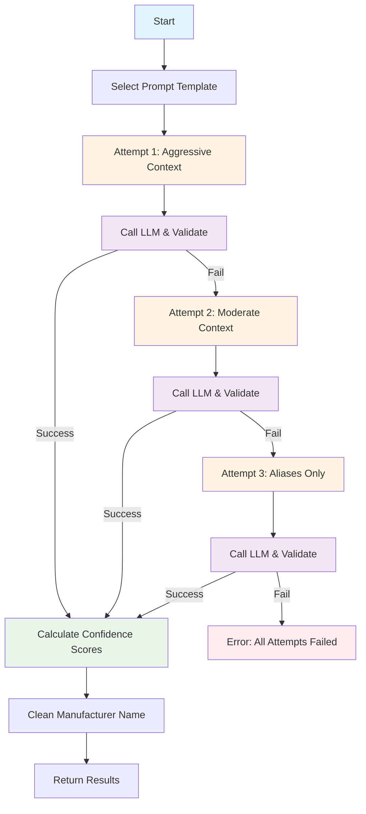

# FINETUNED_LLM Stage - Custom AI Model Extraction

**Last Updated:** 2025-12-23
**Author:** Kirill Levtov
**Related:** [Solution Overview](01-solution-overview.md) | [SEMANTIC_SEARCH Stage](06-semantic-search-stage.md) | [EXTRACTION_WITH_LLM_AND_WEBSEARCH Stage](08-extraction-with-llm-and-websearch-stage.md)

## Overview

The FINETUNED_LLM stage uses a custom-trained Large Language Model (LLM) to extract manufacturer names, part numbers, and UNSPSC codes from invoice descriptions. Unlike the base GPT-4 model, this LLM has been fine-tuned on thousands of product descriptions, making it highly specialized for electrical parts extraction.

This stage employs Retrieval Augmented Generation (RAG) to provide the LLM with relevant examples and manufacturer aliases as context, improving extraction accuracy. It also uses token-level log probabilities to calculate confidence scores for each extracted field.

The stage is typically the fourth extraction stage in the pipeline (after CLASSIFICATION, SEMANTIC_SEARCH, and COMPLETE_MATCH), providing AI-powered extraction when exact matching fails or needs additional validation.

## Key Concepts

### Fine-Tuned LLM
A Large Language Model that has been trained on domain-specific data:
- **Base Model**: GPT-4o
- **Training Data**: ~500K of product descriptions with labeled manufacturer, part number, and UNSPSC
- **Specialization**: Electrical parts and construction materials
- **Advantage**: Better accuracy than general-purpose models for this specific task

**Example Training Data:**
```
Input: "T&B 425 1-1/4 INSULATING SLEEVE"
Output: {
  "ManufacturerName": "THOMAS & BETTS",
  "PartNumber": "425",
  "UNSPSC": "39131711"
}
```

### Retrieval Augmented Generation (RAG)
A technique that provides the LLM with relevant context before extraction:

**Components:**
1. **Manufacturer Aliases**: Dictionary mapping abbreviations to official names
   - Example: "T&B" → "THOMAS & BETTS"
   - Source: COMPLETE_MATCH stage or database

2. **Similar Examples**: Top 3 most similar invoice items from database
   - Source: SEMANTIC_SEARCH stage results
   - Similarity: Based on vector embeddings
   - Format: Input description → Expected output

**Benefits:**
- Improves extraction accuracy
- Helps LLM understand abbreviations
- Provides patterns for complex descriptions
- Reduces hallucinations


### Staged Prompt Strategy
The stage uses a multi-attempt strategy with different prompt styles:

**Attempt 1: Aggressive Context (Patterns for Extraction)**
```
Manufacturer Alias Dictionary:
T&B -> THOMAS & BETTS
ABB -> ABB

Examples (find patterns to use for extraction):
'T&B 425 1-1/4 INSULATING SLEEVE' -> {'ManufacturerName': 'THOMAS & BETTS', 'PartNumber': '425', 'UNSPSC': '39131711'}
'ABB LT50 LIQUIDTIGHT CONNECTOR' -> {'ManufacturerName': 'ABB', 'PartNumber': 'LT50', 'UNSPSC': '39131705'}

Input Description (for extraction):
EATON BR120 CIRCUIT BREAKER 20A
```

**Attempt 2: Moderate Context (Reference Only)**
```
Manufacturer Alias Dictionary:
[same as above]

Examples (for reference only):
[same examples]

Input Description (for extraction):
EATON BR120 CIRCUIT BREAKER 20A
```

**Attempt 3: Aliases Only (Fallback)**
- **Includes**: Manufacturer Aliases **only**.
- **Excludes**: RAG Examples.
- **Goal**: Remove potential noise from misleading examples while still allowing the LLM to resolve manufacturer abbreviations (e.g., "T&B" -> "THOMAS & BETTS").

**Example Prompt (Attempt 3):**
```
Manufacturer Alias Dictionary:
T&B -> THOMAS & BETTS
ABB -> ABB

Input Description:
EATON BR120 CIRCUIT BREAKER 20A
```

**Strategy Rationale:**
- Attempt 1: Aggressive nudging with "find patterns to use"
- Attempt 2: Softer guidance with "for reference only"
- Attempt 3: Minimal context, relies primarily on fine-tuning
- Each attempt validates output; if validation fails, try next strategy

### Token-Level Confidence Scoring
The stage calculates confidence scores using log probabilities from the LLM:

**How It Works:**
1. LLM generates tokens (words/subwords) with log probabilities
2. For each extracted field, identify which tokens belong to it
3. Convert log probabilities to probabilities: `prob = exp(logprob)`
4. Calculate mean probability across all tokens
5. Convert to percentage: `confidence = mean_prob * 100`

**Example:**
```
Extracted: "THOMAS & BETTS"
Tokens: ["THOMAS", " &", " BETTS"]
Log Probs: [-0.05, -0.10, -0.08]
Probs: [0.95, 0.90, 0.92]
Mean: 0.92
Confidence: 92%
```

**Why This Matters:**
- Higher confidence = LLM is more certain
- Lower confidence = LLM is guessing
- Helps the pipline engine and final consolidation choose best result

### Validation Rules
The stage performs rigorous validation on the LLM's output before accepting it. Because the confidence scoring mechanism requires token-level **log probabilities** (`logprobs`), this stage cannot use Azure OpenAI's native "Structured Output" feature (JSON mode), which is currently incompatible with `logprobs`. Instead, the system enforces validation via custom Python logic:

**1. JSON Structure Validation:**
- The raw text response is parsed to ensure it contains valid JSON.
- It handles common LLM formatting issues (e.g., Markdown code blocks like \`\`\`json ... \`\`\`).
- If parsing fails, the attempt is rejected.

**2. UNSPSC Validation:**
- Must be exactly **8 digits**.
- Must be numeric only.
- **Example:** "39131711" (Valid), "3913171" (Invalid - too short), "3913171A" (Invalid - alphanumeric).

**3. Part Number Validation:**
- The extracted part number is normalized (alphanumeric characters only).
- It must be present within the normalized input description.
- **Exception:** For `GENERIC` items (Case 1), part number validation is skipped as none is expected.
- **Example:**
  - Description: "T&B 425 SLEEVE" → Extracted: "425" (Valid).
  - Description: "T&B 425 SLEEVE" → Extracted: "LT50" (Invalid - hallucination).

**Validation Failure Strategy:**
- If any validation rule fails, the system triggers a **retry** using the next available Prompt Strategy (e.g., moving from "Aggressive Context" to "Moderate Context").
- If all strategies fail, the stage returns an error state, and the pipeline relies on subsequent stages (like Web Search) for results.


## Python Modules

### ai_stages.py
Stage implementation that orchestrates fine-tuned LLM extraction.

**Key Method:**

- `AIStages.extract_from_finetuned_llm(sdp, ai_engine_cache, ivce_dtl, stage_number, sub_stage_code)` - Main entry point
  - Selects appropriate prompt template (general or UNSPSC-only)
  - Creates LangChain chain with prompt and LLM
  - Calls execute_hardened_llm_request() with RAG context
  - Calculates confidence scores from log probabilities
  - Cleans manufacturer name using database mapping
  - Returns stage results with confidence scores

**Prompt Selection:**
```python
if ivce_dtl.is_special_case and ivce_dtl.special_case_type == SpecialCases.CASE_1:
    prompt = Prompts.get_fine_tuned_llm_prompt_for_unspsc()
else:
    prompt = Prompts.get_fine_tuned_llm_prompt()
```

**LLM Client:**
```python
llm_to_use = self.llms.aoai_gpt4o_finetuned
```
- Uses raw client (not structured output) to access log probabilities
- Temperature: 0.1 (low randomness, more deterministic)
- Logprobs: True (required for confidence scoring)

### ai_utils.py
Core utility functions for RAG, validation, and confidence calculation.

**Main Functions:**

- `execute_hardened_llm_request(llm_instance, chain, target_description, semantic_search_results, manufacturer_aliases, max_retries)` - Executes LLM with retry logic
  - Builds context-augmented prompt for each attempt
  - Executes LLM chain
  - Validates response content and JSON structure
  - Validates UNSPSC format (8 digits)
  - Validates part number presence in description
  - Retries with different prompt strategies on failure
  - Returns response, parsed JSON, and trace metadata

- `build_context_augmented_description(target_description, semantic_search_results, manufacturer_aliases, attempt)` - Constructs RAG prompt
  - Adds manufacturer alias dictionary
  - Adds top 3 similar examples (attempts 1-2 only)
  - Adds target description with appropriate label
  - Returns full prompt string and trace metadata

- `calculate_confidence_for_finetuned_llm(sdp, response, results_json, fields)` - Calculates confidence scores
  - Extracts tokens and log probabilities from response
  - For each field, identifies relevant tokens
  - Converts log probabilities to probabilities
  - Calculates mean probability across tokens
  - Converts to percentage (0-100)
  - Cleans manufacturer name using database
  - Returns details dict with confidence scores

**Token Alignment:**
```python
def _get_tokens_of_string(token_list, value):
    # Finds which tokens in the response correspond to the extracted value
    # Returns list of indices
```

**Confidence Calculation:**
```python
logprobs = df.iloc[indices]["logprob"].to_numpy(dtype=float)
logprobs = np.clip(logprobs, a_min=None, a_max=0.0)  # Clip to avoid overflow
probs = np.exp(logprobs)  # Convert to probabilities
mean_p = float(np.mean(probs))  # Average across tokens
conf = max(0.0, min(mean_p, 1.0))  # Clamp to [0, 1]
return round(conf, 2)  # Return as decimal
```

### prompts.py
Prompt templates for fine-tuned LLM.

**Key Methods:**

- `Prompts.get_fine_tuned_llm_prompt()` - Returns general extraction prompt
  - Instructs LLM to extract manufacturer, part number, UNSPSC
  - Specifies strict JSON format
  - No additional text or explanations

- `Prompts.get_fine_tuned_llm_prompt_for_unspsc()` - Returns UNSPSC-only prompt
  - Used for special case items (CASE_1)
  - Only extracts UNSPSC code
  - Simpler output format

**General Prompt Template:**
````
{description}

Format the response strictly as a JSON object. No additional text, explanations, or disclaimers - only return JSON in this structure:
```json
{
    "ManufacturerName": "string",
    "PartNumber": "string",
    "UNSPSC": "string",
}
```
If any attribute is unavailable, return an empty string for that attribute.
````

**UNSPSC-Only Prompt Template (Special Case 1):**
````
{description}

Format the response strictly as a JSON object. Return ONLY the UNSPSC code.
```json
{
    "UNSPSC": "string"
}
```
````

### llm.py
LLM client wrapper for fine-tuned model.

**Key Attributes:**

- `LLM.aoai_gpt4o_finetuned` - Fine-tuned LLM client
  - Azure deployment: Configured per environment
  - Temperature: 0.1 (low randomness)
  - Logprobs: True (enables confidence scoring)
  - API version: Latest

**Configuration:**
```python
self.aoai_gpt4o_finetuned = AzureChatOpenAI(
    azure_deployment=config.AOAI_FINETUNED_LLM_API_DEPLOYMENT,
    openai_api_key=config.AOAI_FINETUNED_LLM_OPENAI_API_KEY,
    azure_endpoint=config.AOAI_FINETUNED_LLM_API_ENDPOINT_URL,
    openai_api_version=config.AOAI_FINETUNED_LLM_API_VERSION,
    temperature=0.1,
    logprobs=True,
)
```


## Configuration

The FINETUNED_LLM stage is configured through `config.yaml` and `thresholds.yaml`:

### Configuration Structure (config.yaml)

```yaml
OPENAI_DEPLOYMENT:
  FINETUNED_LLM:
    RESOURCE_NAME: "your-openai-resource"
    API_TYPE: "azure"
    API_VERSION: "2024-08-01-preview"
    DEPLOYMENT_API_VERSION: "2024-08-01-preview"
    API_KEY: "${AOAI_FINETUNED_LLM_API_KEY}"
    API_BASE_URL: "https://your-endpoint.openai.azure.com/"
    API_ENDPOINT_URL: "https://your-endpoint.openai.azure.com/openai/deployments/{API_DEPLOYMENT}"
```

### Configuration Parameters

| Parameter | Type | Description | Example |
|-----------|------|-------------|---------|
| `RESOURCE_NAME` | string | Azure OpenAI resource name | "your-openai-resource" |
| `API_TYPE` | string | API type (always "azure") | "azure" |
| `API_VERSION` | string | Azure OpenAI API version | "2024-08-01-preview" |
| `API_KEY` | string | Azure OpenAI API key | "${AOAI_FINETUNED_LLM_API_KEY}" |
| `API_BASE_URL` | string | Azure OpenAI endpoint URL | "https://your-endpoint.openai.azure.com/" |
| `API_ENDPOINT_URL` | string | Full endpoint with deployment placeholder | "https://your-endpoint.openai.azure.com/openai/deployments/{API_DEPLOYMENT}" |

### Threshold Configuration (thresholds.yaml)

```yaml
FINETUNED_LLM:
  FINETUNED_LLM:
    manufacturer_name: 95
    part_number: 100
    unspsc: 75
```

**Threshold Parameters:**

| Parameter | Type | Description | Default |
|-----------|------|-------------|---------|
| `manufacturer_name` | int | Minimum confidence to use manufacturer | 95 |
| `part_number` | int | Minimum confidence to use part number | 100 |
| `unspsc` | int | Minimum confidence to use UNSPSC | 75 |

**Threshold Behavior:**
- **Pipeline Control**: These thresholds primarily determine **early exit**. If the confidence scores for Manufacturer, Part Number, and UNSPSC all meet or exceed their respective thresholds, the pipeline stops immediately, and the item is marked as ready (RC-AI).
- **Consolidation**: If thresholds are *not* met, the pipeline continues to the next stage. However, the values extracted here are still preserved. In the final consolidation, they may still be selected if they represent the highest confidence available across all stages (though the final invoice line status will be DS1).
- **Part Number Precision**: The Part Number threshold is set to **100** based on empirical tuning to ensure maximum precision for this specific model.

### LLM Settings

**Temperature: 0.1**
- Low randomness for consistent output
- More deterministic than creative
- Reduces hallucinations

**Logprobs: True**
- Enables token-level probability extraction
- Required for confidence scoring
- Adds minimal latency

**Max Retries: 3**
- Three prompt strategies attempted
- Each with different context level
- Stops on first successful validation


## Business Logic

### Processing Flow



### Step-by-Step Processing

**1. Template Selection**
The stage selects the base prompt template. If the item is a "Generic" special case (`CASE_1`), it uses a simplified template that only requests the UNSPSC code. Otherwise, it uses the standard template for Manufacturer, Part Number, and UNSPSC.

**2. Hardened Execution Loop (Attempts 1-3)**
The system enters a retry loop, attempting up to three different prompt strategies to get a valid result.

*   **Strategy Sequence**:
    1.  **Aggressive Context**: Includes Manufacturer Aliases + Top 3 Examples.
    2.  **Moderate Context**: Includes Manufacturer Aliases + Top 3 Examples (Reference Only).
    3.  **Aliases Only**: Includes Manufacturer Aliases, removes Examples (Fallback).

*   **A. Construct Prompt**:
    For the current attempt, the system builds the final prompt string by injecting the selected context (aliases/examples) and the cleaned invoice description.

    *Example (Attempt 3 - Aliases Only):*
    ```text
    Manufacturer Alias Dictionary:
    T&B -> THOMAS & BETTS

    Input Description (for extraction):
    T&B 425 SLEEVE
    ```

*   **B. Call Fine-Tuned LLM**:
    Calls the Azure OpenAI `gpt-4o-finetuned` model with `temperature=0.1` and `logprobs=True`.

*   **C. Validation**:
    The raw text response is parsed and validated:
    1.  **JSON Structure**: Must be valid JSON.
    2.  **UNSPSC**: Must be exactly 8 digits.
    3.  **Part Number**: The extracted alphanumeric sequence must exist in the input description (prevents hallucinations).

    *   **If Validation Passes**: The loop breaks, and processing moves to Step 3.
    *   **If Validation Fails**: A warning is logged, and the loop continues to the next strategy. If all 3 attempts fail, the stage returns an error.

**3. Confidence Calculation**
Using the `logprobs` from the successful response, the system calculates a confidence score (0-100) for each extracted field.

*   **Token Alignment**: Identifies which tokens correspond to specific values (e.g., "EATON").
*   **Probability Conversion**: Converts log probabilities to linear probabilities ($p = e^{logp}$).
*   **Aggregation**: Calculates the mean probability across all tokens for a field.

**4. Manufacturer Name Cleaning**
The extracted manufacturer name is normalized using the SQL database:
- **Normalization**: Removing accents, stripping special characters, upper-casing.
- **Lookup**: Checks against the master manufacturer mapping table (e.g., "T&B" -> "THOMAS & BETTS").
- **Flag**: Sets `is_mfr_clean_flag` to true if a valid mapping is found.

**5. Return Results**
The final stage result is constructed, including the extracted values, confidence scores, and RAG trace metadata.

*Example Output:*
```json
{
  "manufacturer_name": "EATON",
  "unclean_manufacturer_name": "EATON",
  "part_number": "BR120",
  "unspsc": "39121016",
  "confidence_score": {
    "manufacturer_name": 95.0,
    "part_number": 92.0,
    "unspsc": 88.0
  },
  "is_mfr_clean_flag": true,
  "is_verified_flag": false,
  "description": "eaton br120 circuit breaker 20a",
  "rag_trace": {
    "is_mfr_dict_provided": true,
    "prompt_strategy": "patterns_for_extraction",
    "examples_count": 2,
    "examples_used": [
      {
        "input": "EATON BR115 CIRCUIT BREAKER 15A",
        "output": {
          "ManufacturerName": "EATON",
          "PartNumber": "BR115",
          "UNSPSC": "39121016"
        }
      },
      {
        "input": "SIEMENS B120 CIRCUIT BREAKER",
        "output": {
          "ManufacturerName": "SIEMENS",
          "PartNumber": "B120",
          "UNSPSC": "39121601"
        }
      }
    ]
  }
}
```

### RAG (Retrieval Augmented Generation) Logic

The stage uses RAG to provide context to the LLM:

**1. Manufacturer Aliases**

**Source:** COMPLETE_MATCH stage or database

**Format:**
```
Manufacturer Alias to Official ManufacturerName Dictionary:
T&B -> THOMAS & BETTS
ABB -> ABB
EATON -> EATON
```

**Purpose:**
- Helps LLM understand abbreviations
- Maps variants to official names
- Reduces hallucinations

**Example:**
- Description: "T&B 425 SLEEVE"
- Without aliases: LLM might extract "T&B" or "TB"
- With aliases: LLM extracts "THOMAS & BETTS"

**2. Similar Examples**

**Source:** SEMANTIC_SEARCH stage results

**Selection:** Top 3 most similar items

**Format:**
```
Examples (find patterns to use for extraction):
'T&B 425 1-1/4 INSULATING SLEEVE' -> {'ManufacturerName': 'THOMAS & BETTS', 'PartNumber': '425', 'UNSPSC': '39131711'}
'ABB LT50 LIQUIDTIGHT CONNECTOR' -> {'ManufacturerName': 'ABB', 'PartNumber': 'LT50', 'UNSPSC': '39131705'}
'EATON BR120 CIRCUIT BREAKER 20A' -> {'ManufacturerName': 'EATON', 'PartNumber': 'BR120', 'UNSPSC': '39121016'}
```

**Purpose:**
- Shows LLM similar extraction patterns
- Provides context for ambiguous descriptions
- Improves accuracy on complex items

**Example:**
- Description: "EATON BR220 CIRCUIT BREAKER 20A"
- Similar example: "EATON BR120 CIRCUIT BREAKER 20A" → "BR120"
- LLM learns pattern: Extract "BR###" as part number

**3. Trace Metadata**

The stage records RAG usage for debugging:

```json
{
  "is_mfr_dict_provided": true,
  "prompt_strategy": "patterns_for_extraction",
  "examples_count": 1,
  "examples_used": [
    {
      "input": "T&B 425 SLEEVE",
      "output": {"ManufacturerName": "THOMAS & BETTS", "PartNumber": "425", "UNSPSC": "39131711"}
    }
  ]
}
```

**Trace Fields:**
- `is_mfr_dict_provided`: Whether manufacturer aliases were available
- `prompt_strategy`: Which prompt strategy was used
- `examples_count`: Number of examples included
- `examples_used`: Actual examples provided to LLM


## Dependencies

### Required Services

1. **Azure OpenAI (Fine-Tuned Deployment)**
   - Purpose: Custom-trained LLM for extraction
   - Model: GPT-4o fine-tuned on invoice data
   - Dependency: Must be accessible
   - Failure Impact: Stage fails, subsequent stages can provide alternatives

2. **SQL Database (SDP)**
   - Purpose: Manufacturer name cleaning and mapping
   - Dependency: Must be accessible
   - Failure Impact: Manufacturer names not cleaned, confidence may be lower

### Module Dependencies

- `ai_stages.py` - Stage implementation
- `ai_utils.py` - RAG, validation, confidence calculation
- `prompts.py` - Prompt templates
- `llm.py` - LLM client wrapper
- `constants.py` - Stage names, field names, enums
- `utils.py` - Text cleaning, JSON extraction
- `logger.py` - Logging

### Depends On

- **SEMANTIC_SEARCH Stage** (Optional) - Provides similar examples for RAG
  - If available: Examples included in prompt
  - If not available: Prompt uses zero context strategy

- **COMPLETE_MATCH Stage** (Optional) - Provides manufacturer aliases for RAG
  - If available: Aliases included in prompt
  - If not available: Prompt works without aliases

### Used By

- **Final Consolidation** - May use manufacturer/part number/UNSPSC if highest confidence
- **Subsequent Stages** - Results available for comparison

### Stage Execution Order

```
CLASSIFICATION → SEMANTIC_SEARCH → COMPLETE_MATCH → CONTEXT_VALIDATOR →  FINETUNED_LLM → EXTRACTION_WITH_LLM_AND_WEBSEARCH
```

**Key Points:**
- FINETUNED_LLM runs after SEMANTIC_SEARCH to leverage similar examples
- FINETUNED_LLM runs after COMPLETE_MATCH to leverage manufacturer aliases
- Results compete with other stages in final consolidation


## Output Fields

The stage returns the following fields:

| Field | Type | Description | Example |
|-------|------|-------------|---------|
| `manufacturer_name` | string | Clean manufacturer name | "EATON" |
| `unclean_manufacturer_name` | string | Original extracted name | "EATON" |
| `part_number` | string | Manufacturer part number | "BR120" |
| `unspsc` | string | UNSPSC code (8 digits) | "39121016" |
| `confidence_score` | object | Confidence scores for each field | See below |
| `confidence_score.manufacturer_name` | float | Manufacturer confidence (0-100) | 95.0 |
| `confidence_score.part_number` | float | Part number confidence (0-100) | 92.0 |
| `confidence_score.unspsc` | float | UNSPSC confidence (0-100) | 88.0 |
| `is_mfr_clean_flag` | boolean | Whether manufacturer was cleaned | true |
| `is_verified_flag` | boolean | Always false for this stage | false |
| `description` | string | Cleaned invoice description | "eaton br120 circuit breaker 20a" |
| `rag_trace` | object | RAG usage metadata | See below |

**RAG Trace Metadata Fields:**

| Field | Type | Description |
|-------|------|-------------|
| `prompt_strategy` | string | The specific strategy used for the successful attempt (e.g., `patterns_for_extraction`, `reference_only`, `no_context`). |
| `examples_count` | int | Number of RAG examples injected into the prompt (0, 1, 2, or 3). |
| `is_mfr_dict_provided` | boolean | Indicates if the manufacturer alias dictionary was available and included in the prompt. |
| `examples_used` | list | Array of the specific example objects (Input/Output pairs) passed to the LLM. |


**RAG Trace Object:**
```json
{
  "is_mfr_dict_provided": true,
  "prompt_strategy": "patterns_for_extraction",
  "examples_count": 3,
  "examples_used": [...]
}
```

**Special Case Output (UNSPSC-Only):**
```json
{
  "unspsc": "39121016",
  "confidence_score": {
    "unspsc": 88.0
  },
  "description": "generic circuit breaker"
}
```


## Examples

### Example 1: Standard Extraction with RAG Context

**Input:**
```
Description: "EATON BR120 CIRCUIT BREAKER 20A"
Manufacturer Aliases: {"EATON": "EATON"}
Similar Examples: [
  {"ItemDescription": "EATON BR220 CIRCUIT BREAKER 20A", "MfrName": "EATON", "MfrPartNum": "BR220", "UNSPSC": "39121016"},
  {"ItemDescription": "EATON BR115 CIRCUIT BREAKER 15A", "MfrName": "EATON", "MfrPartNum": "BR115", "UNSPSC": "39121016"}
]
```

**Processing:**

1. **Prompt Construction (Attempt 1):**
```
Manufacturer Alias Dictionary:
EATON -> EATON

Examples (find patterns to use for extraction):
'EATON BR220 CIRCUIT BREAKER 20A' -> {'ManufacturerName': 'EATON', 'PartNumber': 'BR220', 'UNSPSC': '39121016'}
'EATON BR115 CIRCUIT BREAKER 15A' -> {'ManufacturerName': 'EATON', 'PartNumber': 'BR115', 'UNSPSC': '39121016'}

Input Description (for extraction):
EATON BR120 CIRCUIT BREAKER 20A
```

2. **LLM Response:**
```json
{
  "ManufacturerName": "EATON",
  "PartNumber": "BR120",
  "UNSPSC": "39121016"
}
```

3. **Validation:**
- Content: ✓ Not empty
- JSON: ✓ Valid structure
- UNSPSC: ✓ "39121016" is 8 digits
- Part Number: ✓ "BR120" found in "EATON BR120 CIRCUIT BREAKER 20A"

4. **Confidence Calculation:**
- Manufacturer: Tokens ["EATON"], Log Probs [-0.05], Confidence: 95.0
- Part Number: Tokens ["BR", "120"], Log Probs [-0.08, -0.10], Confidence: 91.0
- UNSPSC: Tokens ["39121016"], Log Probs [-0.12], Confidence: 88.0

5. **Manufacturer Cleaning:**
- Extracted: "EATON"
- Cleaned: "EATON" (already clean)
- Flag: true

**Output:**
```json
{
  "manufacturer_name": "EATON",
  "unclean_manufacturer_name": "EATON",
  "part_number": "BR120",
  "unspsc": "39121016",
  "confidence_score": {
    "manufacturer_name": 95.0,
    "part_number": 91.0,
    "unspsc": 88.0
  },
  "is_mfr_clean_flag": true,
  "is_verified_flag": false,
  "description": "eaton br120 circuit breaker 20a",
  "rag_trace": {
    "is_mfr_dict_provided": true,
    "prompt_strategy": "patterns_for_extraction",
    "examples_count": 2,
    "examples_used": [
      {
        "input": "EATON BR220 CIRCUIT BREAKER 20A",
        "output": {
          "ManufacturerName": "EATON",
          "PartNumber": "BR220",
          "UNSPSC": "39121016"
        }
      },
      {
        "input": "EATON BR115 CIRCUIT BREAKER 15A",
        "output": {
          "ManufacturerName": "EATON",
          "PartNumber": "BR115",
          "UNSPSC": "39121016"
        }
      }
    ]
  }
}
```

---

### Example 2: Abbreviation Expansion with Manufacturer Aliases

**Input:**
```
Description: "T&B 425 1-1/4 INSULATING SLEEVE"
Manufacturer Aliases: {"THOMAS & BETTS": "T&B"}
Similar Examples: [
  {"ItemDescription": "T&B 426 1-1/2 INSULATING SLEEVE", "MfrName": "THOMAS & BETTS", "MfrPartNum": "426", "UNSPSC": "39131711"}
]
```

**Processing:**

1. **Prompt Construction (Attempt 1):**
```
Manufacturer Alias Dictionary:
T&B -> THOMAS & BETTS

Examples (find patterns to use for extraction):
'T&B 426 1-1/2 INSULATING SLEEVE' -> {'ManufacturerName': 'THOMAS & BETTS', 'PartNumber': '426', 'UNSPSC': '39131711'}

Input Description (for extraction):
T&B 425 1-1/4 INSULATING SLEEVE
```

2. **LLM Response:**
```json
{
  "ManufacturerName": "THOMAS & BETTS",
  "PartNumber": "425",
  "UNSPSC": "39131711"
}
```

3. **Validation:**
- All checks pass

4. **Confidence Calculation:**
- Manufacturer: 93.0 (high confidence due to alias match)
- Part Number: 96.0 (clear extraction)
- UNSPSC: 90.0 (pattern from example)

**Output:**
```json
{
  "manufacturer_name": "THOMAS & BETTS",
  "unclean_manufacturer_name": "THOMAS & BETTS",
  "part_number": "425",
  "unspsc": "39131711",
  "confidence_score": {
    "manufacturer_name": 93.0,
    "part_number": 96.0,
    "unspsc": 90.0
  },
  "is_mfr_clean_flag": true,
  "is_verified_flag": false,
  "description": "t b 425 1-1/4 insulating sleeve",
  "rag_trace": {
    "is_mfr_dict_provided": true,
    "prompt_strategy": "patterns_for_extraction",
    "examples_count": 1,
    "examples_used": [
      {
        "input": "T&B 426 1-1/2 INSULATING SLEEVE",
        "output": {
          "ManufacturerName": "THOMAS & BETTS",
          "PartNumber": "426",
          "UNSPSC": "39131711"
        }
      }
    ]
  }
}
```

**Key Point:** The manufacturer alias helped the LLM expand "T&B" to "THOMAS & BETTS" correctly.

---

### Example 3: Validation Failure and Retry

**Input:**
```
Description: "DEWALT DW745 TABLE SAW"
Manufacturer Aliases: {"DEWALT": "DEWALT"}
Similar Examples: []
```

**Processing:**

**Attempt 1: Aggressive Context**

1. **LLM Response:**
```json
{
  "ManufacturerName": "DEWALT",
  "PartNumber": "DW746",  // Wrong part number!
  "UNSPSC": "27112100"
}
```

2. **Validation:**
- Part Number: ✗ "DW746" NOT found in "DEWALT DW745 TABLE SAW"
- Validation fails, retry with next strategy

**Attempt 2: Moderate Context**

1. **LLM Response:**
```json
{
  "ManufacturerName": "DEWALT",
  "PartNumber": "DW745",  // Correct!
  "UNSPSC": "27112100"
}
```

2. **Validation:**
- All checks pass

3. **Confidence Calculation:**
- Manufacturer: 94.0
- Part Number: 92.0
- UNSPSC: 87.0

**Output:**
```json
{
  "manufacturer_name": "DEWALT",
  "unclean_manufacturer_name": "DEWALT",
  "part_number": "DW745",
  "unspsc": "27112100",
  "confidence_score": {
    "manufacturer_name": 94.0,
    "part_number": 92.0,
    "unspsc": 87.0
  },
  "is_mfr_clean_flag": true,
  "is_verified_flag": false,
  "description": "dewalt dw745 table saw",
  "rag_trace": {
    "is_mfr_dict_provided": true,
    "prompt_strategy": "reference_only",
    "examples_count": 0
  }
}
```

**Key Point:** The staged prompt strategy allowed recovery from initial extraction error.

---

### Example 4: RPA Data Boosting

**Input:**
```
Description: "EATON BR120 CIRCUIT BREAKER 20A"
RPA Data: {
  "manufacturer": "EATON",
  "part_number": "BR120"
}
```

**Processing:**

1. **LLM Extraction:**
```json
{
  "ManufacturerName": "EATON",
  "PartNumber": "BR120",
  "UNSPSC": "39121016"
}
```

2. **Initial Confidence:**
- Manufacturer: 85.0
- Part Number: 88.0
- UNSPSC: 82.0

3. **RPA Boost Check:**
- RPA Manufacturer: "EATON" == AI Manufacturer: "EATON" ✓
- RPA Part Number: "BR120" == AI Part Number: "BR120" ✓
- Boost both by 10 points

4. **Final Confidence:**
- Manufacturer: 95.0 (85 + 10)
- Part Number: 98.0 (88 + 10)
- UNSPSC: 82.0 (no RPA data for UNSPSC)

**Output:**
```json
{
  "manufacturer_name": "EATON",
  "part_number": "BR120",
  "unspsc": "39121016",
  "confidence_score": {
    "manufacturer_name": 95.0,
    "part_number": 98.0,
    "unspsc": 82.0
  },
  "is_mfr_clean_flag": true,
  "is_verified_flag": false,
  "description": "eaton br120 circuit breaker 20a"
}
```

**Key Point:** RPA agreement boosted confidence, making these values more likely to be used in final consolidation.

---

### Example 5: Special Case - UNSPSC Only

**Input:**
```
Description: "GENERIC CIRCUIT BREAKER"
Special Case: CASE_1 (UNSPSC-only extraction)
```

**Processing:**

1. **Prompt Selection:**
- Uses `get_fine_tuned_llm_prompt_for_unspsc()`
- Only extracts UNSPSC, not manufacturer or part number

2. **Prompt Construction:**
```
Input Description:
GENERIC CIRCUIT BREAKER
```

3. **LLM Response:**
```json
{
  "UNSPSC": "39121016"
}
```

4. **Validation:**
- UNSPSC: ✓ "39121016" is 8 digits

5. **Confidence Calculation:**
- UNSPSC: 85.0

**Output:**
```json
{
  "unspsc": "39121016",
  "confidence_score": {
    "unspsc": 85.0
  },
  "is_verified_flag": false,
  "description": "generic circuit breaker",
  "rag_trace": {
    "is_mfr_dict_provided": false,
    "prompt_strategy": "no_context",
    "examples_count": 0
  }
}
```

**Key Point:** Special case handling allows extraction of UNSPSC even when manufacturer and part number are not applicable.


## Performance Characteristics

### Throughput
- **Dependent on Quota**: Throughput is strictly limited by the assigned Tokens-Per-Minute (TPM) quota on the Azure OpenAI fine-tuned model deployment.
- **Bottleneck**: LLM inference latency and concurrency limits.

### Latency
- **Single Attempt**: 1000-3000ms.
- **With Retries**: Up to 9000ms (if all 3 prompt strategies are attempted and fail validation).
- **Breakdown**:
  - **Attempts 1 & 2 (With Context)**: ~2000-3000ms (Higher latency due to longer context window).
  - **Attempt 3 (Aliases Only)**: ~1000-2000ms (Lower latency due to shorter prompt).

### Accuracy
- **Assessment**: **Moderate to High**.
- **Comparison**: Generally slightly lower precision than the deterministic **COMPLETE_MATCH** stage or the live-grounded **WEB_SEARCH** stage due to the generative nature of the model.
- **Strategic Value**: Serves as a high-performance, cost-effective gatekeeper. It resolves a significant volume of items that fail exact matching, preventing them from flowing to the slower and more expensive Web Search stage.
- **Future Optimization**: The current model was fine-tuned on curated catalog data. Accuracy on messy, real-world invoice descriptions can be further improved by incorporating actual invoice data into future fine-tuning datasets.

### Resource Usage
- **Memory**: Minimal (< 20 MB per request).
- **CPU**: Low (Primary operation is I/O waiting for LLM response).
- **Network**: Moderate (Continuous traffic to Azure OpenAI).
- **Cost**: Driven by Token Usage and the pricing tier of Fine-Tuned models (typically higher than base models).

### Token Usage
- **Input**: 400-800 tokens (Aggressive/Moderate strategies), 100-200 tokens (Fallback strategy).
- **Output**: 50-100 tokens.
- **Total**: ~150-900 tokens per extraction.


## Monitoring and Troubleshooting

### Common Issues

**Issue: All Attempts Fail Validation**
- Symptom: Stage returns error after 3 attempts
- Possible Causes:
  - LLM extracting invalid UNSPSC (not 8 digits)
  - LLM extracting part number not in description
  - LLM returning malformed JSON
  - LLM returning empty response
- Solution: Review LLM responses, check validation rules, improve fine-tuning data

**Issue: Low Confidence Scores**
- Symptom: Confidence scores below thresholds
- Possible Causes:
  - LLM uncertain about extraction
  - Ambiguous description
  - Lack of training data for this type of item
  - Token alignment issues
- Solution: Review log probabilities, improve description quality, add training data

**Issue: Wrong Manufacturer Extracted**
- Symptom: Incorrect manufacturer name
- Possible Causes:
  - Manufacturer alias not provided
  - LLM hallucinating manufacturer
  - Similar manufacturer names in description
- Solution: Ensure COMPLETE_MATCH provides aliases, review fine-tuning data

**Issue: Wrong Part Number Extracted**
- Symptom: Incorrect part number
- Possible Causes:
  - Multiple numbers in description
  - LLM confused by measurements or quantities
  - Part number validation too strict
- Solution: Review description, check validation logic, improve fine-tuning data

**Issue: LLM API Errors**
- Symptom: Stage fails with API errors
- Possible Causes:
  - Rate limits exceeded
  - API endpoint unavailable
  - Authentication failure
  - Timeout
- Solution: Check API status, verify credentials, review rate limits, check retry logic

**Issue: RAG Context Not Helping**
- Symptom: Accuracy not improved by examples
- Possible Causes:
  - Examples not similar enough
  - Examples have wrong patterns
  - LLM ignoring context
- Solution: Review SEMANTIC_SEARCH results, check example quality, adjust prompt strategy

### Health Checks

**Before Stage Runs:**
- Azure OpenAI endpoint accessible
- Fine-tuned deployment available
- API credentials valid
- Cleaned description available

**During Execution:**
- Monitor LLM API latency
- Check for API errors or rate limits
- Verify validation pass rates
- Track prompt strategy usage (attempt 1 vs 2 vs 3)

**After Completion:**
- Verify extraction results recorded
- Check confidence scores reasonable
- Review RAG trace metadata
- Confirm manufacturer cleaning succeeded

### Debugging Tips

**Enable Debug Logging:**
```python
logger.setLevel(logging.DEBUG)
```

**Review Full Prompts:**
- Uncomment debug log in `execute_hardened_llm_request()`
- See exact prompt sent to LLM
- Verify context included correctly

**Check LLM Responses:**
- Log raw LLM response content
- Verify JSON structure
- Check for extra text or formatting issues

**Analyze Confidence Scores:**
- Log token-level log probabilities
- Verify token alignment
- Check for outlier probabilities

**Test Validation Rules:**
- Log validation failures
- Check UNSPSC format
- Verify part number presence in description

**Review RAG Context:**
- Check manufacturer aliases provided
- Verify similar examples included
- Confirm prompt strategy used

**Monitor Retry Patterns:**
- Track which attempts succeed
- Identify common failure modes
- Adjust prompt strategies if needed
