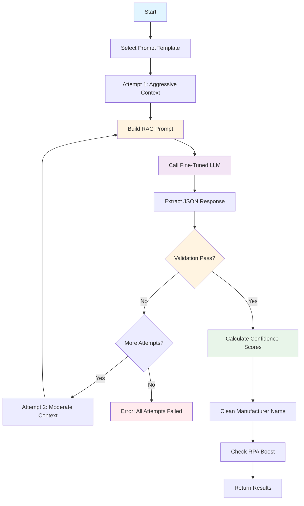

# FINETUNED_LLM Stage - Custom AI Model Extraction

**Last Updated:** 2025-12-17  
**Audience:** Business Analysts, QA Professionals  
**Related:** [Solution Overview](01-solution-overview.md) | [SEMANTIC_SEARCH Stage](06-semantic-search-stage.md) | [EXTRACTION_WITH_LLM_AND_WEBSEARCH Stage](08-extraction-with-llm-and-websearch-stage.md)

## Overview

The FINETUNED_LLM stage uses a custom-trained Large Language Model (LLM) to extract manufacturer names, part numbers, and UNSPSC codes from invoice descriptions. Unlike the base GPT-4 model, this LLM has been fine-tuned on thousands of real invoice examples, making it highly specialized for electrical parts extraction.

This stage employs Retrieval Augmented Generation (RAG) to provide the LLM with relevant examples and manufacturer aliases as context, improving extraction accuracy. It also uses token-level log probabilities to calculate confidence scores for each extracted field.

The stage is typically the fourth extraction stage in the pipeline (after CLASSIFICATION, SEMANTIC_SEARCH, and COMPLETE_MATCH), providing AI-powered extraction when exact matching fails or needs additional validation.

## Key Concepts

### Fine-Tuned LLM
A Large Language Model that has been trained on domain-specific data:
- **Base Model**: GPT-4o or similar
- **Training Data**: Thousands of invoice line items with labeled manufacturer, part number, and UNSPSC
- **Specialization**: Electrical parts and construction materials
- **Advantage**: Better accuracy than general-purpose models for this specific task

**Example Training Data:**
```
Input: "T&B 425 1-1/4 INSULATING SLEEVE"
Output: {
  "ManufacturerName": "THOMAS & BETTS",
  "PartNumber": "425",
  "UNSPSC": "39131711"
}
```

### Retrieval Augmented Generation (RAG)
A technique that provides the LLM with relevant context before extraction:

**Components:**
1. **Manufacturer Aliases**: Dictionary mapping abbreviations to official names
   - Example: "T&B" → "THOMAS & BETTS"
   - Source: COMPLETE_MATCH stage or database

2. **Similar Examples**: Top 3 most similar invoice items from database
   - Source: SEMANTIC_SEARCH stage results
   - Similarity: Based on vector embeddings
   - Format: Input description → Expected output

**Benefits:**
- Improves extraction accuracy
- Helps LLM understand abbreviations
- Provides patterns for complex descriptions
- Reduces hallucinations


### Staged Prompt Strategy
The stage uses a multi-attempt strategy with different prompt styles:

**Attempt 1: Aggressive Context (Patterns for Extraction)**
```
Manufacturer Alias Dictionary:
T&B -> THOMAS & BETTS
ABB -> ABB

Examples (find patterns to use for extraction):
'T&B 425 1-1/4 INSULATING SLEEVE' -> {'ManufacturerName': 'THOMAS & BETTS', 'PartNumber': '425', 'UNSPSC': '39131711'}
'ABB LT50 LIQUIDTIGHT CONNECTOR' -> {'ManufacturerName': 'ABB', 'PartNumber': 'LT50', 'UNSPSC': '39131705'}

Input Description (for extraction):
EATON BR120 CIRCUIT BREAKER 20A
```

**Attempt 2: Moderate Context (Reference Only)**
```
Manufacturer Alias Dictionary:
[same as above]

Examples (for reference only):
[same examples]

Input Description (for extraction):
EATON BR120 CIRCUIT BREAKER 20A
```

**Attempt 3: Zero Context (Fallback)**
```
Input Description:
EATON BR120 CIRCUIT BREAKER 20A
```

**Strategy Rationale:**
- Attempt 1: Aggressive nudging with "find patterns to use"
- Attempt 2: Softer guidance with "for reference only"
- Attempt 3: No context, relies purely on fine-tuning
- Each attempt validates output; if validation fails, try next strategy

### Token-Level Confidence Scoring
The stage calculates confidence scores using log probabilities from the LLM:

**How It Works:**
1. LLM generates tokens (words/subwords) with log probabilities
2. For each extracted field, identify which tokens belong to it
3. Convert log probabilities to probabilities: `prob = exp(logprob)`
4. Calculate mean probability across all tokens
5. Convert to percentage: `confidence = mean_prob * 100`

**Example:**
```
Extracted: "THOMAS & BETTS"
Tokens: ["THOMAS", " &", " BETTS"]
Log Probs: [-0.05, -0.10, -0.08]
Probs: [0.95, 0.90, 0.92]
Mean: 0.92
Confidence: 92%
```

**Why This Matters:**
- Higher confidence = LLM is more certain
- Lower confidence = LLM is guessing
- Helps final consolidation choose best result

### RPA Data Boosting
If RPA (Robotic Process Automation) provided values that match AI-extracted values, confidence scores are boosted:

**Boost Logic:**
```python
if normalize(rpa_value) == normalize(ai_value):
    confidence += boost_amount
```

**Example:**
- RPA extracted: "THOMAS & BETTS"
- AI extracted: "THOMAS & BETTS"
- Match! Boost manufacturer confidence by 10 points

**Rationale:**
- RPA and AI independently extracted the same value
- Agreement increases confidence
- Reduces false positives

### Validation Rules
The stage validates extracted values before accepting them:

**UNSPSC Validation:**
- Must be exactly 8 digits
- Must be numeric only
- Example: "39131711" ✓, "3913171" ✗, "3913171A" ✗

**Part Number Validation:**
- Must appear in the original description (alphanumeric match)
- Exception: GENERIC items (no part number expected)
- Example: Description "T&B 425 SLEEVE" → Part Number "425" ✓
- Example: Description "T&B 425 SLEEVE" → Part Number "LT50" ✗

**Validation Failure:**
- If validation fails, retry with next prompt strategy
- If all strategies fail, stage returns error
- Subsequent stages can still provide results


## Python Modules

### ai_stages.py
Stage implementation that orchestrates fine-tuned LLM extraction.

**Key Method:**

- `AIStages.extract_from_finetuned_llm(sdp, ai_engine_cache, ivce_dtl, stage_number, sub_stage_code)` - Main entry point
  - Selects appropriate prompt template (general or UNSPSC-only)
  - Creates LangChain chain with prompt and LLM
  - Calls execute_hardened_llm_request() with RAG context
  - Calculates confidence scores from log probabilities
  - Cleans manufacturer name using database mapping
  - Returns stage results with confidence scores

**Prompt Selection:**
```python
if ivce_dtl.is_special_case and ivce_dtl.special_case_type == SpecialCases.CASE_1:
    prompt = Prompts.get_fine_tuned_llm_prompt_for_unspsc()
else:
    prompt = Prompts.get_fine_tuned_llm_prompt()
```

**LLM Client:**
```python
llm_to_use = self.llms.aoai_gpt4o_finetuned
```
- Uses raw client (not structured output) to access log probabilities
- Temperature: 0.1 (low randomness, more deterministic)
- Logprobs: True (required for confidence scoring)

### ai_utils.py
Core utility functions for RAG, validation, and confidence calculation.

**Main Functions:**

- `execute_hardened_llm_request(llm_instance, chain, target_description, semantic_search_results, manufacturer_aliases, max_retries)` - Executes LLM with retry logic
  - Builds context-augmented prompt for each attempt
  - Executes LLM chain
  - Validates response content and JSON structure
  - Validates UNSPSC format (8 digits)
  - Validates part number presence in description
  - Retries with different prompt strategies on failure
  - Returns response, parsed JSON, and trace metadata

- `build_context_augmented_description(target_description, semantic_search_results, manufacturer_aliases, attempt)` - Constructs RAG prompt
  - Adds manufacturer alias dictionary
  - Adds top 3 similar examples (attempts 1-2 only)
  - Adds target description with appropriate label
  - Returns full prompt string and trace metadata

- `calculate_confidence_for_finetuned_llm(sdp, response, results_json, fields)` - Calculates confidence scores
  - Extracts tokens and log probabilities from response
  - For each field, identifies relevant tokens
  - Converts log probabilities to probabilities
  - Calculates mean probability across tokens
  - Converts to percentage (0-100)
  - Cleans manufacturer name using database
  - Returns details dict with confidence scores

**Token Alignment:**
```python
def _get_tokens_of_string(token_list, value):
    # Finds which tokens in the response correspond to the extracted value
    # Returns list of indices
```

**Confidence Calculation:**
```python
logprobs = df.iloc[indices]["logprob"].to_numpy(dtype=float)
logprobs = np.clip(logprobs, a_min=None, a_max=0.0)  # Clip to avoid overflow
probs = np.exp(logprobs)  # Convert to probabilities
mean_p = float(np.mean(probs))  # Average across tokens
conf = max(0.0, min(mean_p, 1.0))  # Clamp to [0, 1]
return round(conf, 2)  # Return as decimal
```

### prompts.py
Prompt templates for fine-tuned LLM.

**Key Methods:**

- `Prompts.get_fine_tuned_llm_prompt()` - Returns general extraction prompt
  - Instructs LLM to extract manufacturer, part number, UNSPSC
  - Specifies strict JSON format
  - No additional text or explanations

- `Prompts.get_fine_tuned_llm_prompt_for_unspsc()` - Returns UNSPSC-only prompt
  - Used for special case items (CASE_1)
  - Only extracts UNSPSC code
  - Simpler output format

**General Prompt Template:**
```
{description}

Format the response strictly as a JSON object. No additional text, explanations, or disclaimers - only return JSON in this structure:
```json
{
    "ManufacturerName": "string",
    "PartNumber": "string",
    "UNSPSC": "string",
}
```
If any attribute is unavailable, return an empty string for that attribute.
```

### llm.py
LLM client wrapper for fine-tuned model.

**Key Attributes:**

- `LLM.aoai_gpt4o_finetuned` - Fine-tuned LLM client
  - Azure deployment: Configured per environment
  - Temperature: 0.1 (low randomness)
  - Logprobs: True (enables confidence scoring)
  - API version: Latest

**Configuration:**
```python
self.aoai_gpt4o_finetuned = AzureChatOpenAI(
    azure_deployment=config.AOAI_FINETUNED_LLM_API_DEPLOYMENT,
    openai_api_key=config.AOAI_FINETUNED_LLM_OPENAI_API_KEY,
    azure_endpoint=config.AOAI_FINETUNED_LLM_API_ENDPOINT_URL,
    openai_api_version=config.AOAI_FINETUNED_LLM_API_VERSION,
    temperature=0.1,
    logprobs=True,
)
```


## Configuration

The FINETUNED_LLM stage is configured through `config.yaml` and `thresholds.yaml`:

### Configuration Structure (config.yaml)

```yaml
OPENAI_DEPLOYMENT:
  FINETUNED_LLM:
    RESOURCE_NAME: "your-openai-resource"
    API_TYPE: "azure"
    API_VERSION: "2024-08-01-preview"
    DEPLOYMENT_API_VERSION: "2024-08-01-preview"
    API_KEY: "${AOAI_FINETUNED_LLM_API_KEY}"
    API_BASE_URL: "https://your-endpoint.openai.azure.com/"
    API_ENDPOINT_URL: "https://your-endpoint.openai.azure.com/openai/deployments/{API_DEPLOYMENT}"
```

### Configuration Parameters

| Parameter | Type | Description | Example |
|-----------|------|-------------|---------|
| `RESOURCE_NAME` | string | Azure OpenAI resource name | "your-openai-resource" |
| `API_TYPE` | string | API type (always "azure") | "azure" |
| `API_VERSION` | string | Azure OpenAI API version | "2024-08-01-preview" |
| `API_KEY` | string | Azure OpenAI API key | "${AOAI_FINETUNED_LLM_API_KEY}" |
| `API_BASE_URL` | string | Azure OpenAI endpoint URL | "https://your-endpoint.openai.azure.com/" |
| `API_ENDPOINT_URL` | string | Full endpoint with deployment placeholder | "https://your-endpoint.openai.azure.com/openai/deployments/{API_DEPLOYMENT}" |

### Threshold Configuration (thresholds.yaml)

```yaml
FINETUNED_LLM:
  FINETUNED_LLM:
    manufacturer_name: 95
    part_number: 100
    unspsc: 75
```

**Threshold Parameters:**

| Parameter | Type | Description | Default |
|-----------|------|-------------|---------|
| `manufacturer_name` | int | Minimum confidence to use manufacturer | 95 |
| `part_number` | int | Minimum confidence to use part number | 100 |
| `unspsc` | int | Minimum confidence to use UNSPSC | 75 |

**Threshold Behavior:**
- If confidence < threshold, field is not used in final consolidation
- High thresholds ensure only high-quality extractions are used
- Part number threshold is highest (100) because accuracy is critical

### LLM Settings

**Temperature: 0.1**
- Low randomness for consistent output
- More deterministic than creative
- Reduces hallucinations

**Logprobs: True**
- Enables token-level probability extraction
- Required for confidence scoring
- Adds minimal latency

**Max Retries: 3**
- Three prompt strategies attempted
- Each with different context level
- Stops on first successful validation


## Business Logic

### Processing Flow



### Step-by-Step Processing

**1. Select Prompt Template**

The stage selects the appropriate prompt based on special case handling:

```python
if ivce_dtl.is_special_case and ivce_dtl.special_case_type == SpecialCases.CASE_1:
    prompt = Prompts.get_fine_tuned_llm_prompt_for_unspsc()
else:
    prompt = Prompts.get_fine_tuned_llm_prompt()
```

**Special Case 1 (UNSPSC-Only):**
- Used for generic items or items without manufacturer/part number
- Only extracts UNSPSC code
- Simpler prompt and output

**General Case:**
- Extracts manufacturer name, part number, and UNSPSC
- Full prompt with all fields

**2. Build RAG Prompt (Attempt-Specific)**

For each attempt, the stage builds a context-augmented prompt:

**Attempt 1: Aggressive Context**
```
Manufacturer Alias Dictionary:
T&B -> THOMAS & BETTS

Examples (find patterns to use for extraction):
'T&B 425 SLEEVE' -> {'ManufacturerName': 'THOMAS & BETTS', 'PartNumber': '425', 'UNSPSC': '39131711'}

Input Description (for extraction):
EATON BR120 CIRCUIT BREAKER 20A
```

**Attempt 2: Moderate Context**
```
Manufacturer Alias Dictionary:
T&B -> THOMAS & BETTS

Examples (for reference only):
'T&B 425 SLEEVE' -> {'ManufacturerName': 'THOMAS & BETTS', 'PartNumber': '425', 'UNSPSC': '39131711'}

Input Description (for extraction):
EATON BR120 CIRCUIT BREAKER 20A
```

**Attempt 3: Zero Context**
```
Input Description:
EATON BR120 CIRCUIT BREAKER 20A
```

**Context Sources:**
- **Manufacturer Aliases**: From COMPLETE_MATCH stage or database
- **Similar Examples**: Top 3 from SEMANTIC_SEARCH stage
- **Target Description**: Cleaned invoice description

**3. Call Fine-Tuned LLM**

The stage executes the LLM chain:

```python
response = await llm_instance.get_llm_response(
    chain=chain, 
    params={"description": full_input_string}
)
```

**LLM Response:**
```json
{
  "ManufacturerName": "EATON",
  "PartNumber": "BR120",
  "UNSPSC": "39121016"
}
```

**Response Metadata:**
- Tokens: ["EATON", "BR", "120", ...]
- Log Probabilities: [-0.05, -0.10, -0.08, ...]
- Used for confidence scoring

**4. Extract and Validate JSON**

The stage extracts JSON from the response and validates it:

**JSON Extraction:**
```python
results_json = extract_json(response.content)
```
- Handles markdown code blocks
- Removes extra text
- Parses JSON structure

**Validation Checks:**

**a) Content Validation:**
```python
if not response.content or not response.content.strip():
    raise ValueError("LLM returned empty content")
```

**b) JSON Validation:**
```python
if not results_json:
    raise ValueError("Failed to extract valid JSON from response")
```

**c) UNSPSC Validation:**
```python
unspsc = results_json.get("UNSPSC")
if unspsc and is_not_empty(str(unspsc)):
    clean_unspsc = str(unspsc).strip()
    if not (clean_unspsc.isdigit() and len(clean_unspsc) == 8):
        raise ValueError(f"Extracted UNSPSC '{unspsc}' is not a valid 8-digit code.")
```

**d) Part Number Validation:**
```python
# Skip for GENERIC items
if not is_generic:
    pn = results_json.get("PartNumber")
    if pn and is_not_empty(str(pn)):
        norm_pn = get_alphanumeric(str(pn)).upper()
        norm_target = get_alphanumeric(target_description).upper()
        
        if norm_pn not in norm_target:
            raise ValueError(f"Extracted Part Number '{pn}' not found in Input Description.")
```

**Validation Failure:**
- If any validation fails, retry with next prompt strategy
- Attempt 1 → Attempt 2 → Attempt 3
- If all fail, raise error

**5. Calculate Confidence Scores**

The stage calculates confidence scores using token-level log probabilities:

**For Each Field:**

**a) Identify Tokens:**
```python
# Find which tokens belong to "EATON"
indices = _get_tokens_of_string(token_list, "EATON")
# Example: [0] (first token)
```

**b) Extract Log Probabilities:**
```python
logprobs = df.iloc[indices]["logprob"].to_numpy(dtype=float)
# Example: [-0.05]
```

**c) Convert to Probabilities:**
```python
logprobs = np.clip(logprobs, a_min=None, a_max=0.0)  # Clip to avoid overflow
probs = np.exp(logprobs)
# Example: [0.95]
```

**d) Calculate Mean:**
```python
mean_p = float(np.mean(probs))
# Example: 0.95
```

**e) Convert to Percentage:**
```python
conf = max(0.0, min(mean_p, 1.0))  # Clamp to [0, 1]
confidence = round(conf * 100, 2)
# Example: 95.0
```

**Result:**
```json
{
  "confidence_score": {
    "manufacturer_name": 95.0,
    "part_number": 92.0,
    "unspsc": 88.0
  }
}
```

**6. Clean Manufacturer Name**

The stage cleans the manufacturer name using database mapping:

```python
mfr_name = remove_accents(mfr_name.strip().upper())
cln_mfr_name, cln_mfr_flag = await get_clean_mfr_name(sdp, mfr_name)
```

**Cleaning Process:**
- Remove accents: "CAFÉ" → "CAFE"
- Strip whitespace
- Convert to uppercase
- Look up in manufacturer mapping table
- Return clean name and flag

**Example:**
- Extracted: "T&B"
- Cleaned: "THOMAS & BETTS"
- Flag: True (mapping found)

**7. Check RPA Boost**

If RPA provided values, check for matches and boost confidence:

```python
if normalize(rpa_value) == normalize(ai_value):
    confidence += boost_amount
```

**Example:**
- RPA: "THOMAS & BETTS"
- AI: "THOMAS & BETTS"
- Match! Boost manufacturer confidence by 10 points

**8. Return Results**

The stage returns results with confidence scores:

```json
{
  "manufacturer_name": "EATON",
  "unclean_manufacturer_name": "EATON",
  "part_number": "BR120",
  "unspsc": "39121016",
  "confidence_score": {
    "manufacturer_name": 95.0,
    "part_number": 92.0,
    "unspsc": 88.0
  },
  "is_mfr_clean_flag": true,
  "is_verified_flag": false,
  "description": "eaton br120 circuit breaker 20a"
}
```


### RAG (Retrieval Augmented Generation) Logic

The stage uses RAG to provide context to the LLM:

**1. Manufacturer Aliases**

**Source:** COMPLETE_MATCH stage or database

**Format:**
```
Manufacturer Alias to Official ManufacturerName Dictionary:
T&B -> THOMAS & BETTS
ABB -> ABB
EATON -> EATON
```

**Purpose:**
- Helps LLM understand abbreviations
- Maps variants to official names
- Reduces hallucinations

**Example:**
- Description: "T&B 425 SLEEVE"
- Without aliases: LLM might extract "T&B" or "TB"
- With aliases: LLM extracts "THOMAS & BETTS"

**2. Similar Examples**

**Source:** SEMANTIC_SEARCH stage results

**Selection:** Top 3 most similar items

**Format:**
```
Examples (find patterns to use for extraction):
'T&B 425 1-1/4 INSULATING SLEEVE' -> {'ManufacturerName': 'THOMAS & BETTS', 'PartNumber': '425', 'UNSPSC': '39131711'}
'ABB LT50 LIQUIDTIGHT CONNECTOR' -> {'ManufacturerName': 'ABB', 'PartNumber': 'LT50', 'UNSPSC': '39131705'}
'EATON BR120 CIRCUIT BREAKER 20A' -> {'ManufacturerName': 'EATON', 'PartNumber': 'BR120', 'UNSPSC': '39121016'}
```

**Purpose:**
- Shows LLM similar extraction patterns
- Provides context for ambiguous descriptions
- Improves accuracy on complex items

**Example:**
- Description: "EATON BR220 CIRCUIT BREAKER 20A"
- Similar example: "EATON BR120 CIRCUIT BREAKER 20A" → "BR120"
- LLM learns pattern: Extract "BR###" as part number

**3. Trace Metadata**

The stage records RAG usage for debugging:

```json
{
  "is_mfr_dict_provided": true,
  "prompt_strategy": "patterns_for_extraction",
  "examples_count": 3,
  "examples_used": [
    {
      "input": "T&B 425 SLEEVE",
      "output": {"ManufacturerName": "THOMAS & BETTS", "PartNumber": "425", "UNSPSC": "39131711"}
    }
  ]
}
```

**Trace Fields:**
- `is_mfr_dict_provided`: Whether manufacturer aliases were available
- `prompt_strategy`: Which prompt strategy was used
- `examples_count`: Number of examples included
- `examples_used`: Actual examples provided to LLM


## Dependencies

### Required Services

1. **Azure OpenAI (Fine-Tuned Deployment)**
   - Purpose: Custom-trained LLM for extraction
   - Model: GPT-4o fine-tuned on invoice data
   - Dependency: Must be accessible
   - Failure Impact: Stage fails, subsequent stages can provide alternatives

2. **SQL Database (SDP)**
   - Purpose: Manufacturer name cleaning and mapping
   - Dependency: Must be accessible
   - Failure Impact: Manufacturer names not cleaned, confidence may be lower

### Module Dependencies

- `ai_stages.py` - Stage implementation
- `ai_utils.py` - RAG, validation, confidence calculation
- `prompts.py` - Prompt templates
- `llm.py` - LLM client wrapper
- `constants.py` - Stage names, field names, enums
- `utils.py` - Text cleaning, JSON extraction
- `logger.py` - Logging

### Depends On

- **SEMANTIC_SEARCH Stage** (Optional) - Provides similar examples for RAG
  - If available: Examples included in prompt
  - If not available: Prompt uses zero context strategy

- **COMPLETE_MATCH Stage** (Optional) - Provides manufacturer aliases for RAG
  - If available: Aliases included in prompt
  - If not available: Prompt works without aliases

### Used By

- **Final Consolidation** - May use manufacturer/part number/UNSPSC if highest confidence
- **Subsequent Stages** - Results available for comparison

### Stage Execution Order

```
CLASSIFICATION → COMPLETE_MATCH → CONTEXT_VALIDATOR → SEMANTIC_SEARCH → FINETUNED_LLM → EXTRACTION_WITH_LLM_AND_WEBSEARCH
```

**Key Points:**
- FINETUNED_LLM runs after SEMANTIC_SEARCH to leverage similar examples
- FINETUNED_LLM runs after COMPLETE_MATCH to leverage manufacturer aliases
- Results compete with other stages in final consolidation


## Output Fields

The stage returns the following fields:

| Field | Type | Description | Example |
|-------|------|-------------|---------|
| `manufacturer_name` | string | Clean manufacturer name | "EATON" |
| `unclean_manufacturer_name` | string | Original extracted name | "EATON" |
| `part_number` | string | Manufacturer part number | "BR120" |
| `unspsc` | string | UNSPSC code (8 digits) | "39121016" |
| `confidence_score` | object | Confidence scores for each field | See below |
| `confidence_score.manufacturer_name` | float | Manufacturer confidence (0-100) | 95.0 |
| `confidence_score.part_number` | float | Part number confidence (0-100) | 92.0 |
| `confidence_score.unspsc` | float | UNSPSC confidence (0-100) | 88.0 |
| `is_mfr_clean_flag` | boolean | Whether manufacturer was cleaned | true |
| `is_verified_flag` | boolean | Always false for this stage | false |
| `description` | string | Cleaned invoice description | "eaton br120 circuit breaker 20a" |
| `rag_trace` | object | RAG usage metadata | See below |

**RAG Trace Object:**
```json
{
  "is_mfr_dict_provided": true,
  "prompt_strategy": "patterns_for_extraction",
  "examples_count": 3,
  "examples_used": [...]
}
```

**Special Case Output (UNSPSC-Only):**
```json
{
  "unspsc": "39121016",
  "confidence_score": {
    "unspsc": 88.0
  },
  "description": "generic circuit breaker"
}
```


## Examples

### Example 1: Standard Extraction with RAG Context

**Input:**
```
Description: "EATON BR120 CIRCUIT BREAKER 20A"
Manufacturer Aliases: {"EATON": "EATON"}
Similar Examples: [
  {"ItemDescription": "EATON BR220 CIRCUIT BREAKER 20A", "MfrName": "EATON", "MfrPartNum": "BR220", "UNSPSC": "39121016"},
  {"ItemDescription": "EATON BR115 CIRCUIT BREAKER 15A", "MfrName": "EATON", "MfrPartNum": "BR115", "UNSPSC": "39121016"}
]
```

**Processing:**

1. **Prompt Construction (Attempt 1):**
```
Manufacturer Alias Dictionary:
EATON -> EATON

Examples (find patterns to use for extraction):
'EATON BR220 CIRCUIT BREAKER 20A' -> {'ManufacturerName': 'EATON', 'PartNumber': 'BR220', 'UNSPSC': '39121016'}
'EATON BR115 CIRCUIT BREAKER 15A' -> {'ManufacturerName': 'EATON', 'PartNumber': 'BR115', 'UNSPSC': '39121016'}

Input Description (for extraction):
EATON BR120 CIRCUIT BREAKER 20A
```

2. **LLM Response:**
```json
{
  "ManufacturerName": "EATON",
  "PartNumber": "BR120",
  "UNSPSC": "39121016"
}
```

3. **Validation:**
- Content: ✓ Not empty
- JSON: ✓ Valid structure
- UNSPSC: ✓ "39121016" is 8 digits
- Part Number: ✓ "BR120" found in "EATON BR120 CIRCUIT BREAKER 20A"

4. **Confidence Calculation:**
- Manufacturer: Tokens ["EATON"], Log Probs [-0.05], Confidence: 95.0
- Part Number: Tokens ["BR", "120"], Log Probs [-0.08, -0.10], Confidence: 91.0
- UNSPSC: Tokens ["39121016"], Log Probs [-0.12], Confidence: 88.0

5. **Manufacturer Cleaning:**
- Extracted: "EATON"
- Cleaned: "EATON" (already clean)
- Flag: true

**Output:**
```json
{
  "manufacturer_name": "EATON",
  "unclean_manufacturer_name": "EATON",
  "part_number": "BR120",
  "unspsc": "39121016",
  "confidence_score": {
    "manufacturer_name": 95.0,
    "part_number": 91.0,
    "unspsc": 88.0
  },
  "is_mfr_clean_flag": true,
  "is_verified_flag": false,
  "description": "eaton br120 circuit breaker 20a",
  "rag_trace": {
    "is_mfr_dict_provided": true,
    "prompt_strategy": "patterns_for_extraction",
    "examples_count": 2
  }
}
```

---

### Example 2: Abbreviation Expansion with Manufacturer Aliases

**Input:**
```
Description: "T&B 425 1-1/4 INSULATING SLEEVE"
Manufacturer Aliases: {"THOMAS & BETTS": "T&B"}
Similar Examples: [
  {"ItemDescription": "T&B 426 1-1/2 INSULATING SLEEVE", "MfrName": "THOMAS & BETTS", "MfrPartNum": "426", "UNSPSC": "39131711"}
]
```

**Processing:**

1. **Prompt Construction (Attempt 1):**
```
Manufacturer Alias Dictionary:
T&B -> THOMAS & BETTS

Examples (find patterns to use for extraction):
'T&B 426 1-1/2 INSULATING SLEEVE' -> {'ManufacturerName': 'THOMAS & BETTS', 'PartNumber': '426', 'UNSPSC': '39131711'}

Input Description (for extraction):
T&B 425 1-1/4 INSULATING SLEEVE
```

2. **LLM Response:**
```json
{
  "ManufacturerName": "THOMAS & BETTS",
  "PartNumber": "425",
  "UNSPSC": "39131711"
}
```

3. **Validation:**
- All checks pass

4. **Confidence Calculation:**
- Manufacturer: 93.0 (high confidence due to alias match)
- Part Number: 96.0 (clear extraction)
- UNSPSC: 90.0 (pattern from example)

**Output:**
```json
{
  "manufacturer_name": "THOMAS & BETTS",
  "unclean_manufacturer_name": "THOMAS & BETTS",
  "part_number": "425",
  "unspsc": "39131711",
  "confidence_score": {
    "manufacturer_name": 93.0,
    "part_number": 96.0,
    "unspsc": 90.0
  },
  "is_mfr_clean_flag": true,
  "is_verified_flag": false,
  "description": "t b 425 1-1/4 insulating sleeve"
}
```

**Key Point:** The manufacturer alias helped the LLM expand "T&B" to "THOMAS & BETTS" correctly.

---

### Example 3: Validation Failure and Retry

**Input:**
```
Description: "DEWALT DW745 TABLE SAW"
Manufacturer Aliases: {"DEWALT": "DEWALT"}
Similar Examples: []
```

**Processing:**

**Attempt 1: Aggressive Context**

1. **LLM Response:**
```json
{
  "ManufacturerName": "DEWALT",
  "PartNumber": "DW746",  // Wrong part number!
  "UNSPSC": "27112100"
}
```

2. **Validation:**
- Part Number: ✗ "DW746" NOT found in "DEWALT DW745 TABLE SAW"
- Validation fails, retry with next strategy

**Attempt 2: Moderate Context**

1. **LLM Response:**
```json
{
  "ManufacturerName": "DEWALT",
  "PartNumber": "DW745",  // Correct!
  "UNSPSC": "27112100"
}
```

2. **Validation:**
- All checks pass

3. **Confidence Calculation:**
- Manufacturer: 94.0
- Part Number: 92.0
- UNSPSC: 87.0

**Output:**
```json
{
  "manufacturer_name": "DEWALT",
  "unclean_manufacturer_name": "DEWALT",
  "part_number": "DW745",
  "unspsc": "27112100",
  "confidence_score": {
    "manufacturer_name": 94.0,
    "part_number": 92.0,
    "unspsc": 87.0
  },
  "is_mfr_clean_flag": true,
  "is_verified_flag": false,
  "description": "dewalt dw745 table saw",
  "rag_trace": {
    "is_mfr_dict_provided": true,
    "prompt_strategy": "reference_only",
    "examples_count": 0
  }
}
```

**Key Point:** The staged prompt strategy allowed recovery from initial extraction error.

---

### Example 4: RPA Data Boosting

**Input:**
```
Description: "EATON BR120 CIRCUIT BREAKER 20A"
RPA Data: {
  "manufacturer": "EATON",
  "part_number": "BR120"
}
```

**Processing:**

1. **LLM Extraction:**
```json
{
  "ManufacturerName": "EATON",
  "PartNumber": "BR120",
  "UNSPSC": "39121016"
}
```

2. **Initial Confidence:**
- Manufacturer: 85.0
- Part Number: 88.0
- UNSPSC: 82.0

3. **RPA Boost Check:**
- RPA Manufacturer: "EATON" == AI Manufacturer: "EATON" ✓
- RPA Part Number: "BR120" == AI Part Number: "BR120" ✓
- Boost both by 10 points

4. **Final Confidence:**
- Manufacturer: 95.0 (85 + 10)
- Part Number: 98.0 (88 + 10)
- UNSPSC: 82.0 (no RPA data for UNSPSC)

**Output:**
```json
{
  "manufacturer_name": "EATON",
  "part_number": "BR120",
  "unspsc": "39121016",
  "confidence_score": {
    "manufacturer_name": 95.0,
    "part_number": 98.0,
    "unspsc": 82.0
  },
  "is_mfr_clean_flag": true,
  "is_verified_flag": false,
  "description": "eaton br120 circuit breaker 20a"
}
```

**Key Point:** RPA agreement boosted confidence, making these values more likely to be used in final consolidation.

---

### Example 5: Special Case - UNSPSC Only

**Input:**
```
Description: "GENERIC CIRCUIT BREAKER"
Special Case: CASE_1 (UNSPSC-only extraction)
```

**Processing:**

1. **Prompt Selection:**
- Uses `get_fine_tuned_llm_prompt_for_unspsc()`
- Only extracts UNSPSC, not manufacturer or part number

2. **Prompt Construction:**
```
Input Description:
GENERIC CIRCUIT BREAKER
```

3. **LLM Response:**
```json
{
  "UNSPSC": "39121016"
}
```

4. **Validation:**
- UNSPSC: ✓ "39121016" is 8 digits

5. **Confidence Calculation:**
- UNSPSC: 85.0

**Output:**
```json
{
  "unspsc": "39121016",
  "confidence_score": {
    "unspsc": 85.0
  },
  "is_verified_flag": false,
  "description": "generic circuit breaker",
  "rag_trace": {
    "is_mfr_dict_provided": false,
    "prompt_strategy": "no_context",
    "examples_count": 0
  }
}
```

**Key Point:** Special case handling allows extraction of UNSPSC even when manufacturer and part number are not applicable.


## Performance Characteristics

### Throughput
- ~20-50 extractions per second
- Bottleneck: LLM API calls
- Can be parallelized across multiple invoice lines

### Latency
- LLM API call: 1000-3000ms (depends on model and load)
- Prompt construction: 10-20ms
- Confidence calculation: 20-50ms
- Total per attempt: 1000-3000ms
- Total with retries: Up to 9000ms (3 attempts × 3000ms)

**Latency by Attempt:**
- Attempt 1 (with context): 2000-3000ms (longer prompt)
- Attempt 2 (with context): 2000-3000ms
- Attempt 3 (no context): 1000-2000ms (shorter prompt)

### Accuracy
- Manufacturer extraction: Very high (> 90%)
- Part number extraction: High (> 85%)
- UNSPSC extraction: High (> 80%)

**Factors Affecting Accuracy:**
- Fine-tuning quality: Better training data = better accuracy
- RAG context: Aliases and examples improve accuracy
- Description quality: Clear descriptions = better extraction
- Validation rules: Prevent many false positives

### Resource Usage
- Memory: Minimal (< 20 MB per request)
- CPU: Low (mostly I/O bound waiting for LLM)
- Network: Moderate (LLM API calls)
- Cost: LLM API usage (tokens consumed per extraction)

### Token Usage
- Typical prompt (with context): 400-800 tokens
- Typical prompt (no context): 100-200 tokens
- Typical response: 50-100 tokens
- Total per extraction: 150-900 tokens
- Cost depends on Azure OpenAI pricing

**Token Breakdown:**
- Manufacturer aliases: 50-100 tokens
- Similar examples: 200-400 tokens (3 examples)
- Target description: 50-100 tokens
- Response: 50-100 tokens


## Monitoring and Troubleshooting

### Common Issues

**Issue: All Attempts Fail Validation**
- Symptom: Stage returns error after 3 attempts
- Possible Causes:
  - LLM extracting invalid UNSPSC (not 8 digits)
  - LLM extracting part number not in description
  - LLM returning malformed JSON
  - LLM returning empty response
- Solution: Review LLM responses, check validation rules, improve fine-tuning data

**Issue: Low Confidence Scores**
- Symptom: Confidence scores below thresholds
- Possible Causes:
  - LLM uncertain about extraction
  - Ambiguous description
  - Lack of training data for this type of item
  - Token alignment issues
- Solution: Review log probabilities, improve description quality, add training data

**Issue: Wrong Manufacturer Extracted**
- Symptom: Incorrect manufacturer name
- Possible Causes:
  - Manufacturer alias not provided
  - LLM hallucinating manufacturer
  - Similar manufacturer names in description
- Solution: Ensure COMPLETE_MATCH provides aliases, review fine-tuning data

**Issue: Wrong Part Number Extracted**
- Symptom: Incorrect part number
- Possible Causes:
  - Multiple numbers in description
  - LLM confused by measurements or quantities
  - Part number validation too strict
- Solution: Review description, check validation logic, improve fine-tuning data

**Issue: LLM API Errors**
- Symptom: Stage fails with API errors
- Possible Causes:
  - Rate limits exceeded
  - API endpoint unavailable
  - Authentication failure
  - Timeout
- Solution: Check API status, verify credentials, review rate limits, check retry logic

**Issue: RAG Context Not Helping**
- Symptom: Accuracy not improved by examples
- Possible Causes:
  - Examples not similar enough
  - Examples have wrong patterns
  - LLM ignoring context
- Solution: Review SEMANTIC_SEARCH results, check example quality, adjust prompt strategy

### Health Checks

**Before Stage Runs:**
- Azure OpenAI endpoint accessible
- Fine-tuned deployment available
- API credentials valid
- Cleaned description available

**During Execution:**
- Monitor LLM API latency
- Check for API errors or rate limits
- Verify validation pass rates
- Track prompt strategy usage (attempt 1 vs 2 vs 3)

**After Completion:**
- Verify extraction results recorded
- Check confidence scores reasonable
- Review RAG trace metadata
- Confirm manufacturer cleaning succeeded

### Debugging Tips

**Enable Debug Logging:**
```python
logger.setLevel(logging.DEBUG)
```

**Review Full Prompts:**
- Uncomment debug log in `execute_hardened_llm_request()`
- See exact prompt sent to LLM
- Verify context included correctly

**Check LLM Responses:**
- Log raw LLM response content
- Verify JSON structure
- Check for extra text or formatting issues

**Analyze Confidence Scores:**
- Log token-level log probabilities
- Verify token alignment
- Check for outlier probabilities

**Test Validation Rules:**
- Log validation failures
- Check UNSPSC format
- Verify part number presence in description

**Review RAG Context:**
- Check manufacturer aliases provided
- Verify similar examples included
- Confirm prompt strategy used

**Monitor Retry Patterns:**
- Track which attempts succeed
- Identify common failure modes
- Adjust prompt strategies if needed

### Quality Metrics

**Extraction Success Rate:**
- Percentage of extractions that pass validation
- Typical range: 85-95%
- Too low (< 80%): Review validation rules or fine-tuning

**Confidence Score Distribution:**
- Manufacturer: 85-95 (high confidence)
- Part Number: 80-90 (moderate-high confidence)
- UNSPSC: 75-85 (moderate confidence)

**Prompt Strategy Usage:**
- Attempt 1 success: 70-80%
- Attempt 2 success: 15-20%
- Attempt 3 success: 5-10%
- All fail: < 5%

**RAG Context Availability:**
- Manufacturer aliases provided: 60-80%
- Similar examples provided: 70-90%
- Both provided: 50-70%

**Latency Percentiles:**
- P50: 1500-2000ms
- P95: 2500-3500ms
- P99: 4000-6000ms

**Error Rate:**
- Target: < 5% of extractions
- Includes API errors, validation failures, timeouts
- Excludes business logic issues (low confidence)

