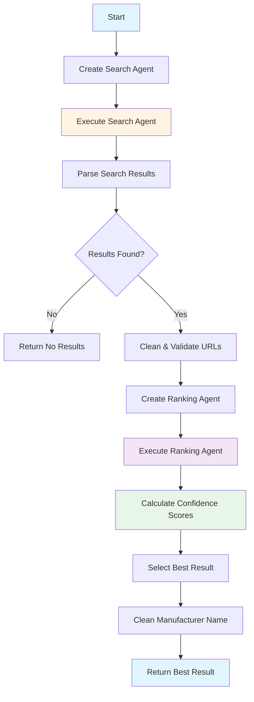
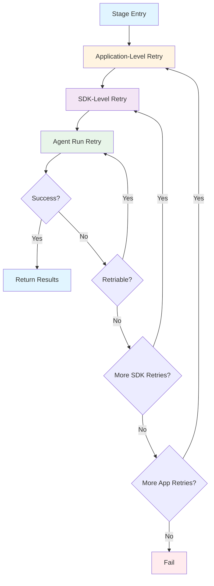

# EXTRACTION_WITH_LLM_AND_WEBSEARCH Stage - Web Search with AI Agent

**Last Updated:** 2025-12-24
**Author:** Kirill Levtov
**Related:** [Solution Overview](01-solution-overview.md) | [FINETUNED_LLM Stage](07-finetuned-llm-stage.md) | [SEMANTIC_SEARCH Stage](06-semantic-search-stage.md)

## Overview

The EXTRACTION_WITH_LLM_AND_WEBSEARCH stage uses an AI agent with Bing search capabilities to find product information from online sources. When internal databases and AI models don't have sufficient information, this stage searches the web for manufacturer names, part numbers, UNSPSC codes, and UPC barcodes.

This stage employs a two-agent system: a **search agent** that formulates queries and retrieves web results, and a **ranking agent** that evaluates and scores the results. The stage then calculates confidence scores based on multiple factors including manufacturer match quality, part number match quality, description similarity, and data source priority.

The stage is typically the last extraction stage in the pipeline, providing a fallback when other stages fail or return low-confidence results. It's particularly useful for obscure products, new items not yet in the database, or specialized equipment.

## Key Concepts

### AI Agent with Bing Search
An autonomous AI system that can search the web and extract structured information:

**Components:**
- **Azure AI Agent**: LLM-powered agent that understands natural language
- **Bing Grounding Tool**: Enables web search capabilities
- **Structured Output**: Agent returns JSON with specific fields

**How It Works:**
1. Agent receives a prompt with the invoice description
2. Agent formulates a Bing search query
3. Bing returns web results
4. Agent visits relevant pages
5. Agent extracts product information
6. Agent returns structured JSON

**Example:**
```
Input: "DEWALT DW745 TABLE SAW"
Agent searches: "DEWALT DW745 TABLE SAW specifications"
Agent finds: grainger.com, homedepot.com, dewalt.com
Agent extracts: {
  "ManufacturerName": "DEWALT",
  "PartNumber": "DW745",
  "UNSPSC": "27112100",
  "Source": "https://www.dewalt.com/product/dw745"
}
```


### Two-Agent System

**Search Agent:**
- Purpose: Find product information on the web
- Tool: Bing search with grounding
- Input: Invoice description + search instructions
- Output: Top 5 web results with extracted fields
- Prompt: Instructs agent to search, extract, and validate URLs

**Ranking Agent:**
- Purpose: Evaluate and score search results
- Tool: No web search (analysis only)
- Input: Search results + invoice description
- Output: Same results with added ranking fields
- Prompt: Instructs agent to compare and classify matches

**Why Two Agents:**
- Separation of concerns: Search vs. evaluation
- Better accuracy: Specialized prompts for each task
- Easier debugging: Can identify which agent failed

### Priority Websites
The stage prioritizes results from trusted electrical parts distributors:

**Priority Sites Include:**
- Grainger
- Digi-Key
- McMaster-Carr
- Home Depot
- Lowe's
- Manufacturer websites (Eaton, ABB, etc.)

**Benefits:**
- Higher data quality
- More reliable specifications
- Better confidence scores
- Faster extraction

**Scoring Impact:**
- Priority site results get bonus points
- Multiple priority results increase confidence
- Non-priority results still accepted but scored lower

### Result Ranking Algorithm
The stage scores each web result based on multiple factors. The **Total Score** determines which result row is selected as the best match, while individual **Field Scores** serve as the confidence values for the extracted data points.

**Scoring Factors:**

1. **Manufacturer Match** (0-50 points)
   - **Base Score**: Exact (40), Likely (30), Possible (20), Mismatch/Not Detected (0).
   - **Bonus**: +10 if the extracted manufacturer name exists in the internal database.

2. **Part Number Match** (0-30 points)
   - Exact: 30 points
   - Strong: 25 points
   - Partial: 15 points
   - Possible: 10 points
   - No Match: 0 points

3. **Part Number Length** (0-15 points)
   - Length > 7: 10 points (decreasing for shorter lengths).
   - Alphanumeric Bonus: +5 points (indicates complexity).

4. **Description Similarity** (0-20 points)
   - Evaluated by the Ranking Agent based on semantic closeness.
   - Exact (20), Very High (15), High (10), Medium (5), Low (0).

5. **Data Sources** (0-25 points)
   - Evaluated based on the *set* of results returned by the search agent.
   - **25 points**: Multiple priority sites found, or one priority + others.
   - **10 points**: Single priority site found.
   - **5 points per site**: Non-priority sites (up to 25 max).

**Confidence Calculation Formulas:**

Unlike other stages that normalize scores to 100, this stage sums specific factors to determine field confidence:

- **Manufacturer Confidence (Max 95)**:
  `Mfr Match Score + Description Similarity + Data Sources Score`

- **Part Number Confidence (Max 90)**:
  `PN Match Score + PN Length Score + Description Similarity + Data Sources Score`

- **UNSPSC Confidence (Max 90)**:
  `(Description Similarity + Data Sources Score) * 2`

*Note: The final "Confidence" used for ranking rows is a weighted average of these three field scores, prioritizing Manufacturer and Part Number.*


### Match Type Classifications

The ranking agent classifies matches into specific categories:

**Manufacturer Match Types:**
- **Exact**: Invoice and web result have identical manufacturer (e.g., "EATON" = "EATON")
- **Likely**: Close match with minor variations (e.g., "3M Electrical" vs "3M")
- **Possible**: Some resemblance but uncertain (e.g., "ADRF" vs "ADVANCED RF TECHNOLOGIES")
- **Mismatch**: Clearly different manufacturers
- **Not Detected**: No manufacturer found in invoice description

**Part Number Match Types:**
- **Exact**: Identical part numbers (e.g., "BR120" = "BR120")
- **Strong**: Same with formatting differences (e.g., "ABC-12345" vs "ABC12345")
- **Partial**: Significant portion matches (e.g., "ABC123456" vs "123456")
- **Possible**: Some similarities but uncertain
- **No Match**: Part number not found in description

**Description Match Types:**
- **Exact**: Identical or nearly identical descriptions
- **Very High**: Close match with minor wording variations
- **High**: Key attributes match with some differences
- **Medium**: Somewhat related with enough differences
- **Low**: Only partial similarities

### URL Validation
The stage validates that URLs are accessible and lead to actual product pages:

**Validation Rules:**
- Must return HTTP 200 OK status
- Must be a complete URL (protocol, domain, path)
- Must not be truncated or shortened
- Must lead to product page (not homepage or error page)

**Invalid URLs Removed:**
- Empty strings
- "None" or "null" values
- Missing source URLs
- Inaccessible pages

### Special Case Handling
For generic items (CASE_1), the stage uses simplified prompts:

**UNSPSC-Only Mode:**
- Only extracts UNSPSC code
- Skips manufacturer and part number
- Simpler search and ranking prompts
- Faster processing

**Example:**
- Description: "GENERIC CIRCUIT BREAKER"
- Search: Focus on product category
- Extract: Only UNSPSC code
- Skip: Manufacturer and part number validation


## Python Modules

### ai_stages.py
Stage implementation that orchestrates web search and ranking.

**Key Method:**

- `AIStages.extract_with_ai_agents_from_websearch(sdp, ai_engine_cache, ivce_dtl, stage_number, sub_stage_code)` - Main entry point
  - Creates search agent with Bing capabilities
  - Executes search agent with retry logic
  - Cleans and validates search results
  - Creates ranking agent
  - Executes ranking agent with retry logic
  - Calculates confidence scores
  - Selects best result
  - Returns stage results with confidence scores

**Processing Steps:**

1. **Search Agent Execution:**
```python
ai_websearch_agent = await self.agents.get_agent_with_bing_search_async(
    self.config.AZ_AGENT_GBS_AGENT_DEPLOYMENT,
    Prompts.get_web_search_system_prompt(),
    self.config.AZ_AGENT_GBS_API_DEPLOYMENT,
)

web_search_results_json, _, search_thread_id, _ = await run_agent_and_get_json_with_retry(
    agents=self.agents,
    prompt=search_prompt,
    agent=ai_websearch_agent,
    agent_type="web search",
    validator=validate_search_results_schema,
)
```

2. **Result Cleaning:**
```python
df = pd.DataFrame(web_search_results_json)
df["Source"] = df["Source"].fillna("").astype(str).str.strip()
df["Source"] = df["Source"].replace(["", "None", "null", "Missing Source URL"], pd.NA)
df.dropna(subset=["Source"], inplace=True)
df = df.drop_duplicates(subset=relevant_cols, keep="first")
```

3. **Ranking Agent Execution:**
```python
ai_ranking_agent = await self.agents.get_agent_async(
    self.config.AZ_AGENT_AGENT_DEPLOYMENT,
    Prompts.get_web_results_ranking_system_prompt(),
    self.config.AZ_AGENT_API_DEPLOYMENT,
)

web_results_ranking_json, _, rank_thread_id, _ = await run_agent_and_get_json_with_retry(
    agents=self.agents,
    prompt=ranking_prompt,
    agent=ai_ranking_agent,
    agent_type="ranking",
    validator=validate_search_results_schema,
)
```

4. **Confidence Calculation:**
```python
df_with_confidences = await calculate_confidence_for_web_search_results_with_ranking(
    sdp=sdp,
    web_results_ranking_json=web_results_ranking_json,
    ivce_dtl=ivce_dtl
)
```

5. **Best Result Selection:**
```python
best_result_df, is_mfr_clean_flag = await get_higher_confidence_web_search_result(
    sdp=sdp,
    df=df_with_confidences,
    fields=ivce_dtl.fields
)
```

### agents.py
Agent management and creation.

**Key Methods:**

- `Agents.get_agent_with_bing_search_async(agent_name, system_prompt, model_name)` - Creates search agent
  - Checks if agent already exists
  - Creates new agent with Bing grounding tool
  - Configures agent with system prompt
  - Returns agent instance

- `Agents.get_agent_async(agent_name, system_prompt, model_name)` - Creates ranking agent
  - Checks if agent already exists
  - Creates new agent without web search
  - Configures agent with system prompt
  - Returns agent instance

**Agent Configuration:**
```python
# Search Agent
tools = [{"type": "bing_grounding", "bing_grounding": {"connection_id": connection_id}}]
ai_agent = self.ai_project_client.agents.create_agent(
    model=model_name,
    name=agent_name,
    instructions=system_prompt,
    tools=tools
)

# Ranking Agent
ai_agent = self.ai_project_client.agents.create_agent(
    model=model_name,
    name=agent_name,
    instructions=system_prompt
)
```

### ai_utils.py
Utility functions for confidence calculation and result selection.

**Main Functions:**

- `calculate_confidence_for_web_search_results_with_ranking(sdp, web_results_ranking_json, ivce_dtl)` - Calculates scores
  - Loads confidence configuration from YAML
  - Calculates manufacturer match score
  - Calculates part number length score
  - Calculates part number match score
  - Calculates description similarity score
  - Calculates data sources score
  - Combines scores into total confidence
  - Returns DataFrame with confidence scores

- `get_higher_confidence_web_search_result(sdp, df, fields)` - Selects best result
  - Sorts results by total score
  - Selects top result
  - Cleans manufacturer name
  - Returns best result and clean flag

- `run_agent_and_get_json_with_retry(agents, prompt, agent, agent_type, validator)` - Executes agent with retry
  - Creates thread for agent
  - Sends message to agent
  - Waits for response
  - Validates JSON structure
  - Retries on failure
  - Returns parsed JSON and thread ID

**Scoring Functions:**

```python
def get_mfr_match_score(match_type, mm_conf_yaml, mfr_nm, mfr_dict):
    score_map = {
        "Exact": mm_conf_yaml["exact"],
        "Likely": mm_conf_yaml["likely"],
        "Possible": mm_conf_yaml["possible"],
        "Not Detected": mm_conf_yaml["not_detected"],
        "Mismatch": mm_conf_yaml["mismatch"],
    }
    score = score_map.get(match_type, mm_conf_yaml["not_detected"])
    if mfr_dict.get(mfr_nm) is not None:
        score += mm_conf_yaml["existing_mfr"]
    return score
```

### prompts.py
Prompt templates for search and ranking agents.

**Key Methods:**

- `Prompts.get_web_search_system_prompt()` - Returns search agent system prompt
  - Instructs agent to find and structure electrical parts information
  - Sets agent role and capabilities

- `Prompts.get_web_search_prompt(config, description)` - Returns search agent user prompt
  - Provides invoice description
  - Instructs agent to search web
  - Specifies fields to extract
  - Lists priority websites
  - Defines JSON output format
  - Includes validation rules

- `Prompts.get_web_results_ranking_system_prompt()` - Returns ranking agent system prompt
  - Instructs agent to compare and match descriptions
  - Sets agent role for ranking

- `Prompts.get_web_results_ranking_prompt(description, results_json)` - Returns ranking agent user prompt
  - Provides invoice description and search results
  - Instructs agent to add ranking fields
  - Defines match type classifications
  - Specifies output format


## Configuration

The EXTRACTION_WITH_LLM_AND_WEBSEARCH stage is configured through `config.yaml` and `confidences.yaml`:

### Configuration Structure (config.yaml)

```yaml
AZURE_AI_AGENT:
  AZURE_AI_AGENT_WITH_BING_SEARCH:
    AGENT_DEPLOYMENT: "search-agent-deployment"
    API_DEPLOYMENT: "gpt-4o"
    CONNECTION_ID: "bing-connection-id"

  AZURE_AI_AGENT:
    AGENT_DEPLOYMENT: "ranking-agent-deployment"
    API_DEPLOYMENT: "gpt-4o"
```

### Confidence Configuration (confidences.yaml)

```yaml
EXTRACTION_WITH_LLM_AND_WEBSEARCH:
  AZURE_AI_AGENT_WITH_BING_SEARCH:
    MFR_MATCH:
      exact: 40
      likely: 30
      possible: 20
      mismatch: 0
      not_detected: 0
      existing_mfr: 10

    PART_NUM_LENGTH:
      gt_7: 10
      eq_6_7: 8
      eq_4_5: 5
      lt_4: 2
      alphanumeric: 5

    PART_NUM_MATCH:
      exact: 30
      strong: 25
      partial: 15
      possible: 10
      no_match: 0

    DESCRIPTION_SIMILARITY:
      exact: 20
      very_high: 15
      high: 10
      medium: 5
      low: 0
```

## Business Logic

### Processing Flow



### Step-by-Step Processing

**1. Create Search Agent**
- Agent with Bing grounding tool
- System prompt: "Find and structure electrical parts information"
- Model: GPT-4o

**2. Execute Search Agent**
- Send invoice description
- Agent formulates Bing query
- Agent visits web pages
- Agent extracts product information
- Returns top 5 results as JSON

**3. Clean & Validate Results**
- Remove empty URLs
- Remove invalid URLs
- Remove duplicates
- Validate URL accessibility

**4. Create Ranking Agent**
- Agent without web search
- System prompt: "Compare and match descriptions"
- Model: GPT-4o

**5. Execute Ranking Agent**
- Send invoice description + search results
- Agent compares each result
- Agent classifies match types
- Returns results with ranking fields

**6. Calculate Confidence Scores**
- Manufacturer match score
- Part number length score
- Part number match score
- Description similarity score
- Data sources score
- Total score = sum of all

**7. Select Best Result**
- Sort by total score
- Select highest scoring result
- Clean manufacturer name
- Return result with confidence

## Dependencies

### Required Services

1. **Azure AI Agent Service**
   - **Purpose**: Orchestrates the AI agents (Search and Ranking), managing threads, runs, and tool execution.
   - **Dependency**: Must be accessible and properly configured with model deployments.
   - **Failure Impact**: Stage fails immediately (non-retriable if service is down).

2. **Grounding with Bing Search**
   - **Purpose**: Provides web search capabilities to the AI Agent.
   - **Integration**: Configured as a "Knowledge" tool connected to the Search Agent.
   - **Dependency**: A "Grounding with Bing Search" resource must be provisioned in Azure and linked to the Agent.
   - **Failure Impact**: The Search Agent cannot retrieve external data; retries may occur, but ultimately the stage will return "No valid results".

3. **SQL Database (SDP)**
   - **Purpose**: Used for manufacturer name cleaning and verification against internal records.
   - **Dependency**: Must be accessible.
   - **Failure Impact**: Manufacturer names remain uncleaned ("UncleanName" used as "ManufacturerName"), but extraction continues.

### Module Dependencies

- `ai_stages.py` - Stage implementation
- `agents.py` - Agent management
- `ai_utils.py` - Confidence calculation, result selection
- `prompts.py` - Prompt templates
- `constants.py` - Stage names, field names
- `utils.py` - JSON extraction, text cleaning
- `logger.py` - Logging

### Depends On

- No dependencies on other stages
- Runs independently
- Can be first or last extraction stage

### Used By

- **Final Consolidation** - May use results if highest confidence

## Output Fields

| Field | Type | Description | Example |
|-------|------|-------------|---------|
| `manufacturer_name` | string | Clean manufacturer name | "DEWALT" |
| `unclean_manufacturer_name` | string | Original extracted name | "DEWALT" |
| `part_number` | string | Manufacturer part number | "DW745" |
| `unspsc` | string | UNSPSC code (8 digits) | "27112100" |
| `upc` | string | UPC barcode (if available) | "885911234567" |
| `confidence_score.manufacturer_name` | float | Manufacturer confidence (0-100) | 85.0 |
| `confidence_score.part_number` | float | Part number confidence (0-100) | 78.0 |
| `confidence_score.unspsc` | float | UNSPSC confidence (0-100) | 72.0 |
| `web_search_url` | string | Source URL | "https://www.dewalt.com/product/dw745" |
| `search_thread` | string | Search agent thread ID | "thread_abc123" |
| `rank_thread` | string | Ranking agent thread ID | "thread_def456" |
| `is_mfr_clean_flag` | boolean | Whether manufacturer was cleaned | true |
| `is_verified_flag` | boolean | Always false for this stage | false |
| `description` | string | Cleaned invoice description | "dewalt dw745 table saw" |


## Examples

### Example 1: Standard Web Search with Priority Site

**Input:**
```
Description: "DEWALT DW745 TABLE SAW"
```

**Processing:**

1.  **Search Agent:**
    - Finds results from: `dewalt.com` (Non-Priority), `homedepot.com` (Priority).

2.  **Ranking Agent Classifications:**
    - **Result 1 (dewalt.com)**:
        - Mfr: Exact | PN: Exact | Desc: Very High.
    - **Result 2 (homedepot.com)**:
        - Mfr: Exact | PN: Exact | Desc: High.

3.  **Score Component Calculation:**
    - **Data Sources Score**: **25** (1 Priority + 1 Non-Priority found in set).
    - **Manufacturer Match**: **50** (40 Exact + 10 Database Bonus).
    - **Part Number Match**: **30** (Exact).
    - **Part Number Length**: **10** (5 chars [5 pts] + Alphanumeric [5 pts]).
    - **Desc Similarity**: Result 1 (**15** - Very High), Result 2 (**10** - High).

4.  **Field Confidence Calculation (Result 1):**
    - **Manufacturer**: Mfr(50) + Desc(15) + Source(25) = **90**.
    - **Part Number**: PN(30) + Len(10) + Desc(15) + Source(25) = **80**.
    - **UNSPSC**: (Desc(15) + Source(25)) * 2 = **80**.
    - **Ranking Confidence**: (90 * 0.45) + (80 * 0.45) + (80 * 0.1) = **84.5**.

5.  **Field Confidence Calculation (Result 2):**
    - **Manufacturer**: 50 + 10 + 25 = **85**.
    - **Part Number**: 30 + 10 + 10 + 25 = **75**.
    - **UNSPSC**: (10 + 25) * 2 = **70**.
    - **Ranking Confidence**: (85 * 0.45) + (75 * 0.45) + (70 * 0.1) = **79.0**.

6.  **Best Result Selection:**
    - Result 1 (84.5) > Result 2 (79.0).
    - Selected: Result 1.

**Output:**
```json
{
  "manufacturer_name": "DEWALT",
  "part_number": "DW745",
  "unspsc": "27112100",
  "confidence_score": {
    "manufacturer_name": 90.0,
    "part_number": 80.0,
    "unspsc": 80.0
  },
  "web_search_url": "https://www.dewalt.com/product/dw745",
  "is_mfr_clean_flag": true,
  "description": "dewalt dw745 table saw"
}
```

---

### Example 2: Obscure Product with Partial Match

**Input:**
```
Description: "ADVANCED RF TECH ADRF5020 AMPLIFIER"
```

**Processing:**

1.  **Search Agent:**
    - Finds limited results: `digikey.com` (Priority) and `generic-parts.com` (Non-Priority).

2.  **Ranking Agent Classifications (Digi-Key Result):**
    - **Manufacturer**: "Likely" (Input "ADVANCED RF TECH" vs Found "ADVANCED RF TECHNOLOGIES").
    - **Part Number**: "Exact" ("ADRF5020").
    - **Description**: "High".

3.  **Score Component Calculation:**
    - **Data Sources Score**: **25** (1 Priority + 1 Non-Priority found).
    - **Manufacturer Match**: **40** (30 Likely + 10 Database Bonus).
    - **Part Number Match**: **30** (Exact).
    - **Part Number Length**: **15** (8 chars [10 pts] + Alphanumeric [5 pts]).
    - **Desc Similarity**: **10** (High).

4.  **Field Confidence Calculation:**
    - **Manufacturer**: Mfr(40) + Desc(10) + Source(25) = **75**.
    - **Part Number**: PN(30) + Len(15) + Desc(10) + Source(25) = **80**.
    - **UNSPSC**: (Desc(10) + Source(25)) * 2 = **70**.

**Output:**
```json
{
  "manufacturer_name": "ADVANCED RF TECHNOLOGIES",
  "unclean_manufacturer_name": "ADVANCED RF TECHNOLOGIES",
  "part_number": "ADRF5020",
  "unspsc": "43201500",
  "confidence_score": {
    "manufacturer_name": 75.0,
    "part_number": 80.0,
    "unspsc": 70.0
  },
  "web_search_url": "https://www.digikey.com/product/adrf5020",
  "is_mfr_clean_flag": true,
  "description": "advanced rf tech adrf5020 amplifier"
}
```

---

### Example 3: No Results Found

**Input:**
```
Description: "CUSTOM FABRICATED BRACKET XYZ999"
```

**Processing:**

1. **Search Agent:**
- Searches web
- Finds no relevant results
- Returns empty array or conversational "no results"

2. **Result Cleaning:**
- DataFrame is empty

**Output:**
```json
{
  "search_thread": "thread_ghi789",
  "is_mfr_clean_flag": false,
  "message": "No valid results found in web search after cleaning.",
  "description": "custom fabricated bracket xyz999"
}
```

---

### Example 4: Special Case - UNSPSC Only

**Input:**
```
Description: "GENERIC CIRCUIT BREAKER"
Special Case: CASE_1
```

**Processing:**

1. **Search Agent (UNSPSC-only prompt):**
- Searches for product category
- Extracts only UNSPSC

**Search Results:**
```json
[
  {
    "ID": 1,
    "ItemDescription": "Circuit Breaker",
    "UNSPSC": "39121016",
    "Source": "https://www.grainger.com/category/circuit-breakers",
    "PriorityMatch": true
  }
]
```

2. **Ranking Agent (UNSPSC-only prompt):**
- Classifies description match

3. **Confidence Calculation:**
- Description Similarity: 15 (Very High)
- Data Sources: 10 (priority site)
- **Total: 25**

**Output:**
```json
{
  "unspsc": "39121016",
  "confidence_score": {
    "unspsc": 65.0
  },
  "web_search_url": "https://www.grainger.com/category/circuit-breakers",
  "is_verified_flag": false,
  "description": "generic circuit breaker"
}
```

---

### Example 5: Multiple Priority Sites

**Input:**
```
Description: "EATON BR120 CIRCUIT BREAKER 20A"
```

**Processing:**

1. **Search Agent:**
- Finds results from multiple priority sites

**Search Results:**
```json
[
  {"Source": "https://www.grainger.com/...", "PriorityMatch": true},
  {"Source": "https://www.homedepot.com/...", "PriorityMatch": true},
  {"Source": "https://www.lowes.com/...", "PriorityMatch": true}
]
```

2. **Confidence Calculation:**
- Data Sources: 25 (multiple priority sites)
- Higher confidence due to agreement across sources

**Output:**
```json
{
  "manufacturer_name": "EATON",
  "part_number": "BR120",
  "unspsc": "39121016",
  "confidence_score": {
    "manufacturer_name": 92.0,
    "part_number": 88.0,
    "unspsc": 85.0
  },
  "web_search_url": "https://www.grainger.com/product/eaton-br120",
  "description": "eaton br120 circuit breaker 20a"
}
```

## Performance Characteristics

### Throughput
- **Low Throughput**: ~1-3 extractions per minute (per thread).
- **Bottleneck**: Web search latency and agent processing time.
- **Concurrency**: Parallelization is possible but limited by API rate limits and cost considerations.

### Latency
- **Search Agent**: **20,000ms - 60,000ms** (20-60 seconds).
  - *Drivers*: Formulating queries, executing Bing search, visiting multiple web pages, parsing HTML content, and synthesizing the answer.
- **Ranking Agent**: **5,000ms - 15,000ms** (5-15 seconds).
  - *Drivers*: Analyzing the JSON results against the invoice description using LLM reasoning.
- **Total Latency**: **~30 - 75 seconds per extraction**.

### Accuracy
- **Assessment**: **High capability** for finding obscure items, but results vary based on web data availability.
- **Pipeline Context**: Since this stage runs last, it processes the **"hardest cases"**—items that failed exact matching, semantic search, and fine-tuned extraction. Consequently, while the agent is powerful, the overall success rate depends heavily on whether the product exists and is indexable on the public web.
- **Factors Affecting Accuracy**:
  - **Web Data Quality**: Availability of clear product pages (distributors vs. generic marketplaces).
  - **Ranking Logic**: The two-agent system (Search + Rank) significantly reduces hallucinations compared to a single-pass search.

### Resource Usage
- **Memory**: Moderate (50-100 MB per request).
- **CPU**: Low (I/O bound).
- **Network**: High. Heavy outbound traffic for web page retrieval.

### Cost Considerations
This is the most expensive stage in the pipeline due to the combination of service fees and high token consumption.

1.  **Bing Search Costs**:
    - **Rate**: **$35 per 1,000 transactions** (Grounding with Bing Search pricing).
    - **Impact**: Every execution triggers at least one search transaction.

2.  **Token Consumption**:
    - **Search Agent Input**: **High (~10,000+ tokens)**.
    - **Reasoning**: The input token count includes not just the user prompt, but the **content of the web pages** the agent visits and analyzes. Parsing multiple distributor pages consumes a significant volume of context window.
    - **Ranking Agent Input**: Moderate (~1,000-2,000 tokens) to process the JSON search results.

3.  **Agent API Calls**:
    - Two distinct agent calls per item (Search + Ranking).

## Retry Strategies and Error Handling

The EXTRACTION_WITH_LLM_AND_WEBSEARCH stage implements a sophisticated multi-layered retry strategy to handle transient failures, rate limits, and malformed responses. This ensures robust operation even under challenging conditions.

### Multi-Layered Retry Architecture

The stage uses three distinct retry layers, each handling different types of failures:



**Layer 1: Application-Level Retry (`run_agent_and_get_json_with_retry`)**
- Handles: Truncated JSON, missing required fields, validation errors
- Max Attempts: Configurable (default: 3)
- Wait Time: Default wait + random jitter (0-5 seconds)
- Scope: Entire agent call including JSON extraction and validation

**Layer 2: SDK-Level Retry (`_execute_sdk_call_with_retry_async`)**
- Handles: Generic SDK failures, network issues, transient errors
- Max Attempts: Configurable (default: 3)
- Wait Time: Default wait + random jitter (0-5 seconds)
- Scope: Individual SDK method calls (create agent, list agents, etc.)

**Layer 3: Agent Run Retry (`_execute_run_with_retry_async`)**
- Handles: Rate limits, agent failures, incomplete runs, timeouts
- Max Attempts: Configurable (default: 3)
- Wait Time: Dynamic based on error type (see below)
- Scope: Agent execution (create_and_process_run)

### Configuration Parameters

Retry behavior is configured dynamically through **Azure App Configuration** (Key: `MAIN:AGENT_RETRY_SETTINGS`). This allows for real-time tuning of retry logic without redeploying the application.

| Parameter | Type | Current Setting | Description |
|-----------|------|-----------------|-------------|
| `max_attempts` | integer | 6 | Maximum retry attempts for each layer (increased to handle high-latency web searches). |
| `default_wait_seconds` | integer | 30 | Base wait time between retries (seconds). |
| `attempt_timeout_seconds` | integer | 360 | Timeout for each individual attempt (6 minutes). Allows sufficient time for deep web traversal. |
| `first_attempt_congestion_multiplier_sec` | integer | 15 | Multiplier for congestion-based delay calculation (Wait = ActiveRetries * 15s). |
| `first_attempt_max_congestion_delay_sec` | integer | 90 | Maximum cap for the congestion-based delay (seconds). |

**Azure App Configuration Example:**
```json
{
  "max_attempts": 6,
  "default_wait_seconds": 30,
  "attempt_timeout_seconds": 360,
  "first_attempt_congestion_multiplier_sec": 15,
  "first_attempt_max_congestion_delay_sec": 90
}
```

### Rate Limit Handling

The stage implements intelligent rate limit handling with dynamic wait times:

#### Rate Limit Detection

When Azure AI Agent service returns a rate limit error, the response includes:
- Error code: `rate_limit_exceeded`
- Error message: "Rate limit exceeded. Please try again in X seconds."

#### Dynamic Wait Time Calculation

The system parses the rate limit message to extract the recommended wait time:

```python
# Example rate limit message
"Rate limit exceeded. Please try again in 45 seconds."

# Parsing logic
match = re.search(r"try again in (\d+)\s*seconds?", error_message, re.IGNORECASE)
parsed_seconds = int(match.group(1))  # 45

# Calculate jitter based on remaining attempts
distance_from_end = max(0, (max_retries - 2) - current_attempt)
jitter_min = distance_from_end * 6 + 1
jitter_max = distance_from_end * 6 + 5
jitter = random.uniform(jitter_min, jitter_max)

# Final wait time
wait_time = parsed_seconds + jitter  # 45 + jitter
```

**Jitter Calculation Logic:**
- **Purpose**: Prevent thundering herd problem by ensuring tasks retry at sufficiently random intervals.
- **Strategy**: Early attempts get significantly higher jitter to alleviate immediate pressure; later attempts get minimal jitter.
- **Configuration**: Based on `max_attempts = 6`.
- **Examples**:
  - **Attempt 1 (Index 0)**: `distance=4` → Jitter Range: **[25 - 29] seconds**.
  - **Attempt 2 (Index 1)**: `distance=3` → Jitter Range: **[19 - 23] seconds**.
  - **Attempt 5 (Index 4)**: `distance=0` → Jitter Range: **[1 - 5] seconds**.

**Fallback Behavior:**
- If message parsing fails: Use `default_wait_seconds` (30s) + random jitter (0-5s).

#### Rate Limit Example

**Scenario: Rate limit hit on first attempt**

```text
Attempt 1:
- Status: failed
- Error: rate_limit_exceeded
- Message: "Please try again in 45 seconds"
- Parsed wait: 45 seconds
- Jitter: 27.5 seconds (range: 25-29s for Attempt 1 of 6)
- Total wait: 72.5 seconds
- Log: "Agent run attempt 1 failed (failed, parsed (45s + 27.5s jitter [25-29s range]))"

[Wait 72.5 seconds]

Attempt 2:
- Status: completed
- Success!
```

### Congestion Control

The stage implements a congestion control mechanism to prevent overwhelming the AI service during high load:

#### Global Retry Counter

A module-level counter tracks how many tasks are currently in a retry-wait state:

```python
_SHARED_RETRY_WAITING_TASKS_COUNT = 0  # Global counter
_SHARED_RETRY_COUNT_LOCK = threading.Lock()  # Thread-safe access
```

**Counter Management:**
- **Increment**: When a task enters retry-wait state (before sleep)
- **Decrement**: When a task completes retry-wait (after sleep)
- **Thread-Safe**: Protected by lock for concurrent access

#### First Attempt Delay

Before the **first attempt** of any agent run, the system calculates a delay based on current congestion:

```python
# Read current retry count
current_retry_tasks = _SHARED_RETRY_WAITING_TASKS_COUNT

# Calculate congestion-based delay
congestion_delay = min(
    current_retry_tasks * first_attempt_congestion_multiplier_sec,
    first_attempt_max_congestion_delay_sec
)

# Add random component
random_delay = random.uniform(0, 5.0)

# Total delay
total_delay = congestion_delay + random_delay
```

**Example Calculations:**

Based on `first_attempt_congestion_multiplier_sec = 15` and `first_attempt_max_congestion_delay_sec = 90`:

| Retrying Tasks | Multiplier | Congestion Delay | Random (Example) | Total Delay |
|----------------|------------|------------------|------------------|-------------|
| 0 | 15 | 0s | 2.3s | 2.3s |
| 3 | 15 | 45s | 4.1s | 49.1s |
| 5 | 15 | 75s | 1.7s | 76.7s |
| 8 | 15 | 90s (capped) | 3.5s | 93.5s |

**Benefits:**
- **Load Distribution**: Spreads out first attempts over a wider window (up to 90s) when the system is under stress.
- **Service Protection**: Prevents a spike of new requests while existing requests are struggling.

#### Congestion Control Example

**Scenario: 5 tasks start their first attempt simultaneously while the system is under load.**

*(Assumes `multiplier = 15s`)*

```text
Task A (first to start):
- Retrying tasks: 0
- Congestion delay: 0s
- Random delay: 2.1s
- Total delay: 2.1s

Task B (second to start):
- Retrying tasks: 1 (Task A waiting)
- Congestion delay: 15s
- Random delay: 3.7s
- Total delay: 18.7s

Task C (third to start):
- Retrying tasks: 2 (Tasks A, B waiting)
- Congestion delay: 30s
- Random delay: 1.4s
- Total delay: 31.4s

Task D (fourth to start):
- Retrying tasks: 3 (Tasks A, B, C waiting)
- Congestion delay: 45s
- Random delay: 4.9s
- Total delay: 49.9s

Task E (fifth to start):
- Retrying tasks: 4 (Tasks A, B, C, D waiting)
- Congestion delay: 60s
- Random delay: 2.6s
- Total delay: 62.6s
```

**Result**: Tasks are spread out over **~63 seconds** instead of all hitting the service simultaneously, significantly reducing the likelihood of triggering rate limits immediately.

### Truncated JSON Handling

The stage handles cases where the agent returns incomplete or malformed JSON:

#### Detection

Truncated JSON is detected during parsing:

```python
def extract_and_validate_json(response: str, agent_type: str, thread_id: str):
    # Extract JSON from response
    json_str = extract_json_from_text(response)

    # Parse JSON
    parsed = json.loads(json_str)

    # Check for truncation indicators
    if appears_truncated(json_str):
        raise TruncatedJsonError(f"JSON appears truncated for {agent_type}")

    return parsed
```

**Truncation Indicators:**
- Unclosed brackets/braces
- Incomplete string values
- Missing closing quotes
- Abrupt end of JSON structure

#### Retry Behavior

When truncated JSON is detected:

1. **Log Warning**: Record truncation with thread ID
2. **Check Attempts**: Verify retries remaining
3. **Wait**: Sleep for `default_wait_seconds` + random jitter (0-5 seconds)
4. **Retry**: Create new agent run with same prompt
5. **Repeat**: Up to `max_attempts` times

**Example:**

```
Attempt 1:
- Response: '{"ID": 1, "ManufacturerName": "DEWALT", "PartNumber": "DW7'
- Error: TruncatedJsonError (incomplete string)
- Log: "RETRY_HELPER: Retriable truncated JSON from 'web search' on attempt 1/3"
- Wait: 32.3 seconds (30 + 2.3 jitter)

Attempt 2:
- Response: '{"ID": 1, "ManufacturerName": "DEWALT", "PartNumber": "DW745", "Source": "..."}'
- Success!
```

#### Failure After Max Retries

If truncated JSON persists after all retries:

```python
raise InvalidJsonResponseError(
    f"Agent '{agent_type}' failed to return valid JSON after {max_retries} retries.",
    thread_id=thread_id,
    response=assistant_response
)
```

### Missing Required Field Handling

The stage handles cases where the agent returns valid JSON but missing required fields (e.g., "Source" URL):

#### Detection

Missing fields are detected during validation:

```python
def validate_search_results_schema(data):
    if isinstance(data, list):
        for item in data:
            if "Source" not in item:
                raise MissingRequiredFieldError("Missing 'Source' field in result")
    elif isinstance(data, dict):
        if "Source" not in data:
            raise MissingRequiredFieldError("Missing 'Source' field in result")
```

#### Retry Behavior

When missing field is detected:

1. **Log Warning**: Record missing field with thread ID
2. **Check Attempts**: Verify retries remaining
3. **Wait**: Sleep for `default_wait_seconds` + random jitter (1-5 seconds)
4. **Retry**: Create new agent run with same prompt
5. **Repeat**: Up to `max_attempts` times

**Example:**

```
Attempt 1:
- Response: [{"ID": 1, "ManufacturerName": "DEWALT", "PartNumber": "DW745"}]
- Error: MissingRequiredFieldError (no "Source" field)
- Log: "RETRY_HELPER: Retriable 'MissingRequiredFieldError' from 'web search' on attempt 1/3"
- Wait: 33.7 seconds (30 + 3.7 jitter)

Attempt 2:
- Response: [{"ID": 1, "ManufacturerName": "DEWALT", "PartNumber": "DW745", "Source": "https://..."}]
- Success!
```

#### Graceful Degradation

If missing field persists after all retries, the system patches the data:

```python
# On final attempt, patch missing fields with placeholder
if attempt + 1 >= max_retries:
    logger.warning("Max retries reached for missing 'Source' key. Patching data with 'N/A'")

    for item in results:
        if "Source" not in item:
            item["Source"] = "Missing Source URL"

    return results  # Return patched data as success
```

**Rationale**: Better to have partial data than fail completely. Downstream processing can filter out "Missing Source URL" entries.

### Timeout Handling

The stage implements timeouts at multiple levels:

#### Attempt-Level Timeout

Each individual attempt has a timeout:

```python
run = await asyncio.wait_for(
    asyncio.to_thread(
        azure_project_client.agents.create_and_process_run,
        thread_id=thread_id,
        agent_id=agent_id
    ),
    timeout=attempt_timeout_seconds  # Default: 360 seconds
)
```

**Timeout Behavior:**
- **Raises**: `asyncio.TimeoutError`
- **Logged**: "Agent run failed due to timeout on attempt X"
- **Not Retried**: Timeout errors are non-retriable (breaks retry loop immediately)
- **Rationale**: If agent takes > 360 seconds, likely stuck or processing too complex

#### Total Stage Timeout

The entire stage execution has an overall timeout (configured at pipeline level):

```python
# In ai_engine.py
stage_result = await asyncio.wait_for(
    ai_stages.extract_with_ai_agents_from_websearch(...),
    timeout=stage_timeout_seconds  # Configured per stage
)
```

**Timeout Behavior:**
- **Raises**: `asyncio.TimeoutError`
- **Logged**: "Stage EXTRACTION_WITH_LLM_AND_WEBSEARCH timed out"
- **Pipeline Continues**: Next stage runs with previous stage results

### Error Classification

The stage classifies errors to determine whether to retry the operation or fail immediately. Retries occur at different layers of the stack (Application wrapper vs. Internal Agent loop).

#### Retriable Errors
These errors trigger retry logic either within the Agent execution loop or the JSON validation wrapper:

| Error Type | Layer | Retry Strategy |
|------------|-------|----------------|
| **Agent Status `failed`** | Internal (SDK) | The system detects the failure, applies a backoff, and retries the run (up to configured limit). |
| **`rate_limit_exceeded`** | Internal (SDK) | Parses the "Retry-After" header/message to calculate a precise dynamic wait time. |
| **`TruncatedJsonError`** | Application | Detected during parsing. Retries with default wait + jitter. |
| **`MissingRequiredFieldError`** | Application | Valid JSON missing key fields. Retries with default wait + jitter. |
| **Generic SDK Exceptions** | Internal (SDK) | Handles transient network issues (500/503) with backoff. |

#### Non-Retriable Errors
These errors cause the execution to stop immediately:

| Error Type | Description | Behavior |
|------------|-------------|----------|
| **`asyncio.TimeoutError`** | Execution exceeded `attempt_timeout_seconds` | Raises error immediately. Assumes the request is stuck or too complex. |
| **`InvalidJsonResponseError`** | Response cannot be parsed as JSON (e.g., conversational text) | Raises error immediately. (Note: Only raised after internal retries for truncation are exhausted). |
| **Persistent Failure** | Any "Retriable" error that persists after `max_attempts` | Raises the last exception to the pipeline orchestrator. |

### Logging and Observability

The stage provides detailed logging for debugging and monitoring:

#### Log Levels

**DEBUG**: Detailed execution flow
```
RETRY_HELPER: Agent 'web search' run finished on attempt 1/3. Status: completed. Thread: thread_abc123
SDK Call Attempt 1/3 for 'create_agent'
First attempt for [Thread: thread_abc123] (retrying tasks: 3). Calculated delay: 30s (congestion) + 2.1s (random) = 32.1s
```

**WARNING**: Retriable errors
```
RETRY_HELPER: Retriable truncated JSON from 'web search' on attempt 1/3. Thread: thread_abc123
Agent run attempt 1 failed (failed, parsed (45s + 8.3s jitter [7-11s range])). [Thread: thread_abc123]
Rate limit: Msg missing wait time 'Rate limit exceeded'. Using default wait. [Thread: thread_abc123]
```

**ERROR**: Non-retriable errors and final failures
```
RETRY_HELPER: Agent 'web search' run failed with non-completed status 'failed'. Thread: thread_abc123
Agent run failed due to timeout on attempt 1. Not retrying TimeoutError. [Thread: thread_abc123]
RETRY_HELPER: Max retries reached for 'web search'. Failing. Thread: thread_abc123
```

#### Key Log Fields

Every log entry includes:
- **Agent Type**: "web search" or "ranking"
- **Attempt Number**: Current attempt / max attempts
- **Thread ID**: Azure AI thread identifier
- **Status**: Agent run status (completed, failed, incomplete)
- **Wait Time**: Calculated wait time with breakdown
- **Error Details**: Error code, message, and context

### Error Recovery Examples

#### Example 1: Rate Limit Recovery

*Context: `max_attempts=6`, `rate_limit_wait=45s` parsed from message.*

```text
[2025-12-17 10:15:23] DEBUG: Agent Run Attempt 1/6 [Thread: thread_abc123, Agent: search-agent]
[2025-12-17 10:15:45] WARNING: Agent run attempt 1 failed (failed, parsed (45s + 27.2s jitter [25-29s range])). [Thread: thread_abc123]
[2025-12-17 10:15:45] DEBUG: [Thread: thread_abc123] Incremented global _SHARED_RETRY_WAITING_TASKS_COUNT to 4 before sleep for attempt 2.
[2025-12-17 10:16:57] DEBUG: [Thread: thread_abc123] Decremented global _SHARED_RETRY_WAITING_TASKS_COUNT to 3 after sleep.
[2025-12-17 10:16:57] DEBUG: Agent Run Attempt 2/6 [Thread: thread_abc123, Agent: search-agent]
[2025-12-17 10:17:20] DEBUG: Agent run successful on attempt 2 [Thread: thread_abc123]
```

**Outcome**: Recovered after 1 retry. The high jitter on Attempt 1 (27.2s) helps disperse load.

#### Example 2: Truncated JSON Recovery

*Context: `max_attempts=6`, `default_wait=30s`.*

```text
[2025-12-17 10:20:15] DEBUG: RETRY_HELPER: Agent 'web search' run finished on attempt 1/6. Status: completed. Thread: thread_def456
[2025-12-17 10:20:15] WARNING: RETRY_HELPER: Retriable truncated JSON from 'web search' on attempt 1/6. Thread: thread_def456. Error: JSON appears truncated
[2025-12-17 10:20:15] DEBUG: RETRY_HELPER: Waiting 56.5 seconds before next attempt (30s default + 26.5s jitter)...
[2025-12-17 10:21:12] DEBUG: RETRY_HELPER: Agent 'web search' run finished on attempt 2/6. Status: completed. Thread: thread_def456
[2025-12-17 10:21:12] DEBUG: RETRY_HELPER: Successfully extracted and validated JSON on attempt 2
```

**Outcome**: Recovered after 1 retry with complete JSON.

#### Example 3: Missing Field with Graceful Degradation

*Context: `max_attempts=6`. Graceful degradation triggers only on the final attempt.*

```text
[2025-12-17 10:25:30] WARNING: RETRY_HELPER: Retriable 'MissingRequiredFieldError' from 'web search' on attempt 1/6. Thread: thread_ghi789
... [Attempts 2-5 fail similarly] ...
[2025-12-17 10:35:00] WARNING: RETRY_HELPER: Retriable 'MissingRequiredFieldError' from 'web search' on attempt 6/6. Thread: thread_ghi789
[2025-12-17 10:35:00] WARNING: RETRY_HELPER: Max retries reached for missing 'Source' key. Patching data with 'N/A' and returning as success. Thread: thread_ghi789
```

**Outcome**: Failed to get "Source" field after 6 attempts; patched with placeholder to allow pipeline to continue.

#### Example 4: Timeout (Non-Retriable)

*Context: `attempt_timeout_seconds=360` (6 minutes).*

```text
[2025-12-17 10:30:00] DEBUG: Agent Run Attempt 1/6 [Thread: thread_jkl012, Agent: search-agent]
[2025-12-17 10:36:01] ERROR: Agent run failed due to timeout on attempt 1. Not retrying TimeoutError. [Thread: thread_jkl012]
[2025-12-17 10:36:01] ERROR: Agent run ultimately failed due to exception: TimeoutError. [Thread: thread_jkl012]
```

**Outcome**: Failed immediately after the 6-minute timeout expired. No retries attempted.

#### Example 5: Congestion Control in Action

*Context: `first_attempt_congestion_multiplier_sec=15`, 5 existing tasks.*

```text
[2025-12-17 10:40:00] DEBUG: First attempt for [Thread: thread_mno345] (retrying tasks: 5). Calculated delay: 75s (congestion) + 3.2s (random) = 78.2s.
[2025-12-17 10:41:18] DEBUG: Agent Run Attempt 1/6 [Thread: thread_mno345, Agent: search-agent]
[2025-12-17 10:41:45] DEBUG: Agent run successful on attempt 1 [Thread: thread_mno345]
```

**Outcome**: Delayed start by ~78 seconds to let 5 other struggling tasks finish, preventing rate limit escalation.

## Monitoring and Troubleshooting

### Common Issues

**Issue: No Results Found**
- Symptom: Agent returns empty array
- Possible Causes:
  - Product not available online
  - Search query too specific
  - Agent unable to find relevant pages
- Solution: Review search prompt, check product availability, try broader queries

**Issue: Invalid URLs**
- Symptom: All results filtered out
- Possible Causes:
  - Agent returning truncated URLs
  - Agent returning homepage URLs
  - URLs not accessible
- Solution: Review agent prompt, check URL validation rules, verify network access

**Issue: Low Confidence Scores**
- Symptom: Confidence below thresholds
- Possible Causes:
  - Weak matches (Likely, Possible)
  - Non-priority sites
  - Low description similarity
- Solution: Review ranking classifications, check data sources, improve search quality

**Issue: Wrong Product Matched**
- Symptom: Incorrect product returned
- Possible Causes:
  - Ranking agent misclassified matches
  - Multiple similar products
  - Agent confused by similar names
- Solution: Review ranking agent output, check match classifications, improve ranking prompt

**Issue: Agent Timeout**
- Symptom: Agent fails to respond
- Possible Causes:
  - Web search taking too long
  - Agent stuck on complex page
  - Network issues
- Solution: Check agent logs, review timeout settings, verify network connectivity

**Issue: Malformed JSON**
- Symptom: JSON parsing fails
- Possible Causes:
  - Agent returning conversational text
  - Agent returning incomplete JSON
  - Agent returning extra text
- Solution: Review agent response, check prompt instructions, improve JSON extraction

### Debugging Agent Behavior (Traceability)

Unlike deterministic code, AI Agents perform autonomous steps. To debug *why* an agent failed to find a part or hallucinated a match, you must inspect the **Thread History** in the Azure AI Agent Service.

**Using Thread IDs:**
1.  Locate the `search_thread` or `rank_thread` ID in the Cosmos DB log (e.g., `thread_abc123...`).
2.  Use the Azure AI Agent API or Portal to list the **Messages** and **Runs** for that thread.
3.  **What to look for:**
    - **Search Queries**: Did the agent generate a specific enough query? (e.g., "Dewalt DW745 specs" vs. "Dewalt saw").
    - **Tool Outputs**: Did Bing return relevant snippets? Did the agent fail to scrape the page?
    - **Reasoning**: Review the agent's internal monologue (if available) to understand why it discarded a result.

### Health Checks

**Before Stage Runs:**
- Azure AI Agent service accessible
- Bing search API accessible
- Agent deployments available

**During Execution:**
- Monitor agent API latency
- Check web search success rate
- Verify URL validation pass rate
- Track ranking agent success rate

**After Completion:**
- Verify results recorded
- Check confidence scores reasonable
- Review source URLs valid
- Confirm manufacturer cleaning succeeded

### Debugging Tips

**Enable Debug Logging:**
```python
logger.setLevel(logging.DEBUG)
```

**Review Agent Responses:**
- Log raw agent output
- Check for conversational text
- Verify JSON structure
- Look for error messages

**Check Search Results:**
- Log search agent output
- Verify URLs valid
- Check extracted fields
- Review priority site matches

**Analyze Ranking Classifications:**
- Log ranking agent output
- Verify match type classifications
- Check for misclassifications
- Review confidence calculations

**Test URL Validation:**
- Log filtered URLs
- Check why URLs removed
- Verify validation rules
- Test URL accessibility
